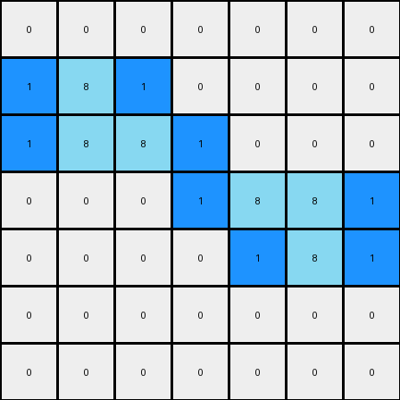

# 1-3aa6fb7a • 005 • refine_dreamer

---


Previous Code:
```python
"""
1.  **Identify Azure Lines:** Find all horizontal, contiguous lines of azure (8) pixels. A line can be of length 1 or more.
2.  **Check Right Edge:** For each azure line, check if it extends to the right edge of the grid.
    *   If the line *does not* extend to the right edge, place a single blue (1) pixel immediately to the right of the last azure pixel in that line.
3. **Check Left Edge:** For each azure line, check it extends to the left edge of the grid.
    * If the line *does not* extend to the left edge, place a single blue (1) pixel immediately to the left of the first azure pixel in that line.
4. **All other pixels:** should be 0 (white).
5.  **Output Grid:** Create a new grid with the original azure lines and the newly placed blue pixels.
"""

import numpy as np

def find_azure_lines(grid):
    azure_lines = []
    for row_index, row in enumerate(grid):
        start = -1
        for col_index, pixel in enumerate(row):
            if pixel == 8:
                if start == -1:
                    start = col_index
            elif start != -1:
                azure_lines.append((row_index, start, col_index - 1))
                start = -1
        if start != -1:  # Check for line at the end of the row
            azure_lines.append((row_index, start, len(row) - 1))
    return azure_lines

def transform(input_grid):
    # initialize output_grid as a copy of input
    output_grid = input_grid.copy()
    
    # set all non azure to zero
    output_grid[output_grid != 8] = 0

    # Find all horizontal azure lines
    azure_lines = find_azure_lines(input_grid)
    
    # Iterate through the lines and place blue pixels
    for row, start_col, end_col in azure_lines:
        # Check right edge
        if end_col + 1 < input_grid.shape[1]:
            output_grid[row, end_col + 1] = 1
        # Check left edge
        if start_col - 1 >= 0:
            output_grid[row, start_col - 1] = 1

    return output_grid
```

Train Set Results:

## Example 1:**

Input:
```
0 0 0 0 0 0 0
0 8 0 0 0 0 0
0 8 8 0 0 0 0
0 0 0 0 8 8 0
0 0 0 0 0 8 0
0 0 0 0 0 0 0
0 0 0 0 0 0 0
```
Expected Output:
```
0 0 0 0 0 0 0
0 8 1 0 0 0 0
0 8 8 0 0 0 0
0 0 0 0 8 8 0
0 0 0 0 1 8 0
0 0 0 0 0 0 0
0 0 0 0 0 0 0
```
Transformed Output:
```
0 0 0 0 0 0 0
1 8 1 0 0 0 0
1 8 8 1 0 0 0
0 0 0 1 8 8 1
0 0 0 0 1 8 1
0 0 0 0 0 0 0
0 0 0 0 0 0 0
```

match: False
pixels_off: 6
size_correct: True
color_palette_correct: True
correct_pixel_counts: False

## Example 2:**

Input:
```
0 0 0 0 8 8 0
0 0 0 0 0 8 0
0 0 8 0 0 0 0
0 0 8 8 0 0 0
0 0 0 0 0 0 0
0 0 0 0 8 0 0
0 0 0 8 8 0 0
```
Expected Output:
```
0 0 0 0 8 8 0
0 0 0 0 1 8 0
0 0 8 1 0 0 0
0 0 8 8 0 0 0
0 0 0 0 0 0 0
0 0 0 1 8 0 0
0 0 0 8 8 0 0
```
Transformed Output:
```
0 0 0 1 8 8 1
0 0 0 0 1 8 1
0 1 8 1 0 0 0
0 1 8 8 1 0 0
0 0 0 0 0 0 0
0 0 0 1 8 1 0
0 0 1 8 8 1 0
```

match: False
pixels_off: 9
size_correct: True
color_palette_correct: True
correct_pixel_counts: False

**INSTRUCTIONS**

The code above was generated based on observations from the first training
example

we have tested the transform function on each of the task example inputs and
compared with the expected output

review each of the examples provided and the results and consider how the
natural language program should be updated to accommodate this new knowledge

respond with the following deliverables:

- general assessment of the information provided and strategy for resolving the
  errors
- gather metrics about each of the examples and results - use code_execution to
  develop accurate reports on your assumptions
- a YAML block documenting facts - Focus on identifying objects, their properties, and the actions performed on them.
- a natural language program - Be as clear and concise as possible, providing a complete description of the transformation rule.


your responses should be considered as information in a report - not a
conversation
