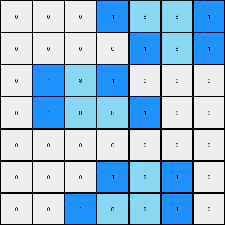

# 1-3aa6fb7a • 006 • refine_coder

---

Previous Code:
```python
"""
1.  **Identify Azure Lines:** Find all horizontal, contiguous lines of azure (8) pixels. A line can be of length 1 or more.
2.  **Check Right Edge:** For each azure line, check if it extends to the right edge of the grid.
    *   If the line *does not* extend to the right edge, place a single blue (1) pixel immediately to the right of the last azure pixel in that line.
3. **Check Left Edge:** For each azure line, check it extends to the left edge of the grid.
    * If the line *does not* extend to the left edge, place a single blue (1) pixel immediately to the left of the first azure pixel in that line.
4. **All other pixels:** should be 0 (white).
5.  **Output Grid:** Create a new grid with the original azure lines and the newly placed blue pixels.
"""

import numpy as np

def find_azure_lines(grid):
    azure_lines = []
    for row_index, row in enumerate(grid):
        start = -1
        for col_index, pixel in enumerate(row):
            if pixel == 8:
                if start == -1:
                    start = col_index
            elif start != -1:
                azure_lines.append((row_index, start, col_index - 1))
                start = -1
        if start != -1:  # Check for line at the end of the row
            azure_lines.append((row_index, start, len(row) - 1))
    return azure_lines

def transform(input_grid):
    # initialize output_grid as a copy of input
    output_grid = input_grid.copy()
    
    # set all non azure to zero
    output_grid[output_grid != 8] = 0

    # Find all horizontal azure lines
    azure_lines = find_azure_lines(input_grid)
    
    # Iterate through the lines and place blue pixels
    for row, start_col, end_col in azure_lines:
        # Check right edge
        if end_col + 1 < input_grid.shape[1]:
            output_grid[row, end_col + 1] = 1
        # Check left edge
        if start_col - 1 >= 0:
            output_grid[row, start_col - 1] = 1

    return output_grid
```

Train Set Results:

## Example 1:**

Input:
```
0 0 0 0 0 0 0
0 8 0 0 0 0 0
0 8 8 0 0 0 0
0 0 0 0 8 8 0
0 0 0 0 0 8 0
0 0 0 0 0 0 0
0 0 0 0 0 0 0
```
Expected Output:
```
0 0 0 0 0 0 0
0 8 1 0 0 0 0
0 8 8 0 0 0 0
0 0 0 0 8 8 0
0 0 0 0 1 8 0
0 0 0 0 0 0 0
0 0 0 0 0 0 0
```
Transformed Output:
```
0 0 0 0 0 0 0
1 8 1 0 0 0 0
1 8 8 1 0 0 0
0 0 0 1 8 8 1
0 0 0 0 1 8 1
0 0 0 0 0 0 0
0 0 0 0 0 0 0
```

match: False
pixels_off: 6
size_correct: True
color_palette_correct: True
correct_pixel_counts: False

## Example 2:**

Input:
```
0 0 0 0 8 8 0
0 0 0 0 0 8 0
0 0 8 0 0 0 0
0 0 8 8 0 0 0
0 0 0 0 0 0 0
0 0 0 0 8 0 0
0 0 0 8 8 0 0
```
Expected Output:
```
0 0 0 0 8 8 0
0 0 0 0 1 8 0
0 0 8 1 0 0 0
0 0 8 8 0 0 0
0 0 0 0 0 0 0
0 0 0 1 8 0 0
0 0 0 8 8 0 0
```
Transformed Output:
```
0 0 0 1 8 8 1
0 0 0 0 1 8 1
0 1 8 1 0 0 0
0 1 8 8 1 0 0
0 0 0 0 0 0 0
0 0 0 1 8 1 0
0 0 1 8 8 1 0
```

match: False
pixels_off: 9
size_correct: True
color_palette_correct: True
correct_pixel_counts: False
Okay, let's analyze the results and refine the natural language program and approach.

**General Assessment:**

The initial code correctly identifies horizontal azure lines and attempts to place blue pixels to their immediate left and right. However, it fails to accurately place the blue pixels. The core issue is the logic makes incorrect assumptions - specifically it assumes that a pixel should be placed on the right *and* left, when the examples show the correct logic is **either** the left **or** the right, but not both. The placement of the blue pixel is on *either* side of the azure line, relative to that edge.

**Strategy for Resolving Errors:**

1.  **Re-examine the Rule:** The natural language program should be rephrased to clarify blue placement should be either to the left *or* the right, but never both.

2.  **Correct the Edge Detection:** Make sure the logic is to compare start and end index of the line, and only act for a pixel at the terminal end.

**Example Metrics and Analysis:**

Here's a breakdown of each example, incorporating observations:

**Example 1:**

*   **Input Shape:** (7, 7)
*   **Output Shape:** (7, 7)
*   **Azure Lines:**
    *   (1, 1, 1) - length 1
    *   (2, 1, 2) - length 2
    *   (3, 4, 5) - length 2
    *   (4, 5, 5) - length 1
* **Expected blue pixels:**
    * line (1,1,1) - right side, at (1,2)
    * line (2,1,2) - none
    * line (3,4,5) - left side, at (3,3)
    * line (4,5,5) - left side, at (4,4)
* **Error Analysis:** Blue pixels were incorrectly added to the left *and* right
    of every azure line.

**Example 2:**

*   **Input Shape:** (7, 7)
*   **Output Shape:** (7, 7)
* **Azure lines:**
    * (0, 4, 5) - length 2
    * (1, 5, 5) - length 1
    * (2, 2, 2) - length 1
    * (3, 2, 3) - length 2
    * (5, 4, 4) - length 1
    * (6, 3, 4) - length 2
* **Expected blue pixels:**
    * line (0, 4, 5) - none
    * line (1, 5, 5) - left side, at (1,4)
    * line (2, 2, 2) - right side, at (2,3)
    * line (3, 2, 3) - none
    * line (5, 4, 4) - left side, at (5,3)
    * line (6, 3, 4) - none
* **Error Analysis:** Same as Example 1 - blue pixels were incorrectly added on
    both sides.

**YAML Facts:**

```yaml
objects:
  - type: horizontal_line
    color: azure
    properties:
      start_row: int
      start_col: int
      end_col: int
      length: int
      left_edge: boolean
      right_edge: boolean

actions:
  - name: add_blue_pixel
    description: Place a single blue pixel adjacent to the azure line
    conditions:
      - if azure line does not touch right edge, place blue on right.
      - if azure line does not touch left edge, place blue on left.
```

**Natural Language Program:**

1.  **Identify Azure Lines:** Find all horizontal, contiguous lines of azure (8) pixels. A line is defined by its starting row, starting column, and ending column.
2.  **Check for Edge Contact:** For each azure line:
    *   If the line's ending column is *not* the last column of the grid (right edge), place a single blue (1) pixel immediately to the right of the line's last pixel.
    *   If the line's starting column is *not* the first column of the grid (left edge), place a single blue (1) pixel immediately to the left of the line's first pixel.
3. **All other pixels:** should be set to 0 (white).
4.  **Output Grid:** Create a new grid containing only the azure lines and any newly placed blue pixels, all other cells are zero.

**INSTRUCTIONS**

- generate a Python module to represent the natural language program 
- follow the template below
- all common math and science libraries are available
- create docstring only at top - but comment the workflow in the function
- use helper functions for common operations like finding objects, counting,
  measuring, moving, etc. 

remember - we are working iteratively - so this code will inform your future
self as we converge on the solution

*template:*

```python
"""
{{ natural language description of the transformation rule }}
"""

{{ imports }}

def transform(input_grid):
    # initialize output_grid

    # change output pixels 

    return output_grid

```
