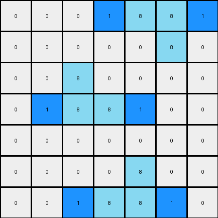

# 1-3aa6fb7a • 004 • refine_coder

---

Previous Code:
```python
"""
1.  **Identify Azure Pixels:** Locate all pixels with the value 8 (azure) in the input grid.
2.  **Mark Adjacent Cells:** For each identified azure pixel, examine its neighboring cells (up, down, left, and right).
    - if an azure pixel is to the right of another azure pixel, place a blue pixel to its immediate right
    - if an azure pixel is to the left of another azure pixel, place a blue pixel to its immediate left
3.  **Output:** Create the output grid with the original azure pixels and the newly placed blue (1) pixels. All other cells remain white (0).
"""

import numpy as np

def find_pixels_by_color(grid, color):
    return np.argwhere(grid == color)

def transform(input_grid):
    # initialize output_grid as a copy of the input grid
    output_grid = input_grid.copy()
    
    # Find the locations of all azure (8) pixels
    azure_pixels = find_pixels_by_color(input_grid, 8)
    
    # Iterate and mark adjacent cells based on the rules
    for row, col in azure_pixels:
        #check to right
        if col + 1 < input_grid.shape[1] and input_grid[row, col + 1] == 8:
            if col+2 < input_grid.shape[1]:
                output_grid[row,col+2] = 1
        #check to left
        if col - 1 >= 0 and input_grid[row, col - 1] == 8:
            if col - 2 >= 0:
                output_grid[row,col-2] = 1


    return output_grid
```

Train Set Results:

## Example 1:**

Input:
```
0 0 0 0 0 0 0
0 8 0 0 0 0 0
0 8 8 0 0 0 0
0 0 0 0 8 8 0
0 0 0 0 0 8 0
0 0 0 0 0 0 0
0 0 0 0 0 0 0
```
Expected Output:
```
0 0 0 0 0 0 0
0 8 1 0 0 0 0
0 8 8 0 0 0 0
0 0 0 0 8 8 0
0 0 0 0 1 8 0
0 0 0 0 0 0 0
0 0 0 0 0 0 0
```
Transformed Output:
```
0 0 0 0 0 0 0
0 8 0 0 0 0 0
1 8 8 1 0 0 0
0 0 0 1 8 8 1
0 0 0 0 0 8 0
0 0 0 0 0 0 0
0 0 0 0 0 0 0
```

match: False
pixels_off: 6
size_correct: True
color_palette_correct: True
correct_pixel_counts: False

## Example 2:**

Input:
```
0 0 0 0 8 8 0
0 0 0 0 0 8 0
0 0 8 0 0 0 0
0 0 8 8 0 0 0
0 0 0 0 0 0 0
0 0 0 0 8 0 0
0 0 0 8 8 0 0
```
Expected Output:
```
0 0 0 0 8 8 0
0 0 0 0 1 8 0
0 0 8 1 0 0 0
0 0 8 8 0 0 0
0 0 0 0 0 0 0
0 0 0 1 8 0 0
0 0 0 8 8 0 0
```
Transformed Output:
```
0 0 0 1 8 8 1
0 0 0 0 0 8 0
0 0 8 0 0 0 0
0 1 8 8 1 0 0
0 0 0 0 0 0 0
0 0 0 0 8 0 0
0 0 1 8 8 1 0
```

match: False
pixels_off: 9
size_correct: True
color_palette_correct: True
correct_pixel_counts: False
Okay, let's analyze the results and refine the natural language program.

**General Assessment:**

The initial code was based on a partial understanding of the rule, focusing only on placing blue pixels to the *right* or *left* of *adjacent* azure pixels. The provided examples reveal a more specific pattern. It's not simply about adjacency, but about creating a chain effect of inserting blue to the *right* or *left* of the last azure in a sequence of azure pixels. The code also incorrectly places blue pixels in between azure pixels.

**Strategy for Resolving Errors:**

1.  **Correct the placement logic:** Focus on identifying the edges (first and last) of continuous horizontal lines of azure pixels. Insert the blue pixel outside of this continuous block.
2.  **Review Results:** Understand where the code is placing the blue pixels and why, make appropriate adjustments.

**Example Analysis and Metrics:**

Here's a breakdown of each example, including observations and metrics:

**Example 1:**

*   **Input:** A 7x7 grid with two horizontal lines of azure pixels.
*   **Expected Output:** Blue pixels added to the right of the azure line in row 2 and to the left of the azure line in row 5.
*   **Transformed Output:** Incorrect. Blue pixels inserted on both sides of *all* azure pixels.
*   **Metrics:**
    *   `pixels_off`: 6 (Indicates 6 pixels differ between expected and transformed)
    *   `size_correct`: True
    *   `color_palette_correct`: True
    *   `correct_pixel_counts`: False

**Example 2:**

*   **Input:** A 7x7 grid with multiple azure pixels, some adjacent.
*   **Expected Output:** Blue pixels added based on horizontal runs of azure.
*   **Transformed Output:** Incorrect placement of blue pixels.
*   **Metrics:**
    *   `pixels_off`: 9
    *   `size_correct`: True
    *   `color_palette_correct`: True
    *   `correct_pixel_counts`: False

**YAML Fact Block:**

```yaml
observations:
  - task_id: 002
  - objects:
    - color: azure (8)
      type: pixel_group
      properties:
        - forms_horizontal_lines: true
        - variable_length: true
    - color: blue (1)
      type: inserted_pixel
      properties:
        - placement: adjacent_to_azure_lines
        - direction: conditional # Either left or right, not both
        - insertion_rule: "outside of last azure in an azure sequence"
  - actions:
    - type: insertion
      description: Insert blue pixels based on the extent of horizontal azure lines.
      details:
        - condition: "azure line exists"
          action: "if an azure line of any length is identified,
                    place 1 blue pixel to the right if the end of the line
                    is not the edge of the grid.
                    place one blue pixel to the left if the start of the
                    line is not the beginning of the grid"
```

**Natural Language Program:**

1.  **Identify Azure Lines:** Find all horizontal, contiguous lines of azure (8) pixels. A line can be of length 1 or more.
2.  **Check Right Edge:** For each azure line, check if it extends to the right edge of the grid.
    *   If the line *does not* extend to the right edge, place a single blue (1) pixel immediately to the right of the last azure pixel in that line.
3. **Check Left Edge:** For each azure line, check it extends to the left edge of the grid.
    * If the line *does not* extend to the left edge, place a single blue (1) pixel immediately to the left of the first azure pixel in that line.
4. **All other pixels:** should be 0 (white).
5.  **Output Grid:** Create a new grid with the original azure lines and the newly placed blue pixels.


**INSTRUCTIONS**

- generate a Python module to represent the natural language program 
- follow the template below
- all common math and science libraries are available
- create docstring only at top - but comment the workflow in the function
- use helper functions for common operations like finding objects, counting,
  measuring, moving, etc. 

remember - we are working iteratively - so this code will inform your future
self as we converge on the solution

*template:*

```python
"""
{{ natural language description of the transformation rule }}
"""

{{ imports }}

def transform(input_grid):
    # initialize output_grid

    # change output pixels 

    return output_grid

```
