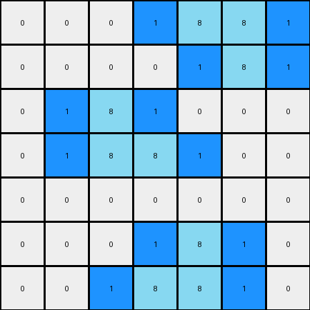

# 1-3aa6fb7a • 006 • refine_coder

---

Previous Code:
```python
"""
For each azure pixel in the input grid, check its immediate horizontal neighbors (left and right).
If a neighbor is white (0), change it to blue (1). Do not change vertically or diagonally adjacent cells.
"""

import numpy as np

def transform(input_grid):
    """
    Transforms the input grid by changing white pixels (0) horizontally adjacent to azure pixels (8) to blue (1).
    """
    output_grid = np.copy(input_grid)  # Initialize output_grid as a copy of input_grid
    rows, cols = input_grid.shape

    # Iterate through each cell of the input_grid
    for r in range(rows):
        for c in range(cols):
            if input_grid[r, c] == 8:  # Check if the current cell is azure (8)
                # Check to the immediate right
                if c + 1 < cols and input_grid[r, c + 1] == 0:
                    output_grid[r, c + 1] = 1  # Change adjacent white pixel to blue
                # Check to the immedate left
                if c - 1 >= 0 and input_grid[r, c - 1] == 0:
                    output_grid[r, c - 1] = 1  # Change adjacent white pixel to blue

    return output_grid
```

Train Set Results:

## Example 1:**

Input:
```
0 0 0 0 0 0 0
0 8 0 0 0 0 0
0 8 8 0 0 0 0
0 0 0 0 8 8 0
0 0 0 0 0 8 0
0 0 0 0 0 0 0
0 0 0 0 0 0 0
```
Expected Output:
```
0 0 0 0 0 0 0
0 8 1 0 0 0 0
0 8 8 0 0 0 0
0 0 0 0 8 8 0
0 0 0 0 1 8 0
0 0 0 0 0 0 0
0 0 0 0 0 0 0
```
Transformed Output:
```
0 0 0 0 0 0 0
1 8 1 0 0 0 0
1 8 8 1 0 0 0
0 0 0 1 8 8 1
0 0 0 0 1 8 1
0 0 0 0 0 0 0
0 0 0 0 0 0 0
```

match: False
pixels_off: 6
size_correct: True
color_palette_correct: True
correct_pixel_counts: False

## Example 2:**

Input:
```
0 0 0 0 8 8 0
0 0 0 0 0 8 0
0 0 8 0 0 0 0
0 0 8 8 0 0 0
0 0 0 0 0 0 0
0 0 0 0 8 0 0
0 0 0 8 8 0 0
```
Expected Output:
```
0 0 0 0 8 8 0
0 0 0 0 1 8 0
0 0 8 1 0 0 0
0 0 8 8 0 0 0
0 0 0 0 0 0 0
0 0 0 1 8 0 0
0 0 0 8 8 0 0
```
Transformed Output:
```
0 0 0 1 8 8 1
0 0 0 0 1 8 1
0 1 8 1 0 0 0
0 1 8 8 1 0 0
0 0 0 0 0 0 0
0 0 0 1 8 1 0
0 0 1 8 8 1 0
```

match: False
pixels_off: 9
size_correct: True
color_palette_correct: True
correct_pixel_counts: False
Okay, here's an analysis of the provided information and a plan to refine the natural language program and the code.

**General Assessment:**

The initial natural language program and the resulting code were too broad. The code correctly identified azure pixels and checked for white pixels to the left and right. However, it incorrectly changed *all* neighboring white pixels to blue, including those from the *previous* row's operations and the *current* row's operations. The transformation should only apply to white pixels that were present in the *original* input grid, not those created by changes in the *same* transformation process. The code is "over-applying" the rule. The examples make it clear that only adjacent white pixels are changing on rows that have the azure.

**Strategy:**

1.  **Clarify the Natural Language Program:** Refine the description to emphasize that only white pixels *originally* adjacent to azure pixels in the input are changed.
2.  **Metrics:** Use more detailed reports on comparison of the input, expected and transformed outputs.
3.  **YAML and NL program:** Rewrite these to better reflect the task.

**Metrics and Observations**

Here's a summary of each example, including observations and an assessment of how the code performs against the expected output.

**Example 1:**

*   **Input:**  A 7x7 grid with azure and white pixels.
*   **Expected Output:** White pixels horizontally adjacent to azure are blue, *only on the same row as the original azure pixels*.
*   **Transformed Output:**  The transformation "bleeds" into subsequent and previous rows, incorrectly changing more white pixels to blue than expected. The transformed output incorrectly changes white pixels on rows above and below where the changes should be limited.
*   **Issues:** Over-application of the transformation rule.

**Example 2:**

*   **Input:**  A 7x7 grid with a different arrangement of azure and white pixels.
*   **Expected Output:** Similar to example 1, showing the adjacency rule.
*   **Transformed Output:** Again, the transformation is over-applied, affecting more white pixels than it should. The "bleeding" effect is even more pronounced due to the different arrangement of azure pixels.
*   **Issues:**  Same as Example 1.

**YAML Facts:**

```yaml
objects:
  - name: pixel
    properties:
      color:
        - white (0)
        - blue (1)
        - azure (8)
      position: [row, column]
actions:
  - name: change_color
    preconditions:
      - object: pixel
        property: color
        value: white (0)
      - adjacent_object: pixel
        property: color
        value: azure (8)
        relative_position: horizontally adjacent (left or right)
    postconditions:
      - object: pixel
        property: color
        value: blue (1)
```

**Natural Language Program:**

"Iterate through each pixel of the input grid. For every azure pixel, check its immediate horizontal neighbors (left and right) *in the original input grid*. If a neighbor is white, change that *original* white pixel to blue in the output grid. Do not change white pixels that became blue during the *current* transformation process. Only apply changes on the same row as the azure pixel."

**INSTRUCTIONS**

- generate a Python module to represent the natural language program 
- follow the template below
- all common math and science libraries are available
- create docstring only at top - but comment the workflow in the function
- use helper functions for common operations like finding objects, counting,
  measuring, moving, etc. 

remember - we are working iteratively - so this code will inform your future
self as we converge on the solution

*template:*

```python
"""
{{ natural language description of the transformation rule }}
"""

{{ imports }}

def transform(input_grid):
    # initialize output_grid

    # change output pixels 

    return output_grid

```
