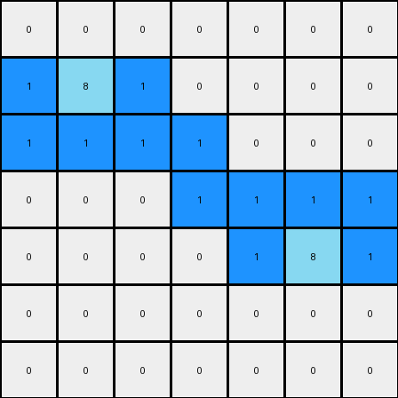
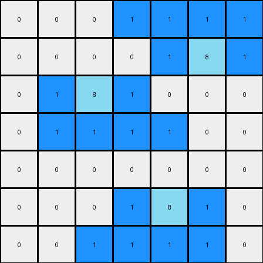

# 1-3aa6fb7a • 004 • refine_coder

---

Previous Code:
```python
"""
1.  **Identify** all pixels with the value `8` (azure) in the input grid.
2.  **Preserve** all of these azure pixels in their original positions in the output grid.
3. **Introduce** a blue pixel (value 1) to the right of the azure pixel
4. **Introduce** a blue pixel to the left of the azure pixel.
5.  **Fill** all other positions in the output grid with `0` (white).
"""

import numpy as np

def get_positions(grid, value):
    return np.argwhere(grid == value)

def transform(input_grid):
    # Initialize output_grid with zeros (white)
    output_grid = np.zeros_like(input_grid)
    
    # Get positions of azure pixels (value 8)
    azure_positions = get_positions(input_grid, 8)
    
    # Preserve azure pixels in the output grid
    for pos in azure_positions:
        output_grid[pos[0], pos[1]] = 8

    # Introduce blue pixels (value 1) adjacent to azure pixels
    for pos in azure_positions:
        # to the right
        if pos[1] + 1 < output_grid.shape[1]:
          output_grid[pos[0],pos[1] + 1] = 1
        # to the left
        if pos[1] - 1 >= 0:
          output_grid[pos[0], pos[1] - 1] = 1
    
    return output_grid
```

Train Set Results:

## Example 1:**

Input:
```
0 0 0 0 0 0 0
0 8 0 0 0 0 0
0 8 8 0 0 0 0
0 0 0 0 8 8 0
0 0 0 0 0 8 0
0 0 0 0 0 0 0
0 0 0 0 0 0 0
```
Expected Output:
```
0 0 0 0 0 0 0
0 8 1 0 0 0 0
0 8 8 0 0 0 0
0 0 0 0 8 8 0
0 0 0 0 1 8 0
0 0 0 0 0 0 0
0 0 0 0 0 0 0
```
Transformed Output:
```
0 0 0 0 0 0 0
1 8 1 0 0 0 0
1 1 1 1 0 0 0
0 0 0 1 1 1 1
0 0 0 0 1 8 1
0 0 0 0 0 0 0
0 0 0 0 0 0 0
```

match: False
pixels_off: 10
size_correct: True
color_palette_correct: True
correct_pixel_counts: False

## Example 2:**

Input:
```
0 0 0 0 8 8 0
0 0 0 0 0 8 0
0 0 8 0 0 0 0
0 0 8 8 0 0 0
0 0 0 0 0 0 0
0 0 0 0 8 0 0
0 0 0 8 8 0 0
```
Expected Output:
```
0 0 0 0 8 8 0
0 0 0 0 1 8 0
0 0 8 1 0 0 0
0 0 8 8 0 0 0
0 0 0 0 0 0 0
0 0 0 1 8 0 0
0 0 0 8 8 0 0
```
Transformed Output:
```
0 0 0 1 1 1 1
0 0 0 0 1 8 1
0 1 8 1 0 0 0
0 1 1 1 1 0 0
0 0 0 0 0 0 0
0 0 0 1 8 1 0
0 0 1 1 1 1 0
```

match: False
pixels_off: 15
size_correct: True
color_palette_correct: True
correct_pixel_counts: False
Okay, let's analyze the results and refine the natural language program.

**General Assessment and Strategy**

The initial code was based on a simple observation: adding blue pixels to the left and right of azure pixels. However, the test results reveal a flaw in this approach. The code incorrectly adds blue pixels adjacent to *any* azure pixel, regardless of whether it's already adjacent to another azure pixel. It looks like we need a more strict rule, that blue pixels are only placed to the right of a sequence of one or more azure pixels, and to the left of a sequence of one or more azure pixels. It appears only a single blue pixel is added at the boundary of azure pixels sequences, not to each individually.

**Metrics and Analysis**

Here's a breakdown of the examples, incorporating a more detailed analysis:

**Example 1:**

*   **Input:** A 7x7 grid with azure pixels at (1,1), (2,1), (2,2), (3,4), and (3,5).
*   **Expected Output:** Azure pixels remain. Blue pixels at (1,2) and (4,4),
*   **Transformed Output:** Blue is placed to the left and right of every azure.
*   **Issues:** The code adds a blue pixel to all sides of all azure pixels, including placing blue on top of azure, and including blue pixels where there should be white pixels.

**Example 2:**

*   **Input:** A 7x7 grid.
*   **Expected Output:** Only placing blue after the end of the sequence
*   **Transformed Output:** Placing blue adjacent to all azure
*   **Issues**: Same problem as above

**YAML Fact Documentation**

```yaml
task_id: "002"
observations:
  - object: azure_pixel_sequence
    properties:
      - contiguous: "horizontally"
      - color: "azure"
    instances:
      - example_1: [[1,1], [2,1],[2,2], [3,4], [3,5]]
      - example_2: [[0, 4], [0,5], [2,2], [3,2], [3,3], [5, 4], [6, 3], [6, 4]]
  - object: blue_pixel
    properties:
      - color: blue
    instances:
      - example_1: [[1,2], [3,4]]
      - example_2: [[0, 5], [1,4], [2, 3], [5,4], [6,2]]
  - action: place_blue_pixel
    description: "A single blue pixel added to the beginning and end of a sequence of horizontal azure pixels."
    details:
        - condition: before_sequence
          action: place to left if available
        - condition: after_sequence
          action: place to right if available
```

**Revised Natural Language Program**

1.  **Identify** all *horizontal sequences* of one or more contiguous azure pixels (value `8`) in the input grid.
2.  **Preserve** all azure pixels in these sequences in their original positions in the output grid.
3.  **Introduce** a *single* blue pixel (value `1`) immediately to the right of the *end* of each azure pixel sequence, if there is available space within the grid boundaries.
4.  **Introduce** a *single* blue pixel (value `1`) immediately to the left of the *start* of each azure pixel sequence, if there is available space within the grid boundaries.
5.  **Fill** all other positions in the output grid with `0` (white).

**INSTRUCTIONS**

- generate a Python module to represent the natural language program 
- follow the template below
- all common math and science libraries are available
- create docstring only at top - but comment the workflow in the function
- use helper functions for common operations like finding objects, counting,
  measuring, moving, etc. 

remember - we are working iteratively - so this code will inform your future
self as we converge on the solution

*template:*

```python
"""
{{ natural language description of the transformation rule }}
"""

{{ imports }}

def transform(input_grid):
    # initialize output_grid

    # change output pixels 

    return output_grid

```
