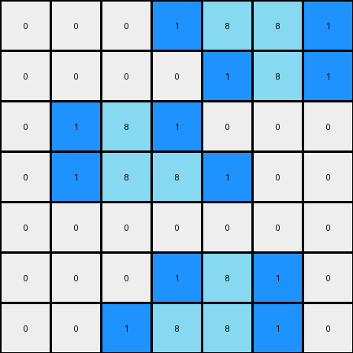

# 1-3aa6fb7a • 005 • refine_dreamer

---


Previous Code:
```python
"""
1.  **Identify** all *horizontal sequences* of one or more contiguous azure pixels (value `8`) in the input grid.
2.  **Preserve** all azure pixels in these sequences in their original positions in the output grid.
3.  **Introduce** a *single* blue pixel (value `1`) immediately to the right of the *end* of each azure pixel sequence, if there is available space within the grid boundaries.
4.  **Introduce** a *single* blue pixel (value `1`) immediately to the left of the *start* of each azure pixel sequence, if there is available space within the grid boundaries.
5.  **Fill** all other positions in the output grid with `0` (white).
"""

import numpy as np

def get_horizontal_sequences(grid, value):
    sequences = []
    for row in range(grid.shape[0]):
        in_sequence = False
        start = -1
        for col in range(grid.shape[1]):
            if grid[row, col] == value:
                if not in_sequence:
                    in_sequence = True
                    start = col
            elif in_sequence:
                in_sequence = False
                sequences.append(((row, start), (row, col - 1)))
                start = -1
        if in_sequence:
            sequences.append(((row, start), (row, grid.shape[1] - 1)))
    return sequences

def transform(input_grid):
    # Initialize output_grid with zeros (white)
    output_grid = np.zeros_like(input_grid)
    
    # Get horizontal sequences of azure pixels (value 8)
    azure_sequences = get_horizontal_sequences(input_grid, 8)
    
    # Preserve azure pixels in the output grid
    for start, end in azure_sequences:
        for col in range(start[1], end[1] + 1):
            output_grid[start[0], col] = 8

    # Introduce blue pixels (value 1) at the boundaries of azure sequences
    for start, end in azure_sequences:
        # To the left of the start
        if start[1] - 1 >= 0:
            output_grid[start[0], start[1] - 1] = 1
        # To the right of the end
        if end[1] + 1 < output_grid.shape[1]:
            output_grid[end[0], end[1] + 1] = 1
    
    return output_grid
```

Train Set Results:

## Example 1:**

Input:
```
0 0 0 0 0 0 0
0 8 0 0 0 0 0
0 8 8 0 0 0 0
0 0 0 0 8 8 0
0 0 0 0 0 8 0
0 0 0 0 0 0 0
0 0 0 0 0 0 0
```
Expected Output:
```
0 0 0 0 0 0 0
0 8 1 0 0 0 0
0 8 8 0 0 0 0
0 0 0 0 8 8 0
0 0 0 0 1 8 0
0 0 0 0 0 0 0
0 0 0 0 0 0 0
```
Transformed Output:
```
0 0 0 0 0 0 0
1 8 1 0 0 0 0
1 8 8 1 0 0 0
0 0 0 1 8 8 1
0 0 0 0 1 8 1
0 0 0 0 0 0 0
0 0 0 0 0 0 0
```

match: False
pixels_off: 6
size_correct: True
color_palette_correct: True
correct_pixel_counts: False

## Example 2:**

Input:
```
0 0 0 0 8 8 0
0 0 0 0 0 8 0
0 0 8 0 0 0 0
0 0 8 8 0 0 0
0 0 0 0 0 0 0
0 0 0 0 8 0 0
0 0 0 8 8 0 0
```
Expected Output:
```
0 0 0 0 8 8 0
0 0 0 0 1 8 0
0 0 8 1 0 0 0
0 0 8 8 0 0 0
0 0 0 0 0 0 0
0 0 0 1 8 0 0
0 0 0 8 8 0 0
```
Transformed Output:
```
0 0 0 1 8 8 1
0 0 0 0 1 8 1
0 1 8 1 0 0 0
0 1 8 8 1 0 0
0 0 0 0 0 0 0
0 0 0 1 8 1 0
0 0 1 8 8 1 0
```

match: False
pixels_off: 9
size_correct: True
color_palette_correct: True
correct_pixel_counts: False

**INSTRUCTIONS**

The code above was generated based on observations from the first training
example

we have tested the transform function on each of the task example inputs and
compared with the expected output

review each of the examples provided and the results and consider how the
natural language program should be updated to accommodate this new knowledge

respond with the following deliverables:

- general assessment of the information provided and strategy for resolving the
  errors
- gather metrics about each of the examples and results - use code_execution to
  develop accurate reports on your assumptions
- a YAML block documenting facts - Focus on identifying objects, their properties, and the actions performed on them.
- a natural language program - Be as clear and concise as possible, providing a complete description of the transformation rule.


your responses should be considered as information in a report - not a
conversation
