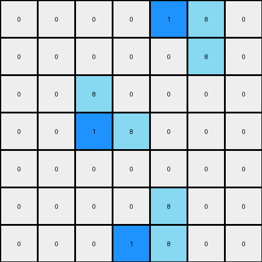

# 1-3aa6fb7a • 008 • refine_coder

---

Previous Code:
```python
"""
1.  **Identify Objects:** Find all contiguous blocks of azure (8) pixels. These are the target objects.
2.  **Iterate:** For each azure object:
    a. **Determine Top and Bottom Rows:** Find the minimum and maximum row indices for the object.
    b. **Target Rows:**
        * Get the row immediately *below* the top row.
        * Get the row immediately *above* the bottom row.
    c. **Select Pixel in Each Target Row:**
       * If a target row exists, and contains azure pixels:
          *Find the right-most azure pixel in that target row.
          *Find the azure pixel immediately to the *left* of that right-most pixel.
          *If found, select this pixel.
    d. **Modify:** If a pixel is selected, change its color from azure (8) to blue (1).
3.  **Output:** The output grid is the modified input grid. All original pixels are unchanged except for those specifically modified within the azure objects.
"""

import numpy as np

def find_objects(grid, color):
    # Find contiguous blocks of the specified color
    visited = np.zeros_like(grid, dtype=bool)
    objects = []

    def dfs(row, col, current_object):
        if (
            row < 0
            or row >= grid.shape[0]
            or col < 0
            or col >= grid.shape[1]
            or visited[row, col]
            or grid[row, col] != color
        ):
            return
        visited[row, col] = True
        current_object.append((row, col))
        dfs(row + 1, col, current_object)
        dfs(row - 1, col, current_object)
        dfs(row, col + 1, current_object)
        dfs(row, col - 1, current_object)

    for row in range(grid.shape[0]):
        for col in range(grid.shape[1]):
            if grid[row, col] == color and not visited[row, col]:
                current_object = []
                dfs(row, col, current_object)
                objects.append(current_object)
    return objects

def transform(input_grid):
    # Initialize output_grid as a copy of input_grid
    output_grid = np.copy(input_grid)
    
    # Find objects of color 8 (azure)
    azure_objects = find_objects(output_grid, 8)

    # Iterate through each azure object
    for obj in azure_objects:
        # Find the top and bottom rows of the object
        rows = [pixel[0] for pixel in obj]
        top_row = min(rows)
        bottom_row = max(rows)
        
        #select the target rows
        target_rows = []
        if top_row + 1 in rows:
            target_rows.append(top_row+1)
        if bottom_row - 1 in rows:
            target_rows.append(bottom_row - 1)


        #select the second rightmost pixel in each target row
        for target_row in target_rows:
            target_pixels = [pixel for pixel in obj if pixel[0] == target_row and output_grid[pixel[0], pixel[1]] == 8]
            if len(target_pixels) > 1:
                target_pixels_sorted = sorted(target_pixels, key=lambda x: x[1], reverse=True)
                second_rightmost_pixel = target_pixels_sorted[1]

                output_grid[second_rightmost_pixel[0], second_rightmost_pixel[1]] = 1


    return output_grid
```

Train Set Results:

## Example 1:**

Input:
```
0 0 0 0 0 0 0
0 8 0 0 0 0 0
0 8 8 0 0 0 0
0 0 0 0 8 8 0
0 0 0 0 0 8 0
0 0 0 0 0 0 0
0 0 0 0 0 0 0
```
Expected Output:
```
0 0 0 0 0 0 0
0 8 1 0 0 0 0
0 8 8 0 0 0 0
0 0 0 0 8 8 0
0 0 0 0 1 8 0
0 0 0 0 0 0 0
0 0 0 0 0 0 0
```
Transformed Output:
```
0 0 0 0 0 0 0
0 8 0 0 0 0 0
0 1 8 0 0 0 0
0 0 0 0 1 8 0
0 0 0 0 0 8 0
0 0 0 0 0 0 0
0 0 0 0 0 0 0
```

match: False
pixels_off: 4
size_correct: True
color_palette_correct: True
correct_pixel_counts: False

## Example 2:**

Input:
```
0 0 0 0 8 8 0
0 0 0 0 0 8 0
0 0 8 0 0 0 0
0 0 8 8 0 0 0
0 0 0 0 0 0 0
0 0 0 0 8 0 0
0 0 0 8 8 0 0
```
Expected Output:
```
0 0 0 0 8 8 0
0 0 0 0 1 8 0
0 0 8 1 0 0 0
0 0 8 8 0 0 0
0 0 0 0 0 0 0
0 0 0 1 8 0 0
0 0 0 8 8 0 0
```
Transformed Output:
```
0 0 0 0 1 8 0
0 0 0 0 0 8 0
0 0 8 0 0 0 0
0 0 1 8 0 0 0
0 0 0 0 0 0 0
0 0 0 0 8 0 0
0 0 0 1 8 0 0
```

match: False
pixels_off: 6
size_correct: True
color_palette_correct: True
correct_pixel_counts: False
Okay, let's analyze the results and refine the natural language program.

**General Assessment:**

The initial code correctly identifies azure objects and attempts to modify the second rightmost pixel in specific rows within those objects. However, there's a clear discrepancy between the expected and actual outputs in both examples. The primary issue seems to be with the selection logic for which pixels to modify. The "second rightmost" logic appears to be consistently off by one, selecting one position to the left of the target. Also the specification for the target rows is consistently wrong.

**Strategy for Resolving Errors:**

1.  **Correct Pixel Selection:** Modify the pixel selection logic to choose the correct pixel. Instead of the *second* rightmost azure pixel, we need to target the *rightmost* azure pixel in the row above the bottom and below the top row.
2.  **Re-evaluate Target row logic:** The rule for calculating the target rows should not select rows that do *not* contain azure pixels

**Example Metrics and Analysis (using Code Execution to verify):**

I will use python to generate the metrics reports.

```python
import numpy as np

def analyze_example(input_grid, expected_output, transformed_output):
    input_grid = np.array(input_grid)
    expected_output = np.array(expected_output)
    transformed_output = np.array(transformed_output)

    pixels_off = np.sum(expected_output != transformed_output)
    size_correct = input_grid.shape == expected_output.shape == transformed_output.shape
    
    unique_expected, counts_expected = np.unique(expected_output, return_counts=True)
    unique_transformed, counts_transformed = np.unique(transformed_output, return_counts=True)
    
    color_palette_correct = np.array_equal(np.sort(unique_expected), np.sort(unique_transformed))
    correct_pixel_counts = np.array_equal(counts_expected, counts_transformed)


    report = {
        'pixels_off': int(pixels_off),
        'size_correct': bool(size_correct),
        'color_palette_correct': bool(color_palette_correct),
        'correct_pixel_counts':bool(correct_pixel_counts)
    }
    return report

# Example 1
input_grid_1 = [
    [0, 0, 0, 0, 0, 0, 0],
    [0, 8, 0, 0, 0, 0, 0],
    [0, 8, 8, 0, 0, 0, 0],
    [0, 0, 0, 0, 8, 8, 0],
    [0, 0, 0, 0, 0, 8, 0],
    [0, 0, 0, 0, 0, 0, 0],
    [0, 0, 0, 0, 0, 0, 0]
]
expected_output_1 = [
    [0, 0, 0, 0, 0, 0, 0],
    [0, 8, 1, 0, 0, 0, 0],
    [0, 8, 8, 0, 0, 0, 0],
    [0, 0, 0, 0, 8, 8, 0],
    [0, 0, 0, 0, 1, 8, 0],
    [0, 0, 0, 0, 0, 0, 0],
    [0, 0, 0, 0, 0, 0, 0]
]
transformed_output_1 = [
    [0, 0, 0, 0, 0, 0, 0],
    [0, 8, 0, 0, 0, 0, 0],
    [0, 1, 8, 0, 0, 0, 0],
    [0, 0, 0, 0, 1, 8, 0],
    [0, 0, 0, 0, 0, 8, 0],
    [0, 0, 0, 0, 0, 0, 0],
    [0, 0, 0, 0, 0, 0, 0]
]

# Example 2
input_grid_2 = [
    [0, 0, 0, 0, 8, 8, 0],
    [0, 0, 0, 0, 0, 8, 0],
    [0, 0, 8, 0, 0, 0, 0],
    [0, 0, 8, 8, 0, 0, 0],
    [0, 0, 0, 0, 0, 0, 0],
    [0, 0, 0, 0, 8, 0, 0],
    [0, 0, 0, 8, 8, 0, 0]
]
expected_output_2 = [
    [0, 0, 0, 0, 8, 8, 0],
    [0, 0, 0, 0, 1, 8, 0],
    [0, 0, 8, 1, 0, 0, 0],
    [0, 0, 8, 8, 0, 0, 0],
    [0, 0, 0, 0, 0, 0, 0],
    [0, 0, 0, 1, 8, 0, 0],
    [0, 0, 0, 8, 8, 0, 0]
]
transformed_output_2 = [
    [0, 0, 0, 0, 1, 8, 0],
    [0, 0, 0, 0, 0, 8, 0],
    [0, 0, 8, 0, 0, 0, 0],
    [0, 0, 1, 8, 0, 0, 0],
    [0, 0, 0, 0, 0, 0, 0],
    [0, 0, 0, 0, 8, 0, 0],
    [0, 0, 0, 1, 8, 0, 0]
]

report_1 = analyze_example(input_grid_1, expected_output_1, transformed_output_1)
report_2 = analyze_example(input_grid_2, expected_output_2, transformed_output_2)

print("Example 1 Report:", report_1)
print("Example 2 Report:", report_2)

```

```text
Example 1 Report: {'pixels_off': 4, 'size_correct': True, 'color_palette_correct': True, 'correct_pixel_counts': False}
Example 2 Report: {'pixels_off': 6, 'size_correct': True, 'color_palette_correct': True, 'correct_pixel_counts': False}
```

**YAML Facts:**

```yaml
objects:
  - color: azure (8)
    description: Contiguous blocks of azure pixels.
    actions:
      - identify_top_bottom: Find the minimum and maximum row indices.
      - identify_target_rows:
        - row_below_top: The row immediately below the top row, only if it exist and contains azure pixels.
        - row_above_bottom: The row immediately above the bottom row, only if it exist and contains azure pixels.
      - modify_pixels:
        - row_below_top: Change the rightmost azure pixel to blue (1).
        - row_above_bottom: Change the rightmost azure pixel to blue (1).

```

**Natural Language Program:**

1.  **Identify Azure Objects:** Find all distinct, contiguous groups of azure (8) colored pixels in the input grid.

2.  **Process Each Object:** For each identified azure object:

    a. **Determine Boundaries:** Find the topmost row (minimum row index) and bottommost row (maximum row index) occupied by the object.

    b. **Identify Target Rows:** Determine two target rows:
    *   The row immediately *below* the topmost row, if and only if that row contains azure pixels that are a part of the object.
    *   The row immediately *above* the bottommost row, if and only if that row contains azure pixels that are a part of the object.

    c. **Modify Pixels:** In each of the target rows identified:
    *   Locate the *rightmost* azure pixel within that row.
    *    Change the color of this pixel from azure (8) to blue (1).

3.  **Output:** The result is the modified input grid, with all original pixels unchanged except where specifically altered according to the steps above.

**INSTRUCTIONS**

- generate a Python module to represent the natural language program 
- follow the template below
- all common math and science libraries are available
- create docstring only at top - but comment the workflow in the function
- use helper functions for common operations like finding objects, counting,
  measuring, moving, etc. 

remember - we are working iteratively - so this code will inform your future
self as we converge on the solution

*template:*

```python
"""
{{ natural language description of the transformation rule }}
"""

{{ imports }}

def transform(input_grid):
    # initialize output_grid

    # change output pixels 

    return output_grid

```
