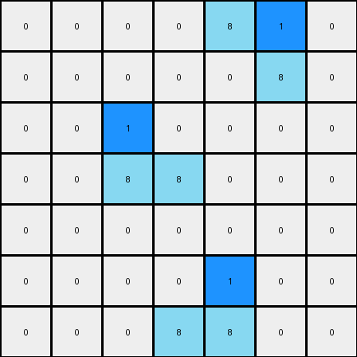

# 1-3aa6fb7a • 005 • refine_dreamer

---


Previous Code:
```python
"""
1.  **Identify Objects:** Locate all contiguous blocks of azure (8) pixels within the grid. These are the target objects.
2.  **Iterate:** For each identified azure object:
    a. **Check Height:** Get the number of rows in the object.
    b. **Select Row:**
        * If the object's height is greater than 1, get the second row and the second to last row.
        * If only one of these rows exist, choose that row.
    c. **Select Pixel:**
        * Find all pixels in that row.
        * Of those, find the pixel that is the furthest right (largest column value).
    d. **Modify:** Change the color value of this selected pixel from azure (8) to blue (1).
3.  **Output:** The output grid is identical to the input grid, except for the modified pixels within each azure object.
"""

import numpy as np

def find_objects(grid, color):
    # Find contiguous blocks of the specified color
    visited = np.zeros_like(grid, dtype=bool)
    objects = []

    def dfs(row, col, current_object):
        if (
            row < 0
            or row >= grid.shape[0]
            or col < 0
            or col >= grid.shape[1]
            or visited[row, col]
            or grid[row, col] != color
        ):
            return
        visited[row, col] = True
        current_object.append((row, col))
        dfs(row + 1, col, current_object)
        dfs(row - 1, col, current_object)
        dfs(row, col + 1, current_object)
        dfs(row, col - 1, current_object)

    for row in range(grid.shape[0]):
        for col in range(grid.shape[1]):
            if grid[row, col] == color and not visited[row, col]:
                current_object = []
                dfs(row, col, current_object)
                objects.append(current_object)
    return objects

def transform(input_grid):
    # Initialize output_grid as a copy of input_grid
    output_grid = np.copy(input_grid)
    
    # Find objects of color 8 (azure)
    azure_objects = find_objects(output_grid, 8)

    # Iterate through each azure object
    for obj in azure_objects:
        # Find the top and bottom rows of the object
        rows = [pixel[0] for pixel in obj]
        top_row = min(rows)
        bottom_row = max(rows)
        
        #select the target row
        target_row = -1

        if (bottom_row - top_row + 1) > 1:
            if top_row + 1 in rows:
                target_row = top_row + 1
            if bottom_row - 1 in rows:
                target_row = bottom_row - 1

        #select the rightmost pixel in the target row
        if target_row != -1:
            target_pixels = [pixel for pixel in obj if pixel[0] == target_row]
            if target_pixels:
                rightmost_pixel = max(target_pixels, key=lambda x: x[1])
                output_grid[rightmost_pixel[0], rightmost_pixel[1]] = 1


    return output_grid
```

Train Set Results:

## Example 1:**

Input:
```
0 0 0 0 0 0 0
0 8 0 0 0 0 0
0 8 8 0 0 0 0
0 0 0 0 8 8 0
0 0 0 0 0 8 0
0 0 0 0 0 0 0
0 0 0 0 0 0 0
```
Expected Output:
```
0 0 0 0 0 0 0
0 8 1 0 0 0 0
0 8 8 0 0 0 0
0 0 0 0 8 8 0
0 0 0 0 1 8 0
0 0 0 0 0 0 0
0 0 0 0 0 0 0
```
Transformed Output:
```
0 0 0 0 0 0 0
0 1 0 0 0 0 0
0 8 8 0 0 0 0
0 0 0 0 8 1 0
0 0 0 0 0 8 0
0 0 0 0 0 0 0
0 0 0 0 0 0 0
```

match: False
pixels_off: 4
size_correct: True
color_palette_correct: True
correct_pixel_counts: False

## Example 2:**

Input:
```
0 0 0 0 8 8 0
0 0 0 0 0 8 0
0 0 8 0 0 0 0
0 0 8 8 0 0 0
0 0 0 0 0 0 0
0 0 0 0 8 0 0
0 0 0 8 8 0 0
```
Expected Output:
```
0 0 0 0 8 8 0
0 0 0 0 1 8 0
0 0 8 1 0 0 0
0 0 8 8 0 0 0
0 0 0 0 0 0 0
0 0 0 1 8 0 0
0 0 0 8 8 0 0
```
Transformed Output:
```
0 0 0 0 8 1 0
0 0 0 0 0 8 0
0 0 1 0 0 0 0
0 0 8 8 0 0 0
0 0 0 0 0 0 0
0 0 0 0 1 0 0
0 0 0 8 8 0 0
```

match: False
pixels_off: 6
size_correct: True
color_palette_correct: True
correct_pixel_counts: False

**INSTRUCTIONS**

The code above was generated based on observations from the first training
example

we have tested the transform function on each of the task example inputs and
compared with the expected output

review each of the examples provided and the results and consider how the
natural language program should be updated to accommodate this new knowledge

respond with the following deliverables:

- general assessment of the information provided and strategy for resolving the
  errors
- gather metrics about each of the examples and results - use code_execution to
  develop accurate reports on your assumptions
- a YAML block documenting facts - Focus on identifying objects, their properties, and the actions performed on them.
- a natural language program - Be as clear and concise as possible, providing a complete description of the transformation rule.


your responses should be considered as information in a report - not a
conversation
