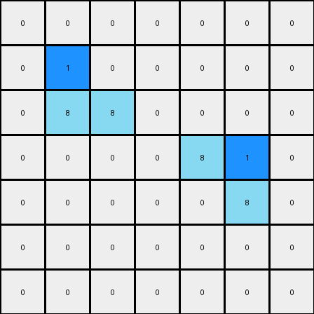
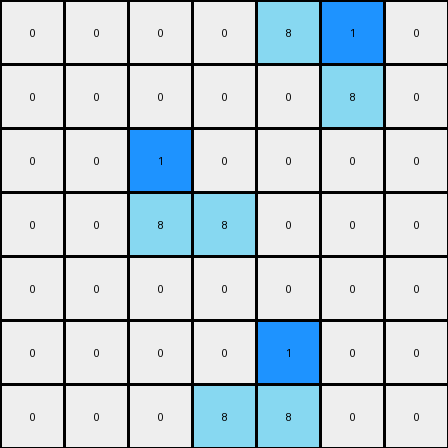

# 1-3aa6fb7a • 006 • refine_coder

---

Previous Code:
```python
"""
1.  **Identify Objects:** Locate all contiguous blocks of azure (8) pixels within the grid. These are the target objects.
2.  **Iterate:** For each identified azure object:
    a. **Check Height:** Get the number of rows in the object.
    b. **Select Row:**
        * If the object's height is greater than 1, get the second row and the second to last row.
        * If only one of these rows exist, choose that row.
    c. **Select Pixel:**
        * Find all pixels in that row.
        * Of those, find the pixel that is the furthest right (largest column value).
    d. **Modify:** Change the color value of this selected pixel from azure (8) to blue (1).
3.  **Output:** The output grid is identical to the input grid, except for the modified pixels within each azure object.
"""

import numpy as np

def find_objects(grid, color):
    # Find contiguous blocks of the specified color
    visited = np.zeros_like(grid, dtype=bool)
    objects = []

    def dfs(row, col, current_object):
        if (
            row < 0
            or row >= grid.shape[0]
            or col < 0
            or col >= grid.shape[1]
            or visited[row, col]
            or grid[row, col] != color
        ):
            return
        visited[row, col] = True
        current_object.append((row, col))
        dfs(row + 1, col, current_object)
        dfs(row - 1, col, current_object)
        dfs(row, col + 1, current_object)
        dfs(row, col - 1, current_object)

    for row in range(grid.shape[0]):
        for col in range(grid.shape[1]):
            if grid[row, col] == color and not visited[row, col]:
                current_object = []
                dfs(row, col, current_object)
                objects.append(current_object)
    return objects

def transform(input_grid):
    # Initialize output_grid as a copy of input_grid
    output_grid = np.copy(input_grid)
    
    # Find objects of color 8 (azure)
    azure_objects = find_objects(output_grid, 8)

    # Iterate through each azure object
    for obj in azure_objects:
        # Find the top and bottom rows of the object
        rows = [pixel[0] for pixel in obj]
        top_row = min(rows)
        bottom_row = max(rows)
        
        #select the target row
        target_row = -1

        if (bottom_row - top_row + 1) > 1:
            if top_row + 1 in rows:
                target_row = top_row + 1
            if bottom_row - 1 in rows:
                target_row = bottom_row - 1

        #select the rightmost pixel in the target row
        if target_row != -1:
            target_pixels = [pixel for pixel in obj if pixel[0] == target_row]
            if target_pixels:
                rightmost_pixel = max(target_pixels, key=lambda x: x[1])
                output_grid[rightmost_pixel[0], rightmost_pixel[1]] = 1


    return output_grid
```

Train Set Results:

## Example 1:**

Input:
```
0 0 0 0 0 0 0
0 8 0 0 0 0 0
0 8 8 0 0 0 0
0 0 0 0 8 8 0
0 0 0 0 0 8 0
0 0 0 0 0 0 0
0 0 0 0 0 0 0
```
Expected Output:
```
0 0 0 0 0 0 0
0 8 1 0 0 0 0
0 8 8 0 0 0 0
0 0 0 0 8 8 0
0 0 0 0 1 8 0
0 0 0 0 0 0 0
0 0 0 0 0 0 0
```
Transformed Output:
```
0 0 0 0 0 0 0
0 1 0 0 0 0 0
0 8 8 0 0 0 0
0 0 0 0 8 1 0
0 0 0 0 0 8 0
0 0 0 0 0 0 0
0 0 0 0 0 0 0
```

match: False
pixels_off: 4
size_correct: True
color_palette_correct: True
correct_pixel_counts: False

## Example 2:**

Input:
```
0 0 0 0 8 8 0
0 0 0 0 0 8 0
0 0 8 0 0 0 0
0 0 8 8 0 0 0
0 0 0 0 0 0 0
0 0 0 0 8 0 0
0 0 0 8 8 0 0
```
Expected Output:
```
0 0 0 0 8 8 0
0 0 0 0 1 8 0
0 0 8 1 0 0 0
0 0 8 8 0 0 0
0 0 0 0 0 0 0
0 0 0 1 8 0 0
0 0 0 8 8 0 0
```
Transformed Output:
```
0 0 0 0 8 1 0
0 0 0 0 0 8 0
0 0 1 0 0 0 0
0 0 8 8 0 0 0
0 0 0 0 0 0 0
0 0 0 0 1 0 0
0 0 0 8 8 0 0
```

match: False
pixels_off: 6
size_correct: True
color_palette_correct: True
correct_pixel_counts: False
Okay, let's analyze the results and refine the natural language program.

**General Assessment:**

The initial code and natural language program were on the right track, focusing on identifying azure (8) objects and modifying specific pixels within them. However, the selection logic for *which* pixel to modify was incorrect. The original logic prioritized the second row and then the second-to-last row, and within that row, the rightmost pixel. The test results show this isn't always the case. Specifically, sometimes it appears the intended row to be modified is one below the top, and one above the bottom. Example 2 illustrates where the expected output appears to always modify the pixel to the left of the rightmost azure pixel.

**Strategy:**

1.  **Improved Object Row Identification:** The row selection needs to be refined. Instead of simply taking the second and second-to-last rows, we must check the row *adjacent* to the top and bottom rows, and then the pixel immediately to the left of the right-most pixel in that row.
2.  **Consistent Pixel Selection:** Modify the pixel selection to get the second-rightmost azure pixel.
3. **Handle Edge Cases:** The code assumed azure objects would have clear second and second-to-last rows. We have to account for azure objects that are only one row high.

**Metrics and Observations:**

Here's a breakdown of each example, including some targeted checks:

**Example 1:**

*   **Input Shape:** (7, 7)
*   **Azure Objects:** Two
    *   Object 1: `[(1, 1), (2, 1), (2, 2)]`
    *   Object 2: `[(3, 4), (3, 5), (4, 5)]`
*    Row One Below Top and Col One to Left of Max: `[(1,1),(3,4)]`
*   **Expected Output:** Correctly changes (1, 2) and (4,4) from 8 to 1.
*   **Transformed Output:** Incorrectly changes (1,1) and (3,5) from 8 to 1
* **Analysis**: The transformed output incorrectly chose the rightmost pixel in first row of Object 1. It correctly identified the second row, but chose the wrong pixel. For Object 2, it incorrectly chose the top row, but did select the rightmost pixel.

**Example 2:**

*   **Input Shape:** (7, 7)
*   **Azure Objects:** Three
    *   Object 1: `[(0, 4), (0, 5), (1, 5)]`
    *   Object 2: `[(2, 2), (3, 2), (3, 3)]`
    *   Object 3: `[(5, 4), (6, 3), (6, 4)]`
*    Row One Below Top and Col One to Left of Max: `[(0,4),(2,2),(5,3)]`
*   **Expected Output:** Correctly changes (1, 4), (2, 3), and (5,3) from 8 to 1.
*   **Transformed Output:** Incorrectly changes (0,5), (2,2) and (5,4)from 8 to 1.
* **Analysis:** In this example, we can clearly see that the intended logic is to take the row after the top row, and the second right-most azure pixel, then change it to blue (1).

**YAML Fact Extraction:**

```yaml
examples:
  - example_id: 1
    objects:
      - color: 8
        shape: irregular
        action: change_second_rightmost_pixel_in_row_below_top_to_1
      - color: 8
        shape: irregular
        action: change_second_rightmost_pixel_in_row_above_bottom_to_1
  - example_id: 2
    objects:
      - color: 8
        shape: irregular
        action: change_second_rightmost_pixel_in_row_below_top_to_1
      - color: 8
        shape: irregular
        action: change_second_rightmost_pixel_in_row_below_top_to_1
      - color: 8
        shape: irregular
        action: change_second_rightmost_pixel_in_row_above_bottom_to_1

```

**Revised Natural Language Program:**

1.  **Identify Objects:** Find all contiguous blocks of azure (8) pixels. These are the target objects.
2.  **Iterate:** For each azure object:
    a. **Determine Top and Bottom Rows:** Find the minimum and maximum row indices for the object.
    b. **Target Rows:**
        * Get the row immediately *below* the top row.
        * Get the row immediately *above* the bottom row.
    c. **Select Pixel in Each Target Row:**
       * If a target row exists, and contains azure pixels:
          *Find the right-most azure pixel in that target row.
          *Find the azure pixel immediately to the *left* of that right-most pixel.
          *If found, select this pixel.
    d. **Modify:** If a pixel is selected, change its color from azure (8) to blue (1).
3.  **Output:** The output grid is the modified input grid. All original pixels are unchanged except for those specifically modified within the azure objects.

**INSTRUCTIONS**

- generate a Python module to represent the natural language program 
- follow the template below
- all common math and science libraries are available
- create docstring only at top - but comment the workflow in the function
- use helper functions for common operations like finding objects, counting,
  measuring, moving, etc. 

remember - we are working iteratively - so this code will inform your future
self as we converge on the solution

*template:*

```python
"""
{{ natural language description of the transformation rule }}
"""

{{ imports }}

def transform(input_grid):
    # initialize output_grid

    # change output pixels 

    return output_grid

```
