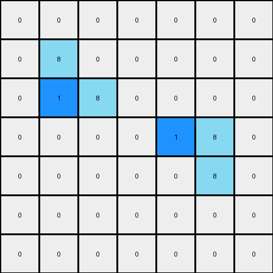
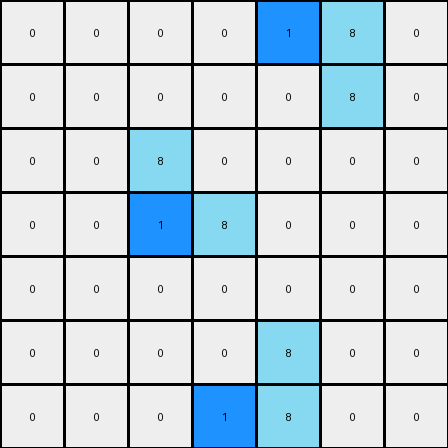

# 1-3aa6fb7a • 007 • refine_dreamer

---

Previous Code:
```python
"""
1.  **Identify Objects:** Find all contiguous blocks of azure (8) pixels. These are the target objects.
2.  **Iterate:** For each azure object:
    a. **Determine Top and Bottom Rows:** Find the minimum and maximum row indices for the object.
    b. **Target Rows:**
        * Get the row immediately *below* the top row.
        * Get the row immediately *above* the bottom row.
    c. **Select Pixel in Each Target Row:**
       * If a target row exists, and contains azure pixels:
          *Find the right-most azure pixel in that target row.
          *Find the azure pixel immediately to the *left* of that right-most pixel.
          *If found, select this pixel.
    d. **Modify:** If a pixel is selected, change its color from azure (8) to blue (1).
3.  **Output:** The output grid is the modified input grid. All original pixels are unchanged except for those specifically modified within the azure objects.
"""

import numpy as np

def find_objects(grid, color):
    # Find contiguous blocks of the specified color
    visited = np.zeros_like(grid, dtype=bool)
    objects = []

    def dfs(row, col, current_object):
        if (
            row < 0
            or row >= grid.shape[0]
            or col < 0
            or col >= grid.shape[1]
            or visited[row, col]
            or grid[row, col] != color
        ):
            return
        visited[row, col] = True
        current_object.append((row, col))
        dfs(row + 1, col, current_object)
        dfs(row - 1, col, current_object)
        dfs(row, col + 1, current_object)
        dfs(row, col - 1, current_object)

    for row in range(grid.shape[0]):
        for col in range(grid.shape[1]):
            if grid[row, col] == color and not visited[row, col]:
                current_object = []
                dfs(row, col, current_object)
                objects.append(current_object)
    return objects

def transform(input_grid):
    # Initialize output_grid as a copy of input_grid
    output_grid = np.copy(input_grid)
    
    # Find objects of color 8 (azure)
    azure_objects = find_objects(output_grid, 8)

    # Iterate through each azure object
    for obj in azure_objects:
        # Find the top and bottom rows of the object
        rows = [pixel[0] for pixel in obj]
        top_row = min(rows)
        bottom_row = max(rows)
        
        #select the target rows
        target_rows = []
        if top_row + 1 in rows:
            target_rows.append(top_row+1)
        if bottom_row - 1 in rows:
            target_rows.append(bottom_row - 1)


        #select the second rightmost pixel in each target row
        for target_row in target_rows:
            target_pixels = [pixel for pixel in obj if pixel[0] == target_row and output_grid[pixel[0], pixel[1]] == 8]
            if len(target_pixels) > 1:
                target_pixels_sorted = sorted(target_pixels, key=lambda x: x[1], reverse=True)
                second_rightmost_pixel = target_pixels_sorted[1]

                output_grid[second_rightmost_pixel[0], second_rightmost_pixel[1]] = 1


    return output_grid
```

Train Set Results:

## Example 1:**

Input:
```
0 0 0 0 0 0 0
0 8 0 0 0 0 0
0 8 8 0 0 0 0
0 0 0 0 8 8 0
0 0 0 0 0 8 0
0 0 0 0 0 0 0
0 0 0 0 0 0 0
```
Expected Output:
```
0 0 0 0 0 0 0
0 8 1 0 0 0 0
0 8 8 0 0 0 0
0 0 0 0 8 8 0
0 0 0 0 1 8 0
0 0 0 0 0 0 0
0 0 0 0 0 0 0
```
Transformed Output:
```
0 0 0 0 0 0 0
0 8 0 0 0 0 0
0 1 8 0 0 0 0
0 0 0 0 1 8 0
0 0 0 0 0 8 0
0 0 0 0 0 0 0
0 0 0 0 0 0 0
```

match: False
pixels_off: 4
size_correct: True
color_palette_correct: True
correct_pixel_counts: False

## Example 2:**

Input:
```
0 0 0 0 8 8 0
0 0 0 0 0 8 0
0 0 8 0 0 0 0
0 0 8 8 0 0 0
0 0 0 0 0 0 0
0 0 0 0 8 0 0
0 0 0 8 8 0 0
```
Expected Output:
```
0 0 0 0 8 8 0
0 0 0 0 1 8 0
0 0 8 1 0 0 0
0 0 8 8 0 0 0
0 0 0 0 0 0 0
0 0 0 1 8 0 0
0 0 0 8 8 0 0
```
Transformed Output:
```
0 0 0 0 1 8 0
0 0 0 0 0 8 0
0 0 8 0 0 0 0
0 0 1 8 0 0 0
0 0 0 0 0 0 0
0 0 0 0 8 0 0
0 0 0 1 8 0 0
```

match: False
pixels_off: 6
size_correct: True
color_palette_correct: True
correct_pixel_counts: False
**INSTRUCTIONS**

The code above was generated based on observations from the first training
example

we have tested the transform function on each of the task example inputs and
compared with the expected output

review each of the examples provided and the results and consider how the
natural language program should be updated to accommodate this new knowledge

respond with the following deliverables:

- general assessment of the information provided and strategy for resolving the
  errors
- gather metrics about each of the examples and results - use code_execution to
  develop accurate reports on your assumptions
- a YAML block documenting facts - Focus on identifying objects, their properties, and the actions performed on them.
- a natural language program - Be as clear and concise as possible, providing a complete description of the transformation rule.


your responses should be considered as information in a report - not a
conversation
