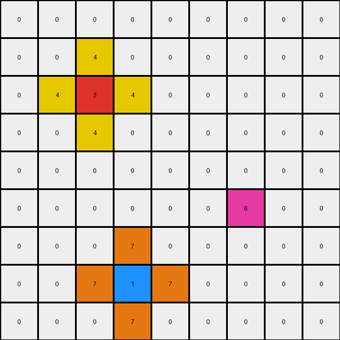

# 2-0ca9ddb6 • 013 • refine_dreamer

---

Previous Code:
```python
"""
1.  **Copy Unchanged:** If an azure (8) or magenta (6) pixel is present in the input, copy it directly to the output grid at the same position.
2.  **Blue Pixel (1) Transformation:** For each blue pixel:
    *   Place an orange (7) pixel immediately to its left and right.
    *   Place an orange (7) pixel immediately above and below.
3.  **Red Pixel (2) Transformation:** For each red pixel:
    *   Place a yellow (4) pixel immediately above and below.
    *  Place a yellow (4) pixel immediately to its left and right.
4. **Ignore other colors**: all other colors in the grid should be ignored.
"""

import numpy as np

def transform(input_grid):
    """Transforms the input grid according to the specified rules."""
    output_grid = np.copy(input_grid)
    height = input_grid.shape[0]
    width = input_grid.shape[1]

    # Iterate through each cell of the input grid
    for r in range(height):
        for c in range(width):
            # Copy Unchanged: Azure (8) and Magenta (6)
            if input_grid[r, c] == 8 or input_grid[r,c] == 6:
                output_grid[r, c] = input_grid[r,c]
            # Blue Pixel (1) Transformation
            elif input_grid[r, c] == 1:
                # Place orange (7) to the left
                if c > 0:
                    output_grid[r, c - 1] = 7
                # Place orange (7) to the right
                if c < width - 1:
                    output_grid[r, c + 1] = 7
                # Place orange (7) above
                if r > 0:
                    output_grid[r - 1, c] = 7
                # Place orange (7) below
                if r < height - 1:
                    output_grid[r + 1, c] = 7
            # Red Pixel (2) Transformation
            elif input_grid[r, c] == 2:
                # Place yellow (4) above
                if r > 0:
                    output_grid[r - 1, c] = 4
                # Place yellow (4) below
                if r < height - 1:
                    output_grid[r + 1, c] = 4
                # Place yellow(4) to the left
                if c > 0:
                  output_grid[r,c-1] = 4
                # Place yellow(4) to the right
                if c < width - 1:
                  output_grid[r,c+1] = 4

    return output_grid
```

Train Set Results:

## Example 1:**

Input:
```
0 0 0 0 0 0 0 0 0
0 0 0 0 0 0 0 0 0
0 0 0 0 0 0 0 0 0
0 0 2 0 0 0 0 0 0
0 0 0 0 0 0 0 0 0
0 0 0 0 0 0 0 0 0
0 0 0 0 0 0 1 0 0
0 0 0 0 0 0 0 0 0
0 0 0 0 0 0 0 0 0
```
Expected Output:
```
0 0 0 0 0 0 0 0 0
0 0 0 0 0 0 0 0 0
0 4 0 4 0 0 0 0 0
0 0 2 0 0 0 0 0 0
0 4 0 4 0 0 0 0 0
0 0 0 0 0 0 7 0 0
0 0 0 0 0 7 1 7 0
0 0 0 0 0 0 7 0 0
0 0 0 0 0 0 0 0 0
```
Transformed Output:
```
0 0 0 0 0 0 0 0 0
0 0 0 0 0 0 0 0 0
0 0 4 0 0 0 0 0 0
0 4 2 4 0 0 0 0 0
0 0 4 0 0 0 0 0 0
0 0 0 0 0 0 7 0 0
0 0 0 0 0 7 1 7 0
0 0 0 0 0 0 7 0 0
0 0 0 0 0 0 0 0 0
```

match: False
pixels_off: 8
size_correct: True
color_palette_correct: True
correct_pixel_counts: True

## Example 2:**

Input:
```
0 0 0 8 0 0 0 0 0
0 0 0 0 0 0 0 0 0
0 0 0 0 0 0 2 0 0
0 0 1 0 0 0 0 0 0
0 0 0 0 0 0 0 0 0
0 0 0 0 0 0 0 0 0
0 0 0 0 0 0 1 0 0
0 2 0 0 0 0 0 0 0
0 0 0 0 0 0 0 0 0
```
Expected Output:
```
0 0 0 8 0 0 0 0 0
0 0 0 0 0 4 0 4 0
0 0 7 0 0 0 2 0 0
0 7 1 7 0 4 0 4 0
0 0 7 0 0 0 0 0 0
0 0 0 0 0 0 7 0 0
4 0 4 0 0 7 1 7 0
0 2 0 0 0 0 7 0 0
4 0 4 0 0 0 0 0 0
```
Transformed Output:
```
0 0 0 8 0 0 0 0 0
0 0 0 0 0 0 4 0 0
0 0 7 0 0 4 2 4 0
0 7 1 7 0 0 4 0 0
0 0 7 0 0 0 0 0 0
0 0 0 0 0 0 7 0 0
0 4 0 0 0 7 1 7 0
4 2 4 0 0 0 7 0 0
0 4 0 0 0 0 0 0 0
```

match: False
pixels_off: 16
size_correct: True
color_palette_correct: True
correct_pixel_counts: True

## Example 3:**

Input:
```
0 0 0 0 0 0 0 0 0
0 0 0 0 0 0 0 0 0
0 0 2 0 0 0 0 0 0
0 0 0 0 0 0 0 0 0
0 0 0 0 0 0 0 0 0
0 0 0 0 0 0 6 0 0
0 0 0 0 0 0 0 0 0
0 0 0 1 0 0 0 0 0
0 0 0 0 0 0 0 0 0
```
Expected Output:
```
0 0 0 0 0 0 0 0 0
0 4 0 4 0 0 0 0 0
0 0 2 0 0 0 0 0 0
0 4 0 4 0 0 0 0 0
0 0 0 0 0 0 0 0 0
0 0 0 0 0 0 6 0 0
0 0 0 7 0 0 0 0 0
0 0 7 1 7 0 0 0 0
0 0 0 7 0 0 0 0 0
```
Transformed Output:
```
0 0 0 0 0 0 0 0 0
0 0 4 0 0 0 0 0 0
0 4 2 4 0 0 0 0 0
0 0 4 0 0 0 0 0 0
0 0 0 0 0 0 0 0 0
0 0 0 0 0 0 6 0 0
0 0 0 7 0 0 0 0 0
0 0 7 1 7 0 0 0 0
0 0 0 7 0 0 0 0 0
```

match: False
pixels_off: 8
size_correct: True
color_palette_correct: True
correct_pixel_counts: True
**INSTRUCTIONS**

The code above was generated based on observations from the first training
example

we have tested the transform function on each of the task example inputs and
compared with the expected output

review each of the examples provided and the results and consider how the
natural language program should be updated to accommodate this new knowledge

respond with the following deliverables:

- general assessment of the information provided and strategy for resolving the
  errors
- gather metrics about each of the examples and results - use code_execution to
  develop accurate reports on your assumptions
- a YAML block documenting facts - Focus on identifying objects, their properties, and the actions performed on them.
- a natural language program - Be as clear and concise as possible, providing a complete description of the transformation rule.


your responses should be considered as information in a report - not a
conversation
