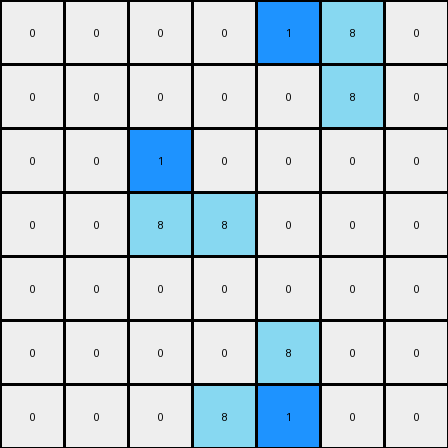

# 1-3aa6fb7a • 005 • refine_dreamer

---


Previous Code:
```python
"""
1.  **Identify:** Locate all pixels with the value '8' (azure) within the input grid.

2.  **Locate 2x2 subgrids**:  Wherever a 2x2 subgrid is found, inspect for
    diagonal pairs of 8s.

3.  **Check for diagonal adjacency**: If the 2x2 area contains an 8 in the
    top-left and bottom-right, change the top-left 8 to a 1. If the 2x2 area
    contains an 8 in the top-right and bottom-left, change the bottom-right 8 to
    a 1.

4.  **Transform:** Apply the transform as the 2x2 subgrids are evaluated.

5.  **Output:** Produce the modified grid.
"""

import numpy as np

def transform(input_grid):
    """Transforms the input grid according to the specified rules."""
    output_grid = np.copy(input_grid)
    rows, cols = input_grid.shape

    # Iterate through the grid, checking 2x2 subgrids
    for i in range(rows - 1):
        for j in range(cols - 1):
            # Define the 2x2 subgrid
            subgrid = input_grid[i:i+2, j:j+2]

            # Check for diagonal patterns
            if subgrid[0, 0] == 8 and subgrid[1, 1] == 8:
                output_grid[i, j] = 1  # Top-left to 1
            elif subgrid[0, 1] == 8 and subgrid[1, 0] == 8:
                output_grid[i + 1, j + 1] = 1  # Bottom-right to 1

    return output_grid
```

Train Set Results:

## Example 1:**

Input:
```
0 0 0 0 0 0 0
0 8 0 0 0 0 0
0 8 8 0 0 0 0
0 0 0 0 8 8 0
0 0 0 0 0 8 0
0 0 0 0 0 0 0
0 0 0 0 0 0 0
```
Expected Output:
```
0 0 0 0 0 0 0
0 8 1 0 0 0 0
0 8 8 0 0 0 0
0 0 0 0 8 8 0
0 0 0 0 1 8 0
0 0 0 0 0 0 0
0 0 0 0 0 0 0
```
Transformed Output:
```
0 0 0 0 0 0 0
0 1 0 0 0 0 0
0 8 8 0 0 0 0
0 0 0 0 1 8 0
0 0 0 0 0 8 0
0 0 0 0 0 0 0
0 0 0 0 0 0 0
```

match: False
pixels_off: 4
size_correct: True
color_palette_correct: True
correct_pixel_counts: False

## Example 2:**

Input:
```
0 0 0 0 8 8 0
0 0 0 0 0 8 0
0 0 8 0 0 0 0
0 0 8 8 0 0 0
0 0 0 0 0 0 0
0 0 0 0 8 0 0
0 0 0 8 8 0 0
```
Expected Output:
```
0 0 0 0 8 8 0
0 0 0 0 1 8 0
0 0 8 1 0 0 0
0 0 8 8 0 0 0
0 0 0 0 0 0 0
0 0 0 1 8 0 0
0 0 0 8 8 0 0
```
Transformed Output:
```
0 0 0 0 1 8 0
0 0 0 0 0 8 0
0 0 1 0 0 0 0
0 0 8 8 0 0 0
0 0 0 0 0 0 0
0 0 0 0 8 0 0
0 0 0 8 1 0 0
```

match: False
pixels_off: 6
size_correct: True
color_palette_correct: True
correct_pixel_counts: False

**INSTRUCTIONS**

The code above was generated based on observations from the first training
example

we have tested the transform function on each of the task example inputs and
compared with the expected output

review each of the examples provided and the results and consider how the
natural language program should be updated to accommodate this new knowledge

respond with the following deliverables:

- general assessment of the information provided and strategy for resolving the
  errors
- gather metrics about each of the examples and results - use code_execution to
  develop accurate reports on your assumptions
- a YAML block documenting facts - Focus on identifying objects, their properties, and the actions performed on them.
- a natural language program - Be as clear and concise as possible, providing a complete description of the transformation rule.


your responses should be considered as information in a report - not a
conversation
