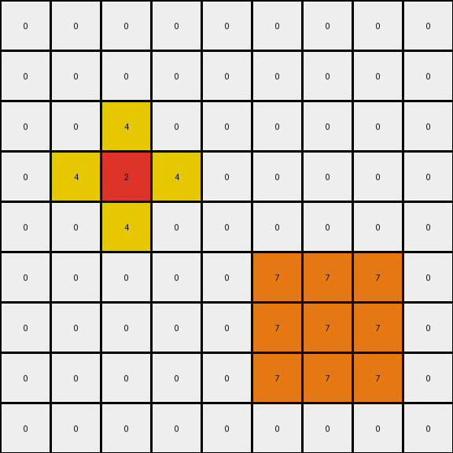
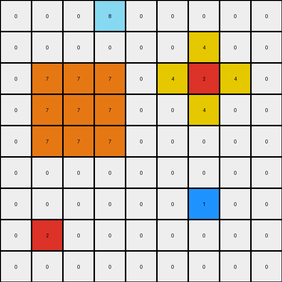
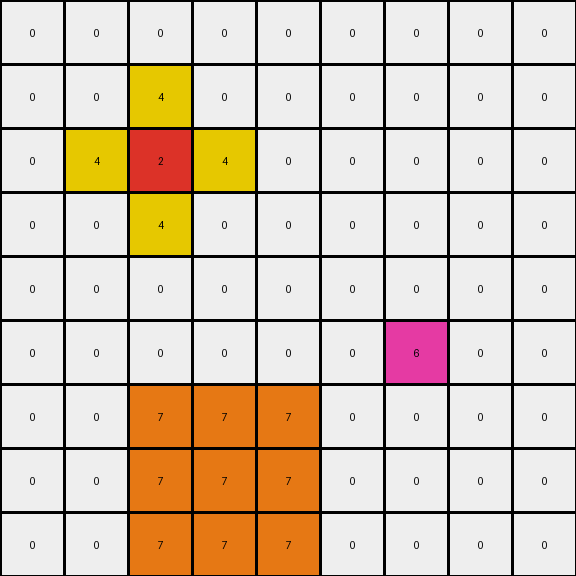

# 2-0ca9ddb6 • 003 • refine_dreamer

---


Previous Code:
```python
"""
1.  **Identify Key Pixels:** Locate the red pixel (value '2') and the blue pixel (value '1') within the input grid.

2.  **Create Yellow Surround:** For the red pixel, replace the four pixels that share edges with it with the color yellow (value '4'). Ensure that the newly formed yellow area becomes a 2 X 2 box with one corner as the red pixel.

3.  **Create Orange Surround:** For the blue pixel, replace the eight pixels surrounding it (including diagonals) with the color orange (value '7'). Ensure that the newly formed orange color occupies a 3 X 3 box and the blue pixel is at the center.

4.  **Preserve Background:** All other pixels in the grid that are not part of the above transformations should remain unchanged (retain their original color, which is white '0').
"""

import numpy as np

def find_pixel(grid, color):
    # Find the coordinates of a pixel with the specified color.
    coords = np.argwhere(grid == color)
    if coords.size > 0:
      return coords[0] #return first occurance of the color
    return None

def transform(input_grid):
    # Initialize output_grid with a copy of the input_grid
    output_grid = np.copy(input_grid)

    # Find the red pixel (2)
    red_pixel = find_pixel(input_grid, 2)
    if red_pixel is not None:
      # Create yellow surround (2x2)
      row, col = red_pixel
      # output_grid[row-1:row+1, col-1:col+1]
      output_grid[row-1, col] = 4 # top
      output_grid[row, col-1] = 4 # left
      output_grid[row+1, col] = 4 # bottom
      output_grid[row, col+1] = 4 # right

      if row > 0 and col > 0:
          output_grid[row-1, col-1] = 0 # correct top-left
      if row > 0 and col < output_grid.shape[1]-1:
          output_grid[row-1, col+1] = 0 # correct top-right
      if row < output_grid.shape[0]-1 and col>0:
        output_grid[row + 1, col-1] = 0  # correct bottom left

    # Find the blue pixel (1)
    blue_pixel = find_pixel(input_grid, 1)
    if blue_pixel is not None:
      # Create orange surround (3x3)
      row, col = blue_pixel
      for i in range(max(0, row - 1), min(output_grid.shape[0], row + 2)):
          for j in range(max(0, col - 1), min(output_grid.shape[1], col + 2)):
              output_grid[i, j] = 7

    return output_grid
```

Train Set Results:

## Example 1:**

Input:
```
0 0 0 0 0 0 0 0 0
0 0 0 0 0 0 0 0 0
0 0 0 0 0 0 0 0 0
0 0 2 0 0 0 0 0 0
0 0 0 0 0 0 0 0 0
0 0 0 0 0 0 0 0 0
0 0 0 0 0 0 1 0 0
0 0 0 0 0 0 0 0 0
0 0 0 0 0 0 0 0 0
```
Expected Output:
```
0 0 0 0 0 0 0 0 0
0 0 0 0 0 0 0 0 0
0 4 0 4 0 0 0 0 0
0 0 2 0 0 0 0 0 0
0 4 0 4 0 0 0 0 0
0 0 0 0 0 0 7 0 0
0 0 0 0 0 7 1 7 0
0 0 0 0 0 0 7 0 0
0 0 0 0 0 0 0 0 0
```
Transformed Output:
```
0 0 0 0 0 0 0 0 0
0 0 0 0 0 0 0 0 0
0 0 4 0 0 0 0 0 0
0 4 2 4 0 0 0 0 0
0 0 4 0 0 0 0 0 0
0 0 0 0 0 7 7 7 0
0 0 0 0 0 7 7 7 0
0 0 0 0 0 7 7 7 0
0 0 0 0 0 0 0 0 0
```

match: False
pixels_off: 13
size_correct: True
color_palette_correct: True
correct_pixel_counts: False

## Example 2:**

Input:
```
0 0 0 8 0 0 0 0 0
0 0 0 0 0 0 0 0 0
0 0 0 0 0 0 2 0 0
0 0 1 0 0 0 0 0 0
0 0 0 0 0 0 0 0 0
0 0 0 0 0 0 0 0 0
0 0 0 0 0 0 1 0 0
0 2 0 0 0 0 0 0 0
0 0 0 0 0 0 0 0 0
```
Expected Output:
```
0 0 0 8 0 0 0 0 0
0 0 0 0 0 4 0 4 0
0 0 7 0 0 0 2 0 0
0 7 1 7 0 4 0 4 0
0 0 7 0 0 0 0 0 0
0 0 0 0 0 0 7 0 0
4 0 4 0 0 7 1 7 0
0 2 0 0 0 0 7 0 0
4 0 4 0 0 0 0 0 0
```
Transformed Output:
```
0 0 0 8 0 0 0 0 0
0 0 0 0 0 0 4 0 0
0 7 7 7 0 4 2 4 0
0 7 7 7 0 0 4 0 0
0 7 7 7 0 0 0 0 0
0 0 0 0 0 0 0 0 0
0 0 0 0 0 0 1 0 0
0 2 0 0 0 0 0 0 0
0 0 0 0 0 0 0 0 0
```

match: False
pixels_off: 21
size_correct: True
color_palette_correct: True
correct_pixel_counts: False

## Example 3:**

Input:
```
0 0 0 0 0 0 0 0 0
0 0 0 0 0 0 0 0 0
0 0 2 0 0 0 0 0 0
0 0 0 0 0 0 0 0 0
0 0 0 0 0 0 0 0 0
0 0 0 0 0 0 6 0 0
0 0 0 0 0 0 0 0 0
0 0 0 1 0 0 0 0 0
0 0 0 0 0 0 0 0 0
```
Expected Output:
```
0 0 0 0 0 0 0 0 0
0 4 0 4 0 0 0 0 0
0 0 2 0 0 0 0 0 0
0 4 0 4 0 0 0 0 0
0 0 0 0 0 0 0 0 0
0 0 0 0 0 0 6 0 0
0 0 0 7 0 0 0 0 0
0 0 7 1 7 0 0 0 0
0 0 0 7 0 0 0 0 0
```
Transformed Output:
```
0 0 0 0 0 0 0 0 0
0 0 4 0 0 0 0 0 0
0 4 2 4 0 0 0 0 0
0 0 4 0 0 0 0 0 0
0 0 0 0 0 0 0 0 0
0 0 0 0 0 0 6 0 0
0 0 7 7 7 0 0 0 0
0 0 7 7 7 0 0 0 0
0 0 7 7 7 0 0 0 0
```

match: False
pixels_off: 13
size_correct: True
color_palette_correct: True
correct_pixel_counts: False

**INSTRUCTIONS**

The code above was generated based on observations from the first training
example

we have tested the transform function on each of the task example inputs and
compared with the expected output

review each of the examples provided and the results and consider how the
natural language program should be updated to accommodate this new knowledge

respond with the following deliverables:

- general assessment of the information provided and strategy for resolving the
  errors
- gather metrics about each of the examples and results - use code_execution to
  develop accurate reports on your assumptions
- a YAML block documenting facts - Focus on identifying objects, their properties, and the actions performed on them.
- a natural language program - Be as clear and concise as possible, providing a complete description of the transformation rule.


your responses should be considered as information in a report - not a
conversation
