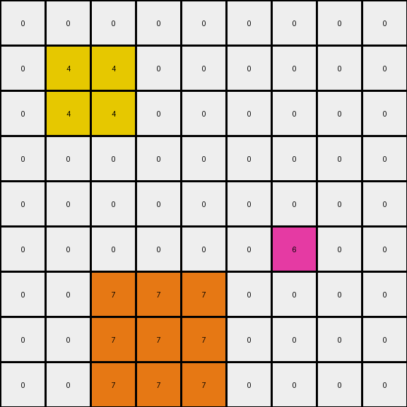

# 2-0ca9ddb6 • 005 • refine_dreamer

---


Previous Code:
```python
"""
1.  **Locate Key Pixels:** Identify all red pixels (value '2') and blue pixels (value '1') within the input grid.

2.  **Create 2x2 Yellow Surrounds:** For each red pixel:
    *   Create a 2x2 square of yellow (value '4') pixels.
    *   The red pixel should be one of the four in the square.

3.  **Create 3x3 Orange Surrounds:** For each blue pixel:
    *   Create a 3x3 square of orange (value '7') pixels.
    *   The blue pixel will be at the center of this 3x3 square.

4. **Preserve Background:** Ensure all other pixels that are not part of the yellow or orange surrounds retain their original colors (in the task, the background is white '0'). The output should only contain values of 0, 1, 2, 4, and 7.

5. **Overlapping surrounds** The output should not contain the original red and blue pixels. They should be replaced by the surround.
"""

import numpy as np

def find_pixels(grid, color):
    # Find the coordinates of all pixels with the specified color.
    return np.argwhere(grid == color)

def transform(input_grid):
    # Initialize output_grid with a copy of the input_grid
    output_grid = np.copy(input_grid)

    # Find all red pixels (2)
    red_pixels = find_pixels(input_grid, 2)
    for red_pixel in red_pixels:
        # Create 2x2 yellow surround
        row, col = red_pixel
        for i in range(max(0, row - 1), min(output_grid.shape[0], row + 1)):
            for j in range(max(0, col - 1), min(output_grid.shape[1], col + 1)):
                output_grid[i, j] = 4


    # Find all blue pixels (1)
    blue_pixels = find_pixels(input_grid, 1)
    for blue_pixel in blue_pixels:
        # Create 3x3 orange surround
        row, col = blue_pixel
        for i in range(max(0, row - 1), min(output_grid.shape[0], row + 2)):
            for j in range(max(0, col - 1), min(output_grid.shape[1], col + 2)):
                output_grid[i, j] = 7

    return output_grid
```

Train Set Results:

## Example 1:**

Input:
```
0 0 0 0 0 0 0 0 0
0 0 0 0 0 0 0 0 0
0 0 0 0 0 0 0 0 0
0 0 2 0 0 0 0 0 0
0 0 0 0 0 0 0 0 0
0 0 0 0 0 0 0 0 0
0 0 0 0 0 0 1 0 0
0 0 0 0 0 0 0 0 0
0 0 0 0 0 0 0 0 0
```
Expected Output:
```
0 0 0 0 0 0 0 0 0
0 0 0 0 0 0 0 0 0
0 4 0 4 0 0 0 0 0
0 0 2 0 0 0 0 0 0
0 4 0 4 0 0 0 0 0
0 0 0 0 0 0 7 0 0
0 0 0 0 0 7 1 7 0
0 0 0 0 0 0 7 0 0
0 0 0 0 0 0 0 0 0
```
Transformed Output:
```
0 0 0 0 0 0 0 0 0
0 0 0 0 0 0 0 0 0
0 4 4 0 0 0 0 0 0
0 4 4 0 0 0 0 0 0
0 0 0 0 0 0 0 0 0
0 0 0 0 0 7 7 7 0
0 0 0 0 0 7 7 7 0
0 0 0 0 0 7 7 7 0
0 0 0 0 0 0 0 0 0
```

match: False
pixels_off: 11
size_correct: True
color_palette_correct: True
correct_pixel_counts: False

## Example 2:**

Input:
```
0 0 0 8 0 0 0 0 0
0 0 0 0 0 0 0 0 0
0 0 0 0 0 0 2 0 0
0 0 1 0 0 0 0 0 0
0 0 0 0 0 0 0 0 0
0 0 0 0 0 0 0 0 0
0 0 0 0 0 0 1 0 0
0 2 0 0 0 0 0 0 0
0 0 0 0 0 0 0 0 0
```
Expected Output:
```
0 0 0 8 0 0 0 0 0
0 0 0 0 0 4 0 4 0
0 0 7 0 0 0 2 0 0
0 7 1 7 0 4 0 4 0
0 0 7 0 0 0 0 0 0
0 0 0 0 0 0 7 0 0
4 0 4 0 0 7 1 7 0
0 2 0 0 0 0 7 0 0
4 0 4 0 0 0 0 0 0
```
Transformed Output:
```
0 0 0 8 0 0 0 0 0
0 0 0 0 0 4 4 0 0
0 7 7 7 0 4 4 0 0
0 7 7 7 0 0 0 0 0
0 7 7 7 0 0 0 0 0
0 0 0 0 0 7 7 7 0
4 4 0 0 0 7 7 7 0
4 4 0 0 0 7 7 7 0
0 0 0 0 0 0 0 0 0
```

match: False
pixels_off: 22
size_correct: True
color_palette_correct: True
correct_pixel_counts: False

## Example 3:**

Input:
```
0 0 0 0 0 0 0 0 0
0 0 0 0 0 0 0 0 0
0 0 2 0 0 0 0 0 0
0 0 0 0 0 0 0 0 0
0 0 0 0 0 0 0 0 0
0 0 0 0 0 0 6 0 0
0 0 0 0 0 0 0 0 0
0 0 0 1 0 0 0 0 0
0 0 0 0 0 0 0 0 0
```
Expected Output:
```
0 0 0 0 0 0 0 0 0
0 4 0 4 0 0 0 0 0
0 0 2 0 0 0 0 0 0
0 4 0 4 0 0 0 0 0
0 0 0 0 0 0 0 0 0
0 0 0 0 0 0 6 0 0
0 0 0 7 0 0 0 0 0
0 0 7 1 7 0 0 0 0
0 0 0 7 0 0 0 0 0
```
Transformed Output:
```
0 0 0 0 0 0 0 0 0
0 4 4 0 0 0 0 0 0
0 4 4 0 0 0 0 0 0
0 0 0 0 0 0 0 0 0
0 0 0 0 0 0 0 0 0
0 0 0 0 0 0 6 0 0
0 0 7 7 7 0 0 0 0
0 0 7 7 7 0 0 0 0
0 0 7 7 7 0 0 0 0
```

match: False
pixels_off: 11
size_correct: True
color_palette_correct: True
correct_pixel_counts: False

**INSTRUCTIONS**

The code above was generated based on observations from the first training
example

we have tested the transform function on each of the task example inputs and
compared with the expected output

review each of the examples provided and the results and consider how the
natural language program should be updated to accommodate this new knowledge

respond with the following deliverables:

- general assessment of the information provided and strategy for resolving the
  errors
- gather metrics about each of the examples and results - use code_execution to
  develop accurate reports on your assumptions
- a YAML block documenting facts - Focus on identifying objects, their properties, and the actions performed on them.
- a natural language program - Be as clear and concise as possible, providing a complete description of the transformation rule.


your responses should be considered as information in a report - not a
conversation
