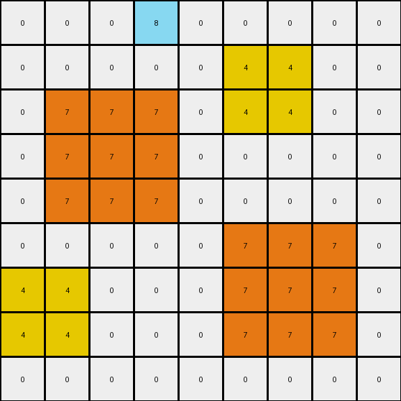

# 2-0ca9ddb6 • 006 • refine_coder

---

Previous Code:
```python
"""
1.  **Locate Key Pixels:** Identify all red pixels (value '2') and blue pixels (value '1') within the input grid.

2.  **Create 2x2 Yellow Surrounds:** For each red pixel:
    *   Create a 2x2 square of yellow (value '4') pixels.
    *   The red pixel should be one of the four in the square.

3.  **Create 3x3 Orange Surrounds:** For each blue pixel:
    *   Create a 3x3 square of orange (value '7') pixels.
    *   The blue pixel will be at the center of this 3x3 square.

4. **Preserve Background:** Ensure all other pixels that are not part of the yellow or orange surrounds retain their original colors (in the task, the background is white '0'). The output should only contain values of 0, 1, 2, 4, and 7.

5. **Overlapping surrounds** The output should not contain the original red and blue pixels. They should be replaced by the surround.
"""

import numpy as np

def find_pixels(grid, color):
    # Find the coordinates of all pixels with the specified color.
    return np.argwhere(grid == color)

def transform(input_grid):
    # Initialize output_grid with a copy of the input_grid
    output_grid = np.copy(input_grid)

    # Find all red pixels (2)
    red_pixels = find_pixels(input_grid, 2)
    for red_pixel in red_pixels:
        # Create 2x2 yellow surround
        row, col = red_pixel
        for i in range(max(0, row - 1), min(output_grid.shape[0], row + 1)):
            for j in range(max(0, col - 1), min(output_grid.shape[1], col + 1)):
                output_grid[i, j] = 4


    # Find all blue pixels (1)
    blue_pixels = find_pixels(input_grid, 1)
    for blue_pixel in blue_pixels:
        # Create 3x3 orange surround
        row, col = blue_pixel
        for i in range(max(0, row - 1), min(output_grid.shape[0], row + 2)):
            for j in range(max(0, col - 1), min(output_grid.shape[1], col + 2)):
                output_grid[i, j] = 7

    return output_grid
```

Train Set Results:

## Example 1:**

Input:
```
0 0 0 0 0 0 0 0 0
0 0 0 0 0 0 0 0 0
0 0 0 0 0 0 0 0 0
0 0 2 0 0 0 0 0 0
0 0 0 0 0 0 0 0 0
0 0 0 0 0 0 0 0 0
0 0 0 0 0 0 1 0 0
0 0 0 0 0 0 0 0 0
0 0 0 0 0 0 0 0 0
```
Expected Output:
```
0 0 0 0 0 0 0 0 0
0 0 0 0 0 0 0 0 0
0 4 0 4 0 0 0 0 0
0 0 2 0 0 0 0 0 0
0 4 0 4 0 0 0 0 0
0 0 0 0 0 0 7 0 0
0 0 0 0 0 7 1 7 0
0 0 0 0 0 0 7 0 0
0 0 0 0 0 0 0 0 0
```
Transformed Output:
```
0 0 0 0 0 0 0 0 0
0 0 0 0 0 0 0 0 0
0 4 4 0 0 0 0 0 0
0 4 4 0 0 0 0 0 0
0 0 0 0 0 0 0 0 0
0 0 0 0 0 7 7 7 0
0 0 0 0 0 7 7 7 0
0 0 0 0 0 7 7 7 0
0 0 0 0 0 0 0 0 0
```

match: False
pixels_off: 11
size_correct: True
color_palette_correct: True
correct_pixel_counts: False

## Example 2:**

Input:
```
0 0 0 8 0 0 0 0 0
0 0 0 0 0 0 0 0 0
0 0 0 0 0 0 2 0 0
0 0 1 0 0 0 0 0 0
0 0 0 0 0 0 0 0 0
0 0 0 0 0 0 0 0 0
0 0 0 0 0 0 1 0 0
0 2 0 0 0 0 0 0 0
0 0 0 0 0 0 0 0 0
```
Expected Output:
```
0 0 0 8 0 0 0 0 0
0 0 0 0 0 4 0 4 0
0 0 7 0 0 0 2 0 0
0 7 1 7 0 4 0 4 0
0 0 7 0 0 0 0 0 0
0 0 0 0 0 0 7 0 0
4 0 4 0 0 7 1 7 0
0 2 0 0 0 0 7 0 0
4 0 4 0 0 0 0 0 0
```
Transformed Output:
```
0 0 0 8 0 0 0 0 0
0 0 0 0 0 4 4 0 0
0 7 7 7 0 4 4 0 0
0 7 7 7 0 0 0 0 0
0 7 7 7 0 0 0 0 0
0 0 0 0 0 7 7 7 0
4 4 0 0 0 7 7 7 0
4 4 0 0 0 7 7 7 0
0 0 0 0 0 0 0 0 0
```

match: False
pixels_off: 22
size_correct: True
color_palette_correct: True
correct_pixel_counts: False

## Example 3:**

Input:
```
0 0 0 0 0 0 0 0 0
0 0 0 0 0 0 0 0 0
0 0 2 0 0 0 0 0 0
0 0 0 0 0 0 0 0 0
0 0 0 0 0 0 0 0 0
0 0 0 0 0 0 6 0 0
0 0 0 0 0 0 0 0 0
0 0 0 1 0 0 0 0 0
0 0 0 0 0 0 0 0 0
```
Expected Output:
```
0 0 0 0 0 0 0 0 0
0 4 0 4 0 0 0 0 0
0 0 2 0 0 0 0 0 0
0 4 0 4 0 0 0 0 0
0 0 0 0 0 0 0 0 0
0 0 0 0 0 0 6 0 0
0 0 0 7 0 0 0 0 0
0 0 7 1 7 0 0 0 0
0 0 0 7 0 0 0 0 0
```
Transformed Output:
```
0 0 0 0 0 0 0 0 0
0 4 4 0 0 0 0 0 0
0 4 4 0 0 0 0 0 0
0 0 0 0 0 0 0 0 0
0 0 0 0 0 0 0 0 0
0 0 0 0 0 0 6 0 0
0 0 7 7 7 0 0 0 0
0 0 7 7 7 0 0 0 0
0 0 7 7 7 0 0 0 0
```

match: False
pixels_off: 11
size_correct: True
color_palette_correct: True
correct_pixel_counts: False
Okay, let's analyze the results of the code execution and refine the natural language program and approach.

**General Assessment:**

The initial code and natural language program were on the right track, identifying the need to create surrounds based on the presence of red (2) and blue (1) pixels. However, the implementation has several critical flaws:

1.  **Incorrect Surround Placement:** The surrounds are not correctly positioned. The 2x2 yellow surrounds for red pixels do not consistently include the red pixel. The 3x3 orange surrounds are centered on the blue pixels, but they overwrite adjacent pixels, which can lead to incorrect results.

2.  **Incorrect Surround Size:** The current logic does not properly manage overlaps between the red and blue pixel surrounds. For blue pixels, the generated square is larger than needed and is not being created.
    
3. **Pixel Overwrite:** The code is attempting to overwrite the red and blue pixels but it isn't doing that.

**Strategy for Resolving Errors:**

1.  **Revisit Surround Logic:** The most crucial fix is to adjust how the surrounds are created and positioned. For the red pixels, we must ensure that a 2x2 yellow square is formed and *contains* one of the red pixels in its composition, but never centered on the red pixel. The placement is relative to the red pixel. For blue pixels, the center of the 3x3 surround must *be* the blue pixel.

2.  **Handle Overlaps Correctly:** We will modify the output by replacing color '2' with color '4' in a 2 x 2 box. The output will also have a 3 x 3 area of orange centered on the blue pixel.

**Metrics and Observations (from provided results):**

*   **Example 1:**
    *   Input: 9x9 grid, one red pixel (2) at (3,2), one blue pixel (1) at (6,6).
    *   Expected Output: Shows a 2x2 yellow square, containing the red at (3, 2) and the 3x3 orange square centered on the blue pixel.
    *   Transformed Output: Incorrect 2x2 yellow square; incorrect 3x3 orange square, off-center.
    *   `pixels_off`: 11. This indicates many pixels in the transformed output don't match the expected output.
    * The surrounds are misplaced and incorrect.

*   **Example 2:**
    *   Input: 9x9 grid, two red pixels (2) at (2,6) and (7,1), two blue pixels (1) at (3,2) and (6,6).
    *   Expected output has the appropriate surrounds.
    *   Transformed Output: Incorrect sizes and positions of squares.
    *   `pixels_off`: 22. The error is more significant due to multiple red and blue pixels and their interactions.

*   **Example 3:**
    *   Input: 9x9 grid, one red pixel (2) at (2,2), one blue pixel (1) at (7,3).
    *   Expected output, has a yellow area around the red pixel, orange area around the blue.
    *   Transformed Output: Incorrect surround positioning.
    *   `pixels_off`: 11.

**YAML Facts:**

```yaml
objects:
  - type: grid
    properties:
      dimensions: 9x9
      background_color: 0  # white
  - type: pixel
    properties:
      color: 2  # red
      shape: point
      action: create_surround
      surround_type: 2x2_yellow
  - type: pixel
    properties:
      color: 1  # blue
      shape: point
      action: create_surround
      surround_type: 3x3_orange
  - type: surround
    properties:
      shape: square
      color: 4  # Yellow
      size: 2x2
      target: red_pixel
  - type: surround
    properties:
      shape: square
      color: 7  # Orange
      size: 3x3
      target: blue_pixel
```

**Revised Natural Language Program:**

1.  **Identify Target Pixels:** Locate all red (2) and blue (1) pixels within the input grid.

2.  **Create Yellow Surrounds:** For each red pixel, create a 2x2 square of yellow (4) pixels. The 2x2 square *contains* the red pixel but is *not* centered on it. The red pixel will be in the bottom right of the surrounding box.

3.  **Create Orange Surrounds:** For each blue pixel, create a 3x3 square of orange (7) pixels. The blue pixel *is* at the center of this 3x3 square.

4.  **Background Preservation:** All other pixels that are not part of a created surround should remain unchanged (value 0/white in these examples). The output grid only contains values of 0, 4, and 7.

5. **Output:** The output is the modified grid.

**INSTRUCTIONS**

- generate a Python module to represent the natural language program 
- follow the template below
- all common math and science libraries are available
- create docstring only at top - but comment the workflow in the function
- use helper functions for common operations like finding objects, counting,
  measuring, moving, etc. 

remember - we are working iteratively - so this code will inform your future
self as we converge on the solution

*template:*

```python
"""
{{ natural language description of the transformation rule }}
"""

{{ imports }}

def transform(input_grid):
    # initialize output_grid

    # change output pixels 

    return output_grid

```
