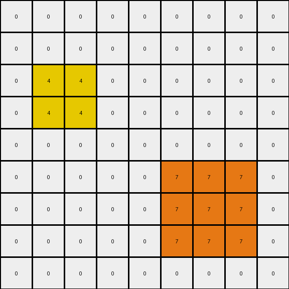
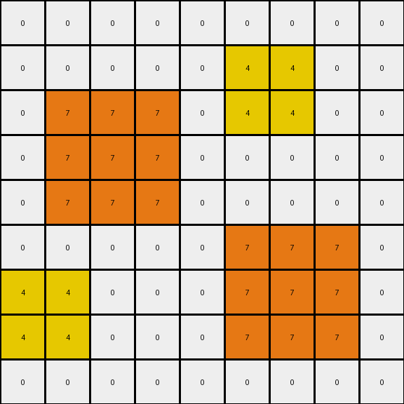
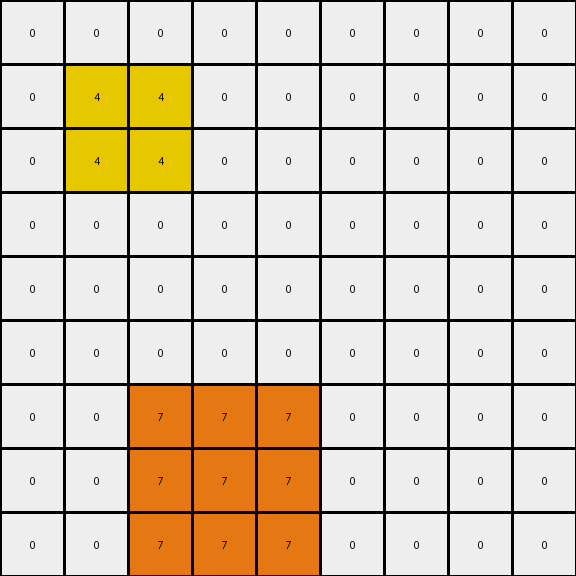

# 2-0ca9ddb6 • 007 • refine_dreamer

---


Previous Code:
```python
"""
1.  **Identify Target Pixels:** Locate all red (2) and blue (1) pixels within the input grid.

2.  **Create Yellow Surrounds:** For each red pixel, create a 2x2 square of yellow (4) pixels. The 2x2 square *contains* the red pixel but is *not* centered on it. The red pixel will be in the bottom right of the surrounding box.

3.  **Create Orange Surrounds:** For each blue pixel, create a 3x3 square of orange (7) pixels. The blue pixel *is* at the center of this 3x3 square.

4.  **Background Preservation:** All other pixels that are not part of a created surround should remain unchanged (value 0/white in these examples). The output grid only contains values of 0, 4, and 7.

5. **Output:** The output is the modified grid.
"""

import numpy as np

def find_pixels(grid, color):
    # Find the coordinates of all pixels with the specified color.
    return np.argwhere(grid == color)

def transform(input_grid):
    # Initialize output_grid with zeros, same dimensions as input.  This ensures
    # that any pixel not explicitly changed will be 0 (white).
    output_grid = np.zeros_like(input_grid)

    # Create Yellow Surrounds for Red Pixels
    red_pixels = find_pixels(input_grid, 2)
    for red_pixel in red_pixels:
        row, col = red_pixel
        # Create the 2x2 yellow surround.  The red pixel will be at the bottom-right.
        for i in range(row - 1, row + 1):
            for j in range(col - 1, col + 1):
                if 0 <= i < output_grid.shape[0] and 0 <= j < output_grid.shape[1]:
                    output_grid[i, j] = 4

    # Create Orange Surrounds for Blue Pixels
    blue_pixels = find_pixels(input_grid, 1)
    for blue_pixel in blue_pixels:
        row, col = blue_pixel
        # Create the 3x3 orange surround, centered on the blue pixel.
        for i in range(row - 1, row + 2):
            for j in range(col - 1, col + 2):
                if 0 <= i < output_grid.shape[0] and 0 <= j < output_grid.shape[1]:
                    output_grid[i, j] = 7

    return output_grid
```

Train Set Results:

## Example 1:**

Input:
```
0 0 0 0 0 0 0 0 0
0 0 0 0 0 0 0 0 0
0 0 0 0 0 0 0 0 0
0 0 2 0 0 0 0 0 0
0 0 0 0 0 0 0 0 0
0 0 0 0 0 0 0 0 0
0 0 0 0 0 0 1 0 0
0 0 0 0 0 0 0 0 0
0 0 0 0 0 0 0 0 0
```
Expected Output:
```
0 0 0 0 0 0 0 0 0
0 0 0 0 0 0 0 0 0
0 4 0 4 0 0 0 0 0
0 0 2 0 0 0 0 0 0
0 4 0 4 0 0 0 0 0
0 0 0 0 0 0 7 0 0
0 0 0 0 0 7 1 7 0
0 0 0 0 0 0 7 0 0
0 0 0 0 0 0 0 0 0
```
Transformed Output:
```
0 0 0 0 0 0 0 0 0
0 0 0 0 0 0 0 0 0
0 4 4 0 0 0 0 0 0
0 4 4 0 0 0 0 0 0
0 0 0 0 0 0 0 0 0
0 0 0 0 0 7 7 7 0
0 0 0 0 0 7 7 7 0
0 0 0 0 0 7 7 7 0
0 0 0 0 0 0 0 0 0
```

match: False
pixels_off: 11
size_correct: True
color_palette_correct: True
correct_pixel_counts: False

## Example 2:**

Input:
```
0 0 0 8 0 0 0 0 0
0 0 0 0 0 0 0 0 0
0 0 0 0 0 0 2 0 0
0 0 1 0 0 0 0 0 0
0 0 0 0 0 0 0 0 0
0 0 0 0 0 0 0 0 0
0 0 0 0 0 0 1 0 0
0 2 0 0 0 0 0 0 0
0 0 0 0 0 0 0 0 0
```
Expected Output:
```
0 0 0 8 0 0 0 0 0
0 0 0 0 0 4 0 4 0
0 0 7 0 0 0 2 0 0
0 7 1 7 0 4 0 4 0
0 0 7 0 0 0 0 0 0
0 0 0 0 0 0 7 0 0
4 0 4 0 0 7 1 7 0
0 2 0 0 0 0 7 0 0
4 0 4 0 0 0 0 0 0
```
Transformed Output:
```
0 0 0 0 0 0 0 0 0
0 0 0 0 0 4 4 0 0
0 7 7 7 0 4 4 0 0
0 7 7 7 0 0 0 0 0
0 7 7 7 0 0 0 0 0
0 0 0 0 0 7 7 7 0
4 4 0 0 0 7 7 7 0
4 4 0 0 0 7 7 7 0
0 0 0 0 0 0 0 0 0
```

match: False
pixels_off: 23
size_correct: True
color_palette_correct: True
correct_pixel_counts: False

## Example 3:**

Input:
```
0 0 0 0 0 0 0 0 0
0 0 0 0 0 0 0 0 0
0 0 2 0 0 0 0 0 0
0 0 0 0 0 0 0 0 0
0 0 0 0 0 0 0 0 0
0 0 0 0 0 0 6 0 0
0 0 0 0 0 0 0 0 0
0 0 0 1 0 0 0 0 0
0 0 0 0 0 0 0 0 0
```
Expected Output:
```
0 0 0 0 0 0 0 0 0
0 4 0 4 0 0 0 0 0
0 0 2 0 0 0 0 0 0
0 4 0 4 0 0 0 0 0
0 0 0 0 0 0 0 0 0
0 0 0 0 0 0 6 0 0
0 0 0 7 0 0 0 0 0
0 0 7 1 7 0 0 0 0
0 0 0 7 0 0 0 0 0
```
Transformed Output:
```
0 0 0 0 0 0 0 0 0
0 4 4 0 0 0 0 0 0
0 4 4 0 0 0 0 0 0
0 0 0 0 0 0 0 0 0
0 0 0 0 0 0 0 0 0
0 0 0 0 0 0 0 0 0
0 0 7 7 7 0 0 0 0
0 0 7 7 7 0 0 0 0
0 0 7 7 7 0 0 0 0
```

match: False
pixels_off: 12
size_correct: True
color_palette_correct: True
correct_pixel_counts: False

**INSTRUCTIONS**

The code above was generated based on observations from the first training
example

we have tested the transform function on each of the task example inputs and
compared with the expected output

review each of the examples provided and the results and consider how the
natural language program should be updated to accommodate this new knowledge

respond with the following deliverables:

- general assessment of the information provided and strategy for resolving the
  errors
- gather metrics about each of the examples and results - use code_execution to
  develop accurate reports on your assumptions
- a YAML block documenting facts - Focus on identifying objects, their properties, and the actions performed on them.
- a natural language program - Be as clear and concise as possible, providing a complete description of the transformation rule.


your responses should be considered as information in a report - not a
conversation
