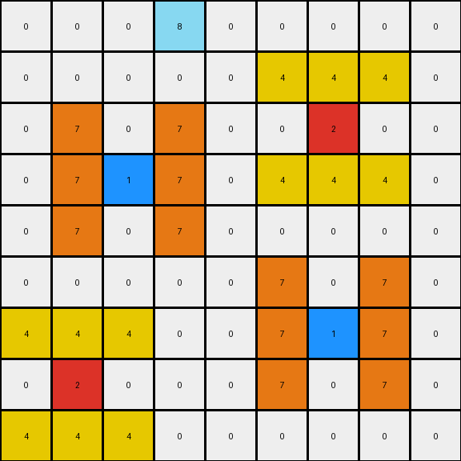
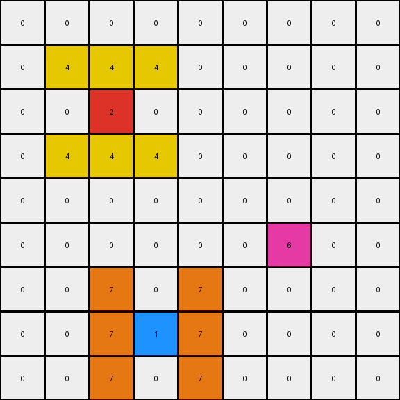

# 2-0ca9ddb6 • 011 • refine_dreamer

---

Previous Code:
```python
"""
1.  **Identify Key Pixels:** Locate all pixels in the input grid that are not white (0). These are our key pixels.
2.  **Preserve Azure:** If an azure (8) pixel is present, copy it directly to the output grid at the same position.
3. **Mirror/reflection rule for Blue (1):** For each blue pixel.
   - Create a new orange pixel with value 7 to the right and at left of the original blue pixel
   - Create two new orange pixels with value 7 mirrored vertically with same horizontal shift

4.  **Mirror/reflection rule for Red (2):** For each red pixel.
   - Create a new yellow pixel with value 4 above and under of the original blue pixel
   - Create two new yellow pixels with value 4 mirrored horizontally with same vertical shift
"""

import numpy as np

def transform(input_grid):
    """Transforms the input grid according to the specified rules."""
    output_grid = np.copy(input_grid)

    # Find key pixels (non-white pixels)
    key_pixels = []
    for r in range(input_grid.shape[0]):
        for c in range(input_grid.shape[1]):
            if input_grid[r, c] != 0:
                key_pixels.append((r, c, input_grid[r, c]))

    # Process key pixels
    for r, c, color in key_pixels:
        # Preserve Azure
        if color == 8:
            output_grid[r, c] = 8
        # Mirror/reflection rule for Blue (1)
        elif color == 1:
            output_grid[r,c] = 1 # keep original
            if c+1 < output_grid.shape[1]:
              output_grid[r, c + 1] = 7  # right
            if c-1 >= 0:
              output_grid[r, c - 1] = 7  # left
            
            if r+1 < output_grid.shape[0]:
                if c+1 < output_grid.shape[1]:
                  output_grid[r+1, c + 1] = 7 # bottom right
                if c-1 >= 0:
                  output_grid[r+1, c - 1] = 7  # bottom left

            if r-1 >= 0:
                if c+1 < output_grid.shape[1]:
                  output_grid[r-1, c + 1] = 7 # top right
                if c-1 >= 0:
                    output_grid[r-1, c - 1] = 7 # top left
            
        # Mirror/reflection rule for Red (2)
        elif color == 2:
            output_grid[r,c] = 2 # keep original
            if r - 1 >= 0:
                output_grid[r - 1, c] = 4  # Up
            if r + 1 < output_grid.shape[0]:
                output_grid[r + 1, c] = 4  # Down

            if c - 1 >= 0:
                if r - 1 >= 0:
                    output_grid[r-1,c-1] = 4 # upper left
                if r+1 < output_grid.shape[0]:
                    output_grid[r+1,c-1] = 4
            
            if c + 1 < output_grid.shape[1]:
                if r - 1 >= 0:
                    output_grid[r-1,c+1] = 4 # upper right
                if r+1 < output_grid.shape[0]:
                    output_grid[r+1,c+1] = 4

    return output_grid
```

Train Set Results:

## Example 1:**

Input:
```
0 0 0 0 0 0 0 0 0
0 0 0 0 0 0 0 0 0
0 0 0 0 0 0 0 0 0
0 0 2 0 0 0 0 0 0
0 0 0 0 0 0 0 0 0
0 0 0 0 0 0 0 0 0
0 0 0 0 0 0 1 0 0
0 0 0 0 0 0 0 0 0
0 0 0 0 0 0 0 0 0
```
Expected Output:
```
0 0 0 0 0 0 0 0 0
0 0 0 0 0 0 0 0 0
0 4 0 4 0 0 0 0 0
0 0 2 0 0 0 0 0 0
0 4 0 4 0 0 0 0 0
0 0 0 0 0 0 7 0 0
0 0 0 0 0 7 1 7 0
0 0 0 0 0 0 7 0 0
0 0 0 0 0 0 0 0 0
```
Transformed Output:
```
0 0 0 0 0 0 0 0 0
0 0 0 0 0 0 0 0 0
0 4 4 4 0 0 0 0 0
0 0 2 0 0 0 0 0 0
0 4 4 4 0 0 0 0 0
0 0 0 0 0 7 0 7 0
0 0 0 0 0 7 1 7 0
0 0 0 0 0 7 0 7 0
0 0 0 0 0 0 0 0 0
```

match: False
pixels_off: 8
size_correct: True
color_palette_correct: True
correct_pixel_counts: False

## Example 2:**

Input:
```
0 0 0 8 0 0 0 0 0
0 0 0 0 0 0 0 0 0
0 0 0 0 0 0 2 0 0
0 0 1 0 0 0 0 0 0
0 0 0 0 0 0 0 0 0
0 0 0 0 0 0 0 0 0
0 0 0 0 0 0 1 0 0
0 2 0 0 0 0 0 0 0
0 0 0 0 0 0 0 0 0
```
Expected Output:
```
0 0 0 8 0 0 0 0 0
0 0 0 0 0 4 0 4 0
0 0 7 0 0 0 2 0 0
0 7 1 7 0 4 0 4 0
0 0 7 0 0 0 0 0 0
0 0 0 0 0 0 7 0 0
4 0 4 0 0 7 1 7 0
0 2 0 0 0 0 7 0 0
4 0 4 0 0 0 0 0 0
```
Transformed Output:
```
0 0 0 8 0 0 0 0 0
0 0 0 0 0 4 4 4 0
0 7 0 7 0 0 2 0 0
0 7 1 7 0 4 4 4 0
0 7 0 7 0 0 0 0 0
0 0 0 0 0 7 0 7 0
4 4 4 0 0 7 1 7 0
0 2 0 0 0 7 0 7 0
4 4 4 0 0 0 0 0 0
```

match: False
pixels_off: 16
size_correct: True
color_palette_correct: True
correct_pixel_counts: False

## Example 3:**

Input:
```
0 0 0 0 0 0 0 0 0
0 0 0 0 0 0 0 0 0
0 0 2 0 0 0 0 0 0
0 0 0 0 0 0 0 0 0
0 0 0 0 0 0 0 0 0
0 0 0 0 0 0 6 0 0
0 0 0 0 0 0 0 0 0
0 0 0 1 0 0 0 0 0
0 0 0 0 0 0 0 0 0
```
Expected Output:
```
0 0 0 0 0 0 0 0 0
0 4 0 4 0 0 0 0 0
0 0 2 0 0 0 0 0 0
0 4 0 4 0 0 0 0 0
0 0 0 0 0 0 0 0 0
0 0 0 0 0 0 6 0 0
0 0 0 7 0 0 0 0 0
0 0 7 1 7 0 0 0 0
0 0 0 7 0 0 0 0 0
```
Transformed Output:
```
0 0 0 0 0 0 0 0 0
0 4 4 4 0 0 0 0 0
0 0 2 0 0 0 0 0 0
0 4 4 4 0 0 0 0 0
0 0 0 0 0 0 0 0 0
0 0 0 0 0 0 6 0 0
0 0 7 0 7 0 0 0 0
0 0 7 1 7 0 0 0 0
0 0 7 0 7 0 0 0 0
```

match: False
pixels_off: 8
size_correct: True
color_palette_correct: True
correct_pixel_counts: False
**INSTRUCTIONS**

The code above was generated based on observations from the first training
example

we have tested the transform function on each of the task example inputs and
compared with the expected output

review each of the examples provided and the results and consider how the
natural language program should be updated to accommodate this new knowledge

respond with the following deliverables:

- general assessment of the information provided and strategy for resolving the
  errors
- gather metrics about each of the examples and results - use code_execution to
  develop accurate reports on your assumptions
- a YAML block documenting facts - Focus on identifying objects, their properties, and the actions performed on them.
- a natural language program - Be as clear and concise as possible, providing a complete description of the transformation rule.


your responses should be considered as information in a report - not a
conversation
