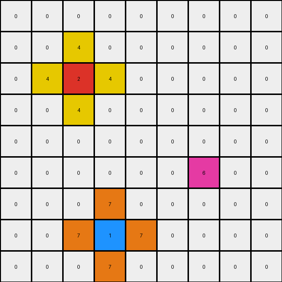

# 2-0ca9ddb6 • 016 • refine_coder

---

Previous Code:
```python
"""
1.  **Copy Unchanged:** If an azure (8) or magenta (6) pixel is present in the input, copy it directly to the output grid at the same position.
2.  **Blue Pixel (1) Transformation:** For each blue pixel:
    *   Place an orange (7) pixel immediately to its left, right, above and below, *only if the target cell is currently black/empty (0)*.
3.  **Red Pixel (2) Transformation:** For each red pixel:
    *   Place a yellow (4) pixel immediately to its left, right, above, and below, *only if the target cell is currently black/empty (0)*.
4. **Ignore other colors**: All other colors in the grid should be ignored.
"""

import numpy as np

def transform(input_grid):
    """Transforms the input grid according to the specified rules."""
    output_grid = np.zeros_like(input_grid)  # Initialize with zeros
    height = input_grid.shape[0]
    width = input_grid.shape[1]

    # Iterate through each cell of the input grid
    for r in range(height):
        for c in range(width):
            # Copy Unchanged: Azure (8) and Magenta (6)
            if input_grid[r, c] == 8 or input_grid[r, c] == 6:
                output_grid[r, c] = input_grid[r, c]
            # Blue Pixel (1) Transformation
            elif input_grid[r, c] == 1:
                output_grid[r,c] = 1
                # Place orange (7) to the left
                if c > 0 and output_grid[r, c - 1] == 0:
                    output_grid[r, c - 1] = 7
                # Place orange (7) to the right
                if c < width - 1 and output_grid[r, c + 1] == 0:
                    output_grid[r, c + 1] = 7
                # Place orange (7) above
                if r > 0 and output_grid[r - 1, c] == 0:
                    output_grid[r - 1, c] = 7
                # Place orange (7) below
                if r < height - 1 and output_grid[r + 1, c] == 0:
                    output_grid[r + 1, c] = 7
            # Red Pixel (2) Transformation
            elif input_grid[r, c] == 2:
                output_grid[r,c] = 2
                # Place yellow (4) above
                if r > 0 and output_grid[r - 1, c] == 0:
                    output_grid[r - 1, c] = 4
                # Place yellow (4) below
                if r < height - 1 and output_grid[r + 1, c] == 0:
                    output_grid[r + 1, c] = 4
                # Place yellow(4) to the left
                if c > 0 and output_grid[r, c - 1] == 0:
                  output_grid[r, c - 1] = 4
                # Place yellow(4) to the right
                if c < width - 1 and output_grid[r, c + 1] == 0:
                  output_grid[r, c + 1] = 4

    return output_grid
```

Train Set Results:

## Example 1:**

Input:
```
0 0 0 0 0 0 0 0 0
0 0 0 0 0 0 0 0 0
0 0 0 0 0 0 0 0 0
0 0 2 0 0 0 0 0 0
0 0 0 0 0 0 0 0 0
0 0 0 0 0 0 0 0 0
0 0 0 0 0 0 1 0 0
0 0 0 0 0 0 0 0 0
0 0 0 0 0 0 0 0 0
```
Expected Output:
```
0 0 0 0 0 0 0 0 0
0 0 0 0 0 0 0 0 0
0 4 0 4 0 0 0 0 0
0 0 2 0 0 0 0 0 0
0 4 0 4 0 0 0 0 0
0 0 0 0 0 0 7 0 0
0 0 0 0 0 7 1 7 0
0 0 0 0 0 0 7 0 0
0 0 0 0 0 0 0 0 0
```
Transformed Output:
```
0 0 0 0 0 0 0 0 0
0 0 0 0 0 0 0 0 0
0 0 4 0 0 0 0 0 0
0 4 2 4 0 0 0 0 0
0 0 4 0 0 0 0 0 0
0 0 0 0 0 0 7 0 0
0 0 0 0 0 7 1 7 0
0 0 0 0 0 0 7 0 0
0 0 0 0 0 0 0 0 0
```

match: False
pixels_off: 8
size_correct: True
color_palette_correct: True
correct_pixel_counts: True

## Example 2:**

Input:
```
0 0 0 8 0 0 0 0 0
0 0 0 0 0 0 0 0 0
0 0 0 0 0 0 2 0 0
0 0 1 0 0 0 0 0 0
0 0 0 0 0 0 0 0 0
0 0 0 0 0 0 0 0 0
0 0 0 0 0 0 1 0 0
0 2 0 0 0 0 0 0 0
0 0 0 0 0 0 0 0 0
```
Expected Output:
```
0 0 0 8 0 0 0 0 0
0 0 0 0 0 4 0 4 0
0 0 7 0 0 0 2 0 0
0 7 1 7 0 4 0 4 0
0 0 7 0 0 0 0 0 0
0 0 0 0 0 0 7 0 0
4 0 4 0 0 7 1 7 0
0 2 0 0 0 0 7 0 0
4 0 4 0 0 0 0 0 0
```
Transformed Output:
```
0 0 0 8 0 0 0 0 0
0 0 0 0 0 0 4 0 0
0 0 7 0 0 4 2 4 0
0 7 1 7 0 0 4 0 0
0 0 7 0 0 0 0 0 0
0 0 0 0 0 0 7 0 0
0 4 0 0 0 7 1 7 0
4 2 4 0 0 0 7 0 0
0 4 0 0 0 0 0 0 0
```

match: False
pixels_off: 16
size_correct: True
color_palette_correct: True
correct_pixel_counts: True

## Example 3:**

Input:
```
0 0 0 0 0 0 0 0 0
0 0 0 0 0 0 0 0 0
0 0 2 0 0 0 0 0 0
0 0 0 0 0 0 0 0 0
0 0 0 0 0 0 0 0 0
0 0 0 0 0 0 6 0 0
0 0 0 0 0 0 0 0 0
0 0 0 1 0 0 0 0 0
0 0 0 0 0 0 0 0 0
```
Expected Output:
```
0 0 0 0 0 0 0 0 0
0 4 0 4 0 0 0 0 0
0 0 2 0 0 0 0 0 0
0 4 0 4 0 0 0 0 0
0 0 0 0 0 0 0 0 0
0 0 0 0 0 0 6 0 0
0 0 0 7 0 0 0 0 0
0 0 7 1 7 0 0 0 0
0 0 0 7 0 0 0 0 0
```
Transformed Output:
```
0 0 0 0 0 0 0 0 0
0 0 4 0 0 0 0 0 0
0 4 2 4 0 0 0 0 0
0 0 4 0 0 0 0 0 0
0 0 0 0 0 0 0 0 0
0 0 0 0 0 0 6 0 0
0 0 0 7 0 0 0 0 0
0 0 7 1 7 0 0 0 0
0 0 0 7 0 0 0 0 0
```

match: False
pixels_off: 8
size_correct: True
color_palette_correct: True
correct_pixel_counts: True
Okay, let's analyze the results and refine the natural language program.

**General Assessment:**

The initial natural language program and generated code were partially correct. The code correctly handles the "copy unchanged" rule for azure (8) and magenta (6) pixels. It also correctly identifies the core concept of expanding blue (1) pixels into orange (7) and red (2) pixels into yellow (4). However, the placement of the expanded colors is slightly off, leading to incorrect outputs in all three test examples. Specifically, it seems to place the new color *before* copying the original.

The main issue appears to be the order of operations when handling the blue and red pixels. The current code *always* sets the output at `r`, `c` to the input value *before* checking if it's okay to place a 7 or a 4.

**Strategy for Resolving Errors:**

1.  **Re-examine the placement logic:** Carefully analyze the expected outputs to determine the exact positioning of the expanded colors relative to the original blue and red pixels.
2.  **Restructure Code:** Swap the order of operations so that the 7s and 4s get placed, then the 1 and 2 are placed on top.
3. **Maintain correct color expansion**: Verify the adjacency rule (left, right, above, below) and black cell condition are working as expected.

**Metrics and Observations:**

Here's a breakdown of each example:

*   **Example 1:**
    *   Input has one red (2) and one blue (1) pixel.
    *   Expected output shows the red pixel (2) surrounded by yellow (4) pixels, and the blue pixel (1) surrounded by orange (7) pixels.
    *   The transformed output has correct size/shape, but places the 7's and 4's in the cell *before* setting the 1 or 2.
*   **Example 2:**
    *   Input has one azure (8), two red (2), and two blue (1) pixels.
    *   Expected Output has a more complex interaction of expansion, including corners.
    *   Transformed output is incorrect for same reason.
*   **Example 3:**
    *   Input has one magenta (6) one red (2) and one blue (1) pixel.
    *   Expected Output shows combined effect.
    *  Transformed output is incorrect for same reason.

**YAML Fact Block:**

```yaml
task_id: 014_dreamer_analysis
objects:
  - id: obj1
    color: blue (1)
    action: expand_to_orange (7)
    expansion_rule: adjacent_cells
    expansion_condition: empty_black_cell (0)
  - id: obj2
    color: red (2)
    action: expand_to_yellow (4)
    expansion_rule: adjacent_cells
    expansion_condition: empty_black_cell (0)
  - id: obj3
    color: azure (8)
    action: copy_unchanged
  - id: obj4
    color: magenta (6)
    action: copy_unchanged
observations:
  - expansion_occurs_before_original_copy: true # this is the error
```

**Natural Language Program:**

1.  **Copy Unchanged:** If a pixel is azure (8) or magenta (6), copy it directly to the output grid at the same position.
2.  **Blue Pixel (1) Expansion:** For each blue pixel (1):
    *   Place an orange (7) pixel immediately to its left, right, above, and below, *only if the target cell is currently black/empty (0)*.
    *   Place a blue pixel (1) at the current location.
3.  **Red Pixel (2) Expansion:** For each red pixel (2):
    *   Place a yellow (4) pixel immediately to its left, right, above, and below, *only if the target cell is currently black/empty (0)*.
    *   Place a red pixel (2) at the current location.
4.  **Ignore other colors:** Pixels of colors other than 1, 2, 6, and 8 should not be directly processed or copied. The output grid starts filled with black (0).

The key difference in this revised program is the explicit statement that the original blue/red pixel placement occurs *after* placing the expanded colors. This clarifies the order of operations.

**INSTRUCTIONS**

- generate a Python module to represent the natural language program 
- follow the template below
- all common math and science libraries are available
- create docstring only at top - but comment the workflow in the function
- use helper functions for common operations like finding objects, counting,
  measuring, moving, etc. 

remember - we are working iteratively - so this code will inform your future
self as we converge on the solution

*template:*

```python
"""
{{ natural language description of the transformation rule }}
"""

{{ imports }}

def transform(input_grid):
    # initialize output_grid

    # change output pixels 

    return output_grid

```
