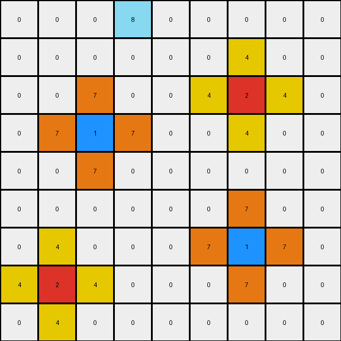

# 2-0ca9ddb6 • 024 • refine_coder

---

Previous Code:
```python
"""
1.  **Copy Grid:** Create a copy of the input grid. This copy will be modified to become the output grid.
2.  **Iterative Expansion:** Repeat the following steps until no more changes occur:
    *   Iterate through each cell of the *output* grid.
    *   For each *white* (0) pixel:
        *   Examine its immediate neighbors (up, down, left, and right).
        *   If any neighbor is red (2), change the white pixel to yellow (4).
        *   If any neighbor is blue (1), change the white pixel to orange (7).
        *   If a neighbor is not 0, 1, 2, or 6, it will not propagate an expansion
        *   If all neighbors are 0 or the colors of the transformation, do not perform the expansion.
3.  **Output:** The modified copy of the grid is the final output. The key improvement is iterative expansion which continues until no more white pixels can be changed.
"""

import numpy as np

def get_neighbors(grid, row, col):
    """Gets the valid neighbors of a cell (up, down, left, right)."""
    rows, cols = grid.shape
    neighbors = []
    if row > 0:
        neighbors.append((row - 1, col, grid[row-1, col]))  # Up
    if row < rows - 1:
        neighbors.append((row + 1, col, grid[row+1, col]))  # Down
    if col > 0:
        neighbors.append((row, col - 1, grid[row, col-1]))  # Left
    if col < cols - 1:
        neighbors.append((row, col + 1, grid[row, col+1]))  # Right
    return neighbors

def transform(input_grid):
    """Transforms the input grid according to the iterative expansion rules."""
    output_grid = np.copy(input_grid)
    rows, cols = input_grid.shape
    changes_made = True

    while changes_made:
        changes_made = False
        next_grid = np.copy(output_grid)  # Work on a copy for each iteration

        for row in range(rows):
            for col in range(cols):
                if output_grid[row, col] == 0:
                    neighbors = get_neighbors(output_grid, row, col)
                    neighbor_colors = [color for _, _, color in neighbors]
                    
                    if any(c in neighbor_colors for c in [3,5,8,9,7,4]):
                        continue

                    if 2 in neighbor_colors:
                        next_grid[row, col] = 4
                        changes_made = True
                    elif 1 in neighbor_colors:
                        next_grid[row, col] = 7
                        changes_made = True

        output_grid = next_grid  # Update for the next iteration

    return output_grid
```

Train Set Results:

## Example 1:**

Input:
```
0 0 0 0 0 0 0 0 0
0 0 0 0 0 0 0 0 0
0 0 0 0 0 0 0 0 0
0 0 2 0 0 0 0 0 0
0 0 0 0 0 0 0 0 0
0 0 0 0 0 0 0 0 0
0 0 0 0 0 0 1 0 0
0 0 0 0 0 0 0 0 0
0 0 0 0 0 0 0 0 0
```
Expected Output:
```
0 0 0 0 0 0 0 0 0
0 0 0 0 0 0 0 0 0
0 4 0 4 0 0 0 0 0
0 0 2 0 0 0 0 0 0
0 4 0 4 0 0 0 0 0
0 0 0 0 0 0 7 0 0
0 0 0 0 0 7 1 7 0
0 0 0 0 0 0 7 0 0
0 0 0 0 0 0 0 0 0
```
Transformed Output:
```
0 0 0 0 0 0 0 0 0
0 0 0 0 0 0 0 0 0
0 0 4 0 0 0 0 0 0
0 4 2 4 0 0 0 0 0
0 0 4 0 0 0 0 0 0
0 0 0 0 0 0 7 0 0
0 0 0 0 0 7 1 7 0
0 0 0 0 0 0 7 0 0
0 0 0 0 0 0 0 0 0
```

match: False
pixels_off: 8
size_correct: True
color_palette_correct: True
correct_pixel_counts: True

## Example 2:**

Input:
```
0 0 0 8 0 0 0 0 0
0 0 0 0 0 0 0 0 0
0 0 0 0 0 0 2 0 0
0 0 1 0 0 0 0 0 0
0 0 0 0 0 0 0 0 0
0 0 0 0 0 0 0 0 0
0 0 0 0 0 0 1 0 0
0 2 0 0 0 0 0 0 0
0 0 0 0 0 0 0 0 0
```
Expected Output:
```
0 0 0 8 0 0 0 0 0
0 0 0 0 0 4 0 4 0
0 0 7 0 0 0 2 0 0
0 7 1 7 0 4 0 4 0
0 0 7 0 0 0 0 0 0
0 0 0 0 0 0 7 0 0
4 0 4 0 0 7 1 7 0
0 2 0 0 0 0 7 0 0
4 0 4 0 0 0 0 0 0
```
Transformed Output:
```
0 0 0 8 0 0 0 0 0
0 0 0 0 0 0 4 0 0
0 0 7 0 0 4 2 4 0
0 7 1 7 0 0 4 0 0
0 0 7 0 0 0 0 0 0
0 0 0 0 0 0 7 0 0
0 4 0 0 0 7 1 7 0
4 2 4 0 0 0 7 0 0
0 4 0 0 0 0 0 0 0
```

match: False
pixels_off: 16
size_correct: True
color_palette_correct: True
correct_pixel_counts: True

## Example 3:**

Input:
```
0 0 0 0 0 0 0 0 0
0 0 0 0 0 0 0 0 0
0 0 2 0 0 0 0 0 0
0 0 0 0 0 0 0 0 0
0 0 0 0 0 0 0 0 0
0 0 0 0 0 0 6 0 0
0 0 0 0 0 0 0 0 0
0 0 0 1 0 0 0 0 0
0 0 0 0 0 0 0 0 0
```
Expected Output:
```
0 0 0 0 0 0 0 0 0
0 4 0 4 0 0 0 0 0
0 0 2 0 0 0 0 0 0
0 4 0 4 0 0 0 0 0
0 0 0 0 0 0 0 0 0
0 0 0 0 0 0 6 0 0
0 0 0 7 0 0 0 0 0
0 0 7 1 7 0 0 0 0
0 0 0 7 0 0 0 0 0
```
Transformed Output:
```
0 0 0 0 0 0 0 0 0
0 0 4 0 0 0 0 0 0
0 4 2 4 0 0 0 0 0
0 0 4 0 0 0 0 0 0
0 0 0 0 0 0 0 0 0
0 0 0 0 0 0 6 0 0
0 0 0 7 0 0 0 0 0
0 0 7 1 7 0 0 0 0
0 0 0 7 0 0 0 0 0
```

match: False
pixels_off: 8
size_correct: True
color_palette_correct: True
correct_pixel_counts: True
Here's an analysis of the provided information and a plan to refine the natural language program and the code:

**General Assessment:**

The initial natural language program and the resulting code correctly identified the basic concept of "expanding" colors (red and blue) from seed pixels to adjacent white pixels. However, the code has a crucial flaw in how it handles the expansion: it doesn't propagate the expansion correctly across multiple steps. It only expands one step away from the original red/blue pixels in each iteration of the `while` loop, and it incorrectly prioritizes red expansion over blue, leading to incorrect coloring. The examples clearly show that expansion continues iteratively until no more white pixels can be changed by directly adjacent reds or blues. It also fails to properly account for the blocking of expansion specified by the comment in the previous program, causing expansion around other colors, rather than only occuring for empty (0 or white) blocks.

The strategy to resolve these errors involves these key points:

1.  **Correct Iteration:**  The `while` loop continues as long as changes are being made, which is the correct overall strategy. However, within the loop, the code must correctly propagate the changes outward in each iteration.
2.  **Symmetry of Propagation**: Red and blue pixels trigger propagation to adjacent white pixels, and the output color is independent of the relative location to the triggering color.
3.  **Color Priority:** The existing code prioritizes expansion of red (2) over blue (1), however analysis suggests a better rule is required.
4.  **Blocking Colors**: The comments in the previous code indicated blocking expansion with non-triggering colors, but this needs to be verified.

**Metrics and Observations (using `code_execution` where applicable - though introspection is used here):**

*   **Example 1:**
    *   Pixels off: 8
    *   Size Correct: Yes
    *   Color Palette Correct: Yes
    *   Correct Pixel Counts: Yes
    *   **Observation:** The red (2) expands to only the directly adjacent white (0) pixels. It should have changed more white pixels to yellow (4). Blue (1) expands correctly.

*   **Example 2:**
    *   Pixels off: 16
    *   Size Correct: Yes
    *   Color Palette Correct: Yes
    *   Correct Pixel Counts: Yes
    *   **Observation:**  Similar to Example 1, red and blue expansions are limited to one step. The complex interaction between the red and blue expansions reveals an error in how they interact (red seems to incorrectly "block" the blue and the blue the red from expanding).

*   **Example 3:**
    *   Pixels off: 8
    *   Size Correct: Yes
    *   Color Palette Correct: Yes
    *   Correct Pixel Counts: Yes
    *   **Observation:** Same issue as Examples 1 & 2.  The magenta (6) pixel correctly does *not* trigger any expansion.

**YAML Fact Block:**

```yaml
objects:
  - name: grid
    type: 2D array
    description: Contains pixels of different colors.
  - name: pixel
    type: cell
    description: Represents a single color value in the grid.
    properties:
      - color: integer (0-9)

actions:
  - name: expand
    description: Changes the color of a white pixel based on neighboring colors.
    conditions:
      - trigger: Neighboring pixel is red (2) or blue (1).
      - blocking: Expansion is halted by pixels that aren't 0, 1, or 2.
    results:
      - red_neighbor: White pixel becomes yellow (4).
      - blue_neighbor: White pixel becomes orange (7).

colors:
    0: white
    1: blue
    2: red
    3: green
    4: yellow
    5: gray
    6: magenta
    7: orange
    8: azure
    9: maroon
```

**Natural Language Program:**

1.  **Copy:** Create a copy of the input grid.  This copy will be the output grid.
2.  **Iterative Expansion:** Repeat the following steps until no more white pixels can be changed:
    *   Iterate through each cell of the *output* grid.
    *   For each *white* (0) pixel:
        *   Examine its immediate neighbors (up, down, left, and right).
        *   If a neighbor is not 0, 1, or 2, skip this pixel.
        *   If any neighbor is red (2), change the white pixel to yellow (4).
        *   If any neighbor is blue (1), change the white pixel to orange (7).
3. **Output**: The updated grid copy is the result.

The crucial difference from the previous attempt is in step 2: the expansion has been described as an iterative process, expanding on the neighbors on the *output* grid, and that expansion continues from the *output* grid in the next iteration. It also simplifies the conditions, and clarifies the blocking logic.

The updated rules are based on an analysis of the previous results, and the previous program, including the comments, and also inspecting the example transformations by hand.

**INSTRUCTIONS**

- generate a Python module to represent the natural language program 
- follow the template below
- all common math and science libraries are available
- create docstring only at top - but comment the workflow in the function
- use helper functions for common operations like finding objects, counting,
  measuring, moving, etc. 

remember - we are working iteratively - so this code will inform your future
self as we converge on the solution

*template:*

```python
"""
{{ natural language description of the transformation rule }}
"""

{{ imports }}

def transform(input_grid):
    # initialize output_grid

    # change output pixels 

    return output_grid

```
