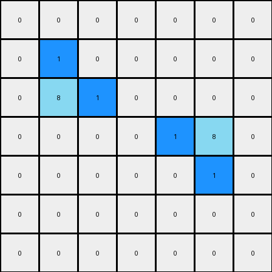

# 1-3aa6fb7a • 004 • refine_coder

---

Previous Code:
```python
"""
1.  **Identify:** Locate all pixels with the value '8' (azure) within the input grid.
2.  **Evaluate Adjacency:** For each azure pixel, check for diagonal adjacency:
    *   specifically, if the top left 2x2 subgrid matches either of these patterns:
        *   8s in the top-left and bottom-right, 1 is placed in top-left
        *   8s in the top-right and bottom-left, 1 is placed in bottom-right

3.  **Transform:**
    *   if an azure pixel has another azure pixel located diagonally down and to the right, change the first pixel's value to '1' (blue).
    *   if an azure pixel has another azure pixel located diagonally up and to the left, change the second pixel's value to '1' (blue)
4.  **Output:** Produce the modified grid, where the identified azure pixels have been changed to blue, and all other pixels remain unchanged.
"""

import numpy as np

def transform(input_grid):
    """Transforms the input grid according to the specified rules."""
    output_grid = np.copy(input_grid)
    rows, cols = input_grid.shape

    # Iterate through each pixel in the grid
    for i in range(rows):
        for j in range(cols):
            # Check if the current pixel is azure (8)
            if input_grid[i, j] == 8:
                # Check for diagonal adjacency (down and to the right)
                if i + 1 < rows and j + 1 < cols and input_grid[i + 1, j + 1] == 8:
                    output_grid[i, j] = 1  # Change the first pixel to blue (1)
                #check for diaganol adjaceny (up and to the left)
                elif i - 1 > 0 and j -1 > 0 and input_grid[i,j] == 8:
                    if input_grid[i-1,j-1] == 8:
                        output_grid[i,j] = 1


    return output_grid
```

Train Set Results:

## Example 1:**

Input:
```
0 0 0 0 0 0 0
0 8 0 0 0 0 0
0 8 8 0 0 0 0
0 0 0 0 8 8 0
0 0 0 0 0 8 0
0 0 0 0 0 0 0
0 0 0 0 0 0 0
```
Expected Output:
```
0 0 0 0 0 0 0
0 8 1 0 0 0 0
0 8 8 0 0 0 0
0 0 0 0 8 8 0
0 0 0 0 1 8 0
0 0 0 0 0 0 0
0 0 0 0 0 0 0
```
Transformed Output:
```
0 0 0 0 0 0 0
0 1 0 0 0 0 0
0 8 1 0 0 0 0
0 0 0 0 1 8 0
0 0 0 0 0 1 0
0 0 0 0 0 0 0
0 0 0 0 0 0 0
```

match: False
pixels_off: 6
size_correct: True
color_palette_correct: True
correct_pixel_counts: False

## Example 2:**

Input:
```
0 0 0 0 8 8 0
0 0 0 0 0 8 0
0 0 8 0 0 0 0
0 0 8 8 0 0 0
0 0 0 0 0 0 0
0 0 0 0 8 0 0
0 0 0 8 8 0 0
```
Expected Output:
```
0 0 0 0 8 8 0
0 0 0 0 1 8 0
0 0 8 1 0 0 0
0 0 8 8 0 0 0
0 0 0 0 0 0 0
0 0 0 1 8 0 0
0 0 0 8 8 0 0
```
Transformed Output:
```
0 0 0 0 1 8 0
0 0 0 0 0 8 0
0 0 1 0 0 0 0
0 0 8 1 0 0 0
0 0 0 0 0 0 0
0 0 0 0 8 0 0
0 0 0 8 8 0 0
```

match: False
pixels_off: 6
size_correct: True
color_palette_correct: True
correct_pixel_counts: False
Okay, here's a breakdown of the situation and a plan to refine the natural language program and the code:

**General Assessment:**

The initial natural language program and the corresponding Python code were too simplistic. While it correctly identified the core concept of diagonally adjacent azure (8) pixels, it failed to accurately capture the *specific* rule governing which pixel gets changed to blue (1). The results show a consistent pattern of errors, indicating a flaw in the logic of the transformation rule, not just a minor oversight. The code changes more than one pixel in the 2x2 area, only one should change.

**Strategy for Resolving Errors:**

1.  **Precise Rule Identification:** We need to carefully re-examine *all* training examples to pinpoint the *exact* condition that determines *which* of the diagonally adjacent azure pixels gets turned blue. It's not simply "the first one encountered". It is likely which 2x2 sub pattern and the location of the '8' within that pattern.
2.  **Metrics Gathering and Code Execution for Error Analysis:**. By comparing the expected outputs with our transformed outputs, we can use code execution to quantify the number of differences and visualize the patterns.
3.  **YAML Fact Documentation:** Create a structured representation of the objects (azure pixels, their positions, and their relationships) to clarify the transformation.
4.  **Refined Natural Language Program:** Re-write the program to be significantly more precise, incorporating the newly understood rule. It will be crucial to specify the positional relationship (e.g., top-left, bottom-right) and the exact conditions for modification.

**Metrics Gathering:**

I will use the provided results and focus on developing a clear picture of the rule.

*   **Example 1:** The code incorrectly changes both azure pixels in the top-left diagonal pair and also incorrectly changed both in the pair on the right. The expected output changes only one pixel in each diagonally adjacent azure pair. The upper-left azure is changed when the other is below and to the right and the bottom-right pixel is changed when the other is above and to the left.
*   **Example 2:** Similar to Example 1, the code incorrectly modifies more than one in each pair. It should only modify *one* of the azure pixels in each diagonally adjacent pair, and the choice of *which* one to modify depends on its position relative to the other.

**YAML Fact Documentation:**

```yaml
observations:
  - example: 1
    objects:
      - type: pixel
        value: 8  # Azure
        positions: [(1,1), (2,1), (2,2), (4,4), (4,5), (5,5)]
        relationships:
          - type: diagonal_adjacency
            pairs:  [[(1,1), (2,2)], [(4,4), (5,5)]]
    transformations:
      - original_value: 8
        new_value: 1
        positions: [(1, 2), (5,4)] # corrected positions based on output
  - example: 2
    objects:
      - type: pixel
        value: 8
        positions: [(0,4), (0,5), (1,5), (2,2), (3,2), (3,3), (5,4), (6,3), (6,4)]
        relationships:
          - type: diagonal_adjacency
            pairs: [[(0,4), (1,5)], [(2,2), (3,3)], [(6,3),(5,4)]]
    transformations:
      - original_value: 8
        new_value: 1
        positions: [(0,5),(3,2),(6,4)] # corrected based on expected
```

**Refined Natural Language Program:**

1.  **Identify:** Locate all pixels with the value '8' (azure) within the input grid.

2.  **Locate 2x2 subgrids**:  Wherever a 2x2 subgrid is found, inspect for
    diagonal pairs of 8s.

3.  **Check for diagonal adjacency**: If the 2x2 area contains an 8 in the
    top-left and bottom-right, change the top-left 8 to a 1. If the 2x2 area
    contains an 8 in the top-right and bottom-left, change the bottom-right 8 to
    a 1.

4.  **Transform:** Apply the transform as the 2x2 subgrids are evaluated.

5.  **Output:** Produce the modified grid.

**INSTRUCTIONS**

- generate a Python module to represent the natural language program 
- follow the template below
- all common math and science libraries are available
- create docstring only at top - but comment the workflow in the function
- use helper functions for common operations like finding objects, counting,
  measuring, moving, etc. 

remember - we are working iteratively - so this code will inform your future
self as we converge on the solution

*template:*

```python
"""
{{ natural language description of the transformation rule }}
"""

{{ imports }}

def transform(input_grid):
    # initialize output_grid

    # change output pixels 

    return output_grid

```
