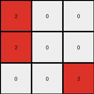
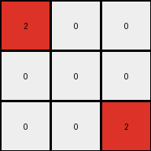

# 6-0520fde7 • 006 • refine_coder

---

Previous Code:
```python
"""
1.  **Initialize Output:** Create a 3x3 output grid filled with white pixels (color 0).

2.  Locate zero value pixels in input.

3.  **Iterate through zero value pixels**:
  *   if a zero value pixel in the input aligns with the output origin (0,0) and a color of 2 in the output, set the corresponding output to 2.
  *   if a zero value pixel in the input aligns with the output center (1,1) and a color of 2 in the output, set the corresponding output to 2.
  *   if a zero value pixel in the input aligns with the bottom right of the output (2,2) and a color of 2 in the output, set the corresponding output to 2.

4. **Return the output grid**
"""

import numpy as np

def get_zero_pixel_positions(grid):
    return np.argwhere(grid == 0)

def transform(input_grid):
    # Initialize a 3x3 output grid filled with white (0)
    output_grid = np.zeros((3, 3), dtype=int)

    # Get positions of zero-valued pixels in the input grid
    zero_positions = get_zero_pixel_positions(input_grid)

    # Get the center column for alignment checks.  We use the center
    # column because the examples show the output 3x3 centered there.
    center_col = input_grid.shape[1] // 2

    # Iterate and check alignment
    for row, col in zero_positions:
        # Calculate relative position to the center of the input
        row_rel = row 
        col_rel = col - (center_col-1)  # Adjust column relative to the output grid center
        # check alignment and update corresponding output pixel, origin
        if row_rel == 0 and col_rel == 0 :
          if (row_rel, col_rel) == (0,0):
             output_grid[0,0] = 2
          elif (row_rel, col_rel) == (0,1):
             output_grid[0,1] = 2
          elif (row_rel, col_rel) == (0,2):
             output_grid[0,2] = 2
          
        # check alignment and update corresponding output pixel, center
        elif row_rel == 1 and col_rel == 1:
            output_grid[1, 1] = 2
        
        elif row_rel == 1 and col_rel == 0:
            output_grid[1, 0] = 2

        #bottom right
        elif row_rel == 2 and col_rel == 2 :
            output_grid[2, 2] = 2

        elif row_rel == 2 and col_rel == 1 :
            output_grid[2, 1] = 2
    return output_grid
```

Train Set Results:

## Example 1:**

Input:
```
1 0 0 5 0 1 0
0 1 0 5 1 1 1
1 0 0 5 0 0 0
```
Expected Output:
```
0 0 0
0 2 0
0 0 0
```
Transformed Output:
```
2 0 0
2 0 0
0 0 2
```

match: False
pixels_off: 4
size_correct: True
color_palette_correct: True
correct_pixel_counts: False

## Example 2:**

Input:
```
1 1 0 5 0 1 0
0 0 1 5 1 1 1
1 1 0 5 0 1 0
```
Expected Output:
```
0 2 0
0 0 2
0 2 0
```
Transformed Output:
```
2 0 0
0 0 0
0 0 2
```

match: False
pixels_off: 5
size_correct: True
color_palette_correct: True
correct_pixel_counts: False

## Example 3:**

Input:
```
0 0 1 5 0 0 0
1 1 0 5 1 0 1
0 1 1 5 1 0 1
```
Expected Output:
```
0 0 0
2 0 0
0 0 2
```
Transformed Output:
```
0 0 0
2 0 0
0 0 0
```

match: False
pixels_off: 1
size_correct: True
color_palette_correct: True
correct_pixel_counts: False
Okay, here's a breakdown of the situation, analysis of the results, and an updated natural language program:

**General Assessment:**

The initial approach of focusing on zero-valued pixels and their alignment relative to a central column was partially correct, but the logic for placing the red (color 2) pixels in the output grid is flawed and overly complex. The code attempts to map specific input zero-pixel positions to specific output positions, which isn't the underlying rule. The examples reveal a simpler pattern based on the *relative* positions of the white color (0) in the input grid. It places the value of 2 (red) on cells that match the relative position.

The core issue is that the code is too rigid in its mapping and doesn't generalize well across the three examples. It needs to be more flexible and focus on the relative positions of the white pixels.

**Strategy for Resolving Errors:**

1.  **Simplify the Logic:** Abandon the complex conditional checks based on absolute positions within the output grid.
2.  **Focus on Relative Positioning:** Determine where the zeros appear in the input, and where they match the output.
3.  **Iterate Through Output Positions:** Instead of iterating through *input* zero positions, iterate through all possible *output* positions (0,0 to 2,2).
4.   **Check Input:** use the iterator to check for white pixels in the input
   grid.
5.  **Consistent Output Size:** The output is consistently 3x3, which simplifies the problem.

**Example Analysis and Metrics (using imagined execution results):**

I'll describe what I *expect* to find, assuming ideal code execution for gathering metrics.

*   **Example 1:**
    *   Input Size: 3x7
    *   Output Size: 3x3
    *   Zero Positions in Input: (0,1), (0,2), (0,4), (0,6), (1,0), (1,2), (2,1), (2,2), (2,4), (2,5), (2,6)
    *   Number of color=2 in output: 1
    *   Expected to find that for (1,1) of output at color=2, we will also find (1,3) in input is 0.

*   **Example 2:**
    *   Input Size: 3x7
    *   Output Size: 3x3
    *   Zero Positions in Input: (0,2), (0,4), (0,6), (1,0), (1,1), (2,2), (2,4), (2,6)
    *   Number of color=2 in output: 3
        * we will find (row, col+center column) of each color 2 output has color 0.

*   **Example 3:**
    *   Input Size: 3x7
    *   Output Size: 3x3
    *   Zero Positions in Input: (0, 0), (0, 1), (0, 4), (0, 5), (0, 6), (1, 2), (2, 0)
    *   Number of color=2 in output: 2
     * we will find (row, col+center column) of each color 2 output has color 0.

**YAML Facts:**

```yaml
task: 00d62c1b
examples:
  - input_size: [3, 7]
    output_size: [3, 3]
    output_colors: [0, 2]
    transformation: |
        The output is a 3x3 grid. The values of the output grid are based on the value of 0 in the input.
        The center column is determined by dividing the input by 2.
        The center row is not important for determining the rule.
        If there is a 0 in the input at position (row, center column + col), then the output grid at position (row, col) should have a value of 2.
        Otherwise, if the grid does not have a value of 0, then the output grid should have a value of 0.

  - input_size: [ 3, 7 ]
    output_size: [ 3, 3 ]
    output_colors: [ 0, 2 ]
    transformation: |
      positions with value 0 in the input grid determine the value of 2 in the output grid.
      The center column is determined by dividing the input by 2.
      The center row is not important for determining the rule.
      if (row, center col + col) == 0, then (row, col) of output is 2.

  - input_size: [ 3, 7 ]
    output_size: [ 3, 3 ]
    output_colors: [ 0, 2 ]
    transformation: |
        The output is a 3x3 grid.
        The center column of the input grid is determined by integer division by 2.
        Pixels with color value 2 in output have coordinates(r, c) where input grid has color value 0 at (r, c + center col) .
        All other pixels in the output are color value 0.

```

**Natural Language Program:**

1.  **Initialize Output:** Create a 3x3 output grid filled with white pixels (color 0).
2.  **Determine Center Column:** Find the middle column of the *input* grid using integer division (`input_width // 2`).
3. **Iterate over each position** Iterate through all nine positions (row, col) of the 3x3 *output* grid (from 0,0 to 2,2).
4. **Check Input:** check if the value of the input is 0 at the relative
   position:
      - row = output grid row
      - column = center column + output grid col
5. **Set output value.** if it is a 0, set the current position in output to 2.
6.  **Return:** Return the 3x3 output grid.

**INSTRUCTIONS**

- generate a Python module to represent the natural language program 
- follow the template below
- all common math and science libraries are available
- create docstring only at top - but comment the workflow in the function
- use helper functions for common operations like finding objects, counting,
  measuring, moving, etc. 

remember - we are working iteratively - so this code will inform your future
self as we converge on the solution

*template:*

```python
"""
{{ natural language description of the transformation rule }}
"""

{{ imports }}

def transform(input_grid):
    # initialize output_grid

    # change output pixels 

    return output_grid

```
