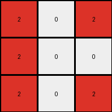
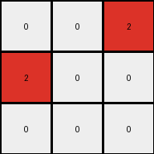

# 6-0520fde7 • 007 • refine_dreamer

---


Previous Code:
```python
"""
1.  **Initialize Output:** Create a 3x3 output grid filled with white pixels (color 0).
2.  **Determine Center Column:** Find the middle column of the *input* grid using integer division (`input_width // 2`).
3. **Iterate over each position** Iterate through all nine positions (row, col) of the 3x3 *output* grid (from 0,0 to 2,2).
4. **Check Input:** check if the value of the input is 0 at the relative
   position:
      - row = output grid row
      - column = center column + output grid col
5. **Set output value.** if it is a 0, set the current position in output to 2.
6.  **Return:** Return the 3x3 output grid.
"""

import numpy as np

def transform(input_grid):
    # Initialize a 3x3 output grid filled with white (0)
    output_grid = np.zeros((3, 3), dtype=int)

    # Determine the center column of the input grid
    center_col = input_grid.shape[1] // 2

    # Iterate through all positions in the output grid
    for row in range(3):
        for col in range(3):
            # Calculate the corresponding position in the input grid
            input_row = row
            input_col = center_col + col -1 #adjust to the output grid coordinate

            # Check if the input_col is within the bounds of input_grid
            if 0 <= input_row < input_grid.shape[0] and 0 <= input_col < input_grid.shape[1]:
                # Check if the corresponding input pixel is 0
                if input_grid[input_row, input_col] == 0:
                    # Set the output pixel to 2
                    output_grid[row, col] = 2

    return output_grid
```

Train Set Results:

## Example 1:**

Input:
```
1 0 0 5 0 1 0
0 1 0 5 1 1 1
1 0 0 5 0 0 0
```
Expected Output:
```
0 0 0
0 2 0
0 0 0
```
Transformed Output:
```
2 0 2
2 0 0
2 0 2
```

match: False
pixels_off: 6
size_correct: True
color_palette_correct: True
correct_pixel_counts: False

## Example 2:**

Input:
```
1 1 0 5 0 1 0
0 0 1 5 1 1 1
1 1 0 5 0 1 0
```
Expected Output:
```
0 2 0
0 0 2
0 2 0
```
Transformed Output:
```
2 0 2
0 0 0
2 0 2
```

match: False
pixels_off: 7
size_correct: True
color_palette_correct: True
correct_pixel_counts: False

## Example 3:**

Input:
```
0 0 1 5 0 0 0
1 1 0 5 1 0 1
0 1 1 5 1 0 1
```
Expected Output:
```
0 0 0
2 0 0
0 0 2
```
Transformed Output:
```
0 0 2
2 0 0
0 0 0
```

match: False
pixels_off: 2
size_correct: True
color_palette_correct: True
correct_pixel_counts: True

**INSTRUCTIONS**

The code above was generated based on observations from the first training
example

we have tested the transform function on each of the task example inputs and
compared with the expected output

review each of the examples provided and the results and consider how the
natural language program should be updated to accommodate this new knowledge

respond with the following deliverables:

- general assessment of the information provided and strategy for resolving the
  errors
- gather metrics about each of the examples and results - use code_execution to
  develop accurate reports on your assumptions
- a YAML block documenting facts - Focus on identifying objects, their properties, and the actions performed on them.
- a natural language program - Be as clear and concise as possible, providing a complete description of the transformation rule.


your responses should be considered as information in a report - not a
conversation
