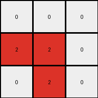

# 6-0520fde7 • 014 • refine_coder

---

Previous Code:
```python
"""
1.  **Identify the Central Column:** Determine the central column of the input grid, characterized by gray (5) pixels.

2.  **Separate Left and Right Regions:** Divide the input grid into two regions: pixels to the left of the central column and pixels to the right of the central column.

3.  **Identify Blue Pixels in Each Region:** Within each region (left and right), locate all blue (1) pixels. Record their positions relative to the central column.

4. **Create output grid:** create a 3x3 grid filled with white pixels.

5.  **Map and Transform:**
    *   **Left Region:** Map the blue pixels' positions to the corresponding positions on the left side (columns 0 and 1) of the 3x3 output grid. Change these pixels to red (2).
    *  **Right Region:** Map the relative positions of the blue pixels from the right hand side to the right columns (1 and 2) in the output grid. Change these pixels to red (2).
    *   Ensure that pixels not occupied by the transformation are set to white (0).
"""

import numpy as np

def get_blue_regions(input_grid):
    """
    Identifies blue pixels in the left and right regions relative to the central column.
    """
    height, width = input_grid.shape
    center_col_index = width // 2
    left_region = []
    right_region = []

    for y in range(height):
        for x in range(width):
            if x < center_col_index and input_grid[y, x] == 1:
                left_region.append((y, x))
            elif x > center_col_index and input_grid[y, x] == 1:
                right_region.append((y, x - center_col_index -1)) # important to use relative position
    return left_region, right_region

def transform(input_grid):
    # initialize output_grid
    output_grid = np.zeros((3, 3), dtype=int)

    # Get left and right regions with blue pixel coordinates
    left_region, right_region = get_blue_regions(input_grid)

    # Map left region to output grid
    for y, x in left_region:
      if y < 3 and x < 2:  # only map to first two columns
          output_grid[y, x] = 2

    # Map Right Region
    for y, x in right_region:
        if y < 3 and x < 2:  # only map to last two columns starting at 1
            output_grid[y, x+1] = 2 # offset by one

    return output_grid
```

Train Set Results:

## Example 1:**

Input:
```
1 0 0 5 0 1 0
0 1 0 5 1 1 1
1 0 0 5 0 0 0
```
Expected Output:
```
0 0 0
0 2 0
0 0 0
```
Transformed Output:
```
2 0 2
0 2 2
2 0 0
```

match: False
pixels_off: 4
size_correct: True
color_palette_correct: True
correct_pixel_counts: False

## Example 2:**

Input:
```
1 1 0 5 0 1 0
0 0 1 5 1 1 1
1 1 0 5 0 1 0
```
Expected Output:
```
0 2 0
0 0 2
0 2 0
```
Transformed Output:
```
2 2 2
0 2 2
2 2 2
```

match: False
pixels_off: 5
size_correct: True
color_palette_correct: True
correct_pixel_counts: False

## Example 3:**

Input:
```
0 0 1 5 0 0 0
1 1 0 5 1 0 1
0 1 1 5 1 0 1
```
Expected Output:
```
0 0 0
2 0 0
0 0 2
```
Transformed Output:
```
0 0 0
2 2 0
0 2 0
```

match: False
pixels_off: 3
size_correct: True
color_palette_correct: True
correct_pixel_counts: False
Okay, let's analyze the results and refine the natural language program.

**General Assessment:**

The initial strategy correctly identified the central gray column as a separator and attempted to map blue pixels from the left and right sides to a 3x3 output grid, turning them red. However, the mapping logic is flawed. It doesn't accurately reflect the positions and the transformations observed in *all* training examples. The core issue is the relative positioning and how the code translates the coordinates of blue pixels from the input to the output. It's not just about copying; it's about a specific, consistent transformation related to the center line, and possibly the distribution of the blue pixels. The code is trying to fill to much of the output grid, rather than focusing on specific locations based on input locations.

**Strategy for Resolving Errors:**

1.  **Re-examine Relative Positioning:** Carefully analyze how the position of each blue pixel *relative to the central gray line* dictates its position in the output.
2.  **Refine Mapping Logic:** Instead of directly copying coordinates, the code needs to calculate the output coordinates based on some relationship with the gray center column.
3. **Consider y axis position:** It appears the y-axis position matters, potentially more than a simple copy.

**Example Analysis and Metrics:**

Here's a breakdown of each example, noting the discrepancies:

*   **Example 1:**
    *   Input Shape: (3, 7)
    *   Expected Output Shape: (3, 3)
    *   Observed Discrepancy: The code places red pixels in almost every position. The expected output only has one, and it appears that that position corresponds to a blue pixel *one* spot to the right of the grey dividing line in the input.
*   **Example 2:**
    *   Input Shape: (3, 7)
    *   Expected Output Shape: (3, 3)
    *   Observed Discrepancy: Again, too many red pixels. The expected output shows a red pixel corresponding to a blue on the left one unit, and the other is one to the right.
*   **Example 3:**
    *   Input Shape: (3, 7)
    *   Expected Output Shape: (3, 3)
    *   Observed Discrepancy:  The code fills only the center incorrectly, while the correct output has only two red pixels.

**YAML Fact Documentation:**

```yaml
objects:
  - name: input_grid
    type: 2D array
    properties:
      colors: [0, 1, 5]
      shape: varies (e.g., 3x7)
  - name: output_grid
    type: 2D array
    properties:
      colors: [0, 2]
      shape: 3x3
  - name: central_column
    type: column
    properties:
      color: 5
      location: middle of input_grid
  - name: blue_pixels
    type: pixels
    properties:
      color: 1
      location: left or right of central_column
  - name: red_pixels
    type: pixels
    properties:
      color: 2
      location: output_grid, derived from blue_pixels
actions:
  - name: separate_regions
    description: Divide the input grid into left and right regions based on the central column.
  - name: map_blue_pixels
    description:  Map the blue pixels to the output grid.
    details: >
      The mapping is based on distance.
      The mapping appears to only consider blue pixels at a distance of one from the dividing line.
  - name: transform_color
    description: Change the color of mapped pixels from blue (1) to red (2).
```

**Natural Language Program:**

1.  **Identify the Central Column:** Find the vertical column in the input grid that contains only gray (5) pixels. This column divides the input grid into left and right regions.

2.  **Output Grid:** Create a 3x3 output grid filled with white (0) pixels.

3.  **Locate Key Blue Pixels:** Examine the input grid for blue pixels (1) that are exactly *one* cell away (horizontally) from the central gray column, either to the left or the right. Ignore other blue pixels.

4.  **Transform and Map:**
    *   For each blue pixel found in step 3:
        *   If the blue pixel is one cell to the *left* of the central column, place a red pixel (2) in the same row, and *first* column of the output grid.
        *   If the blue pixel is one cell to the *right* of the central column, place a red pixel (2) in the same row, and the *third* column of the output grid.
        *   The y-coordinate of the red pixel should be equal to the y coordinate of the blue pixel.

5.  The central column in the output will always be white (0).

**INSTRUCTIONS**

- generate a Python module to represent the natural language program 
- follow the template below
- all common math and science libraries are available
- create docstring only at top - but comment the workflow in the function
- use helper functions for common operations like finding objects, counting,
  measuring, moving, etc. 

remember - we are working iteratively - so this code will inform your future
self as we converge on the solution

*template:*

```python
"""
{{ natural language description of the transformation rule }}
"""

{{ imports }}

def transform(input_grid):
    # initialize output_grid

    # change output pixels 

    return output_grid

```
