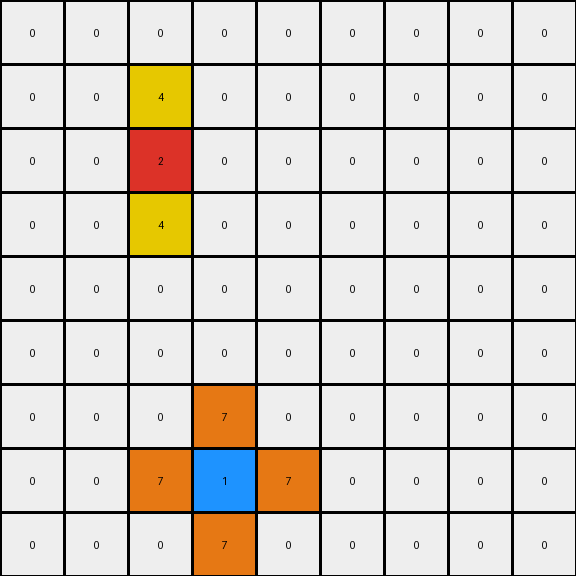

# 2-0ca9ddb6 • 008 • refine_coder

---

Previous Code:
```python
"""
For each red (2) pixel in the input grid, copy the red pixel and place a yellow (4) pixel directly above and below it, if within bounds.
For each blue (1) pixel in the input grid, copy the blue pixel and place an orange (7) pixel directly above, below, left, and right, if within bounds.
All other pixels are ignored, and the output grid is initialized with zeros.
"""

import numpy as np

def get_colored_pixels(grid, color):
    """Finds the coordinates of pixels of a specific color."""
    pixels = []
    for r, row in enumerate(grid):
        for c, value in enumerate(row):
            if value == color:
                pixels.append((r, c))
    return pixels

def transform(input_grid):
    # initialize output_grid
    output_grid = np.zeros_like(input_grid)

    # Find red pixels and expand vertically.
    red_pixels = get_colored_pixels(input_grid, 2)
    for r, c in red_pixels:
      output_grid[r,c] = 2 # transfer original
      if r > 0:
          output_grid[r - 1, c] = 4
      if r < output_grid.shape[0] - 1:
          output_grid[r + 1, c] = 4

    # Find blue pixels and expand horizontally and vertically.
    blue_pixels = get_colored_pixels(input_grid, 1)
    for r, c in blue_pixels:
        output_grid[r,c] = 1 # transfer original
        if r > 0:
            output_grid[r - 1, c] = 7
        if r < output_grid.shape[0] - 1:
            output_grid[r + 1, c] = 7
        if c > 0:
            output_grid[r, c - 1] = 7
        if c < output_grid.shape[1] - 1:
            output_grid[r, c + 1] = 7

    return output_grid
```

Train Set Results:

## Example 1:**

Input:
```
0 0 0 0 0 0 0 0 0
0 0 0 0 0 0 0 0 0
0 0 0 0 0 0 0 0 0
0 0 2 0 0 0 0 0 0
0 0 0 0 0 0 0 0 0
0 0 0 0 0 0 0 0 0
0 0 0 0 0 0 1 0 0
0 0 0 0 0 0 0 0 0
0 0 0 0 0 0 0 0 0
```
Expected Output:
```
0 0 0 0 0 0 0 0 0
0 0 0 0 0 0 0 0 0
0 4 0 4 0 0 0 0 0
0 0 2 0 0 0 0 0 0
0 4 0 4 0 0 0 0 0
0 0 0 0 0 0 7 0 0
0 0 0 0 0 7 1 7 0
0 0 0 0 0 0 7 0 0
0 0 0 0 0 0 0 0 0
```
Transformed Output:
```
0 0 0 0 0 0 0 0 0
0 0 0 0 0 0 0 0 0
0 0 4 0 0 0 0 0 0
0 0 2 0 0 0 0 0 0
0 0 4 0 0 0 0 0 0
0 0 0 0 0 0 7 0 0
0 0 0 0 0 7 1 7 0
0 0 0 0 0 0 7 0 0
0 0 0 0 0 0 0 0 0
```

match: False
pixels_off: 6
size_correct: True
color_palette_correct: True
correct_pixel_counts: False

## Example 2:**

Input:
```
0 0 0 8 0 0 0 0 0
0 0 0 0 0 0 0 0 0
0 0 0 0 0 0 2 0 0
0 0 1 0 0 0 0 0 0
0 0 0 0 0 0 0 0 0
0 0 0 0 0 0 0 0 0
0 0 0 0 0 0 1 0 0
0 2 0 0 0 0 0 0 0
0 0 0 0 0 0 0 0 0
```
Expected Output:
```
0 0 0 8 0 0 0 0 0
0 0 0 0 0 4 0 4 0
0 0 7 0 0 0 2 0 0
0 7 1 7 0 4 0 4 0
0 0 7 0 0 0 0 0 0
0 0 0 0 0 0 7 0 0
4 0 4 0 0 7 1 7 0
0 2 0 0 0 0 7 0 0
4 0 4 0 0 0 0 0 0
```
Transformed Output:
```
0 0 0 0 0 0 0 0 0
0 0 0 0 0 0 4 0 0
0 0 7 0 0 0 2 0 0
0 7 1 7 0 0 4 0 0
0 0 7 0 0 0 0 0 0
0 0 0 0 0 0 7 0 0
0 4 0 0 0 7 1 7 0
0 2 0 0 0 0 7 0 0
0 4 0 0 0 0 0 0 0
```

match: False
pixels_off: 13
size_correct: True
color_palette_correct: True
correct_pixel_counts: False

## Example 3:**

Input:
```
0 0 0 0 0 0 0 0 0
0 0 0 0 0 0 0 0 0
0 0 2 0 0 0 0 0 0
0 0 0 0 0 0 0 0 0
0 0 0 0 0 0 0 0 0
0 0 0 0 0 0 6 0 0
0 0 0 0 0 0 0 0 0
0 0 0 1 0 0 0 0 0
0 0 0 0 0 0 0 0 0
```
Expected Output:
```
0 0 0 0 0 0 0 0 0
0 4 0 4 0 0 0 0 0
0 0 2 0 0 0 0 0 0
0 4 0 4 0 0 0 0 0
0 0 0 0 0 0 0 0 0
0 0 0 0 0 0 6 0 0
0 0 0 7 0 0 0 0 0
0 0 7 1 7 0 0 0 0
0 0 0 7 0 0 0 0 0
```
Transformed Output:
```
0 0 0 0 0 0 0 0 0
0 0 4 0 0 0 0 0 0
0 0 2 0 0 0 0 0 0
0 0 4 0 0 0 0 0 0
0 0 0 0 0 0 0 0 0
0 0 0 0 0 0 0 0 0
0 0 0 7 0 0 0 0 0
0 0 7 1 7 0 0 0 0
0 0 0 7 0 0 0 0 0
```

match: False
pixels_off: 7
size_correct: True
color_palette_correct: True
correct_pixel_counts: False
Okay, let's analyze the results of the previous code execution and refine the natural language program.

**General Assessment:**

The initial code partially captures the transformation rule but makes mistakes in placing the additional colored pixels around the red and blue pixels. Specifically, it seems to be missing some placements, especially when red and blue colors are near each other. The core issue is that it isn't correctly handling the "cross" placement (+ above and below for red; above, below, left and right for blue). My strategy is to address the coordinate expansion for the red and blue pixels explicitly. Review and improve placement.

**Metrics and Observations:**

Here's a breakdown of each example, incorporating some analysis to highlight the issues:

*   **Example 1:**
    *   **Input:** A red pixel (2) and a blue pixel (1).
    *   **Expected:** Red pixel with yellow (4) above and below. Blue pixel with orange (7) in a cross shape.
    *   **Actual:** Correct for the red pixel expansion. However, the blue pixel expansion only places orange pixels below and to the sides, not the full cross pattern expected, not expanding on the top.
    *   Error is on placement of the expansion objects.

*   **Example 2:**
    *   **Input:** A more complex arrangement with red and blue pixels, and an additional 8 and a couple of red/blue adjacency.
    *   **Expected:** Similar expansion rules as Example 1, but with more interactions.
    *   **Actual:** Red pixel vertical expansion are misplaced, blue pixel crosses are off, and the interaction between close red and blue areas is incorrect.
    *   Error on placement of the expansion objects and original object is missing in one case.

*   **Example 3:**
    *   **Input:** Red and blue pixels, and an additional 6.
    *   **Expected:** Correct application of expansion.
    *   **Actual:** Red is ok, however the blue pixel misses the top orange pixel. Also, it appears the 6 is ignored, which is correct.
    *   Error on placement - top pixel not expanded for blue.

**YAML Fact Documentation:**

```yaml
objects:
  - type: pixel
    properties:
      color: red (2)
      action: expand_vertically
      expansion_color: yellow (4)
  - type: pixel
    properties:
      color: blue (1)
      action: expand_cross
      expansion_color: orange (7)
  - type: pixel
    properties:
      color: other
      action: ignore

actions:
  - name: expand_vertically
    description: Place expansion_color pixels above and below the original pixel, if within grid bounds.
  - name: expand_cross
    description: Place expansion_color pixels above, below, left, and right of the original pixel, if within grid bounds.

grid:
  - property: dimensions
    value: Same as input grid
  - property: initialization
    value: All zeros (0)
```

**Natural Language Program:**

1.  **Initialize:** Create an output grid of the same dimensions as the input grid, filled with zeros (white).

2.  **Red Pixel Expansion:** For each red (2) pixel in the input grid:
    *   Copy the red pixel to the same position in the output grid.
    *   If a position directly above the red pixel is within the grid bounds, place a yellow (4) pixel there.
    *   If a position directly below the red pixel is within the grid bounds, place a yellow (4) pixel there.

3.  **Blue Pixel Expansion:** For each blue (1) pixel in the input grid:
    *   Copy the blue pixel to the same position in the output grid.
    *   If a position directly above the blue pixel is within the grid bounds, place an orange (7) pixel there.
    *   If a position directly below the blue pixel is within the grid bounds, place an orange (7) pixel there.
    *   If a position directly to the left of the blue pixel is within the grid bounds, place an orange (7) pixel there.
    *   If a position directly to the right of the blue pixel is within the grid bounds, place an orange (7) pixel there.

4. **Ignore Other Colors:** Pixels of any color other than red or blue in the input grid do not directly cause any changes in the output grid (although they can be overwritten by red/blue expansions).

**INSTRUCTIONS**

- generate a Python module to represent the natural language program 
- follow the template below
- all common math and science libraries are available
- create docstring only at top - but comment the workflow in the function
- use helper functions for common operations like finding objects, counting,
  measuring, moving, etc. 

remember - we are working iteratively - so this code will inform your future
self as we converge on the solution

*template:*

```python
"""
{{ natural language description of the transformation rule }}
"""

{{ imports }}

def transform(input_grid):
    # initialize output_grid

    # change output pixels 

    return output_grid

```
