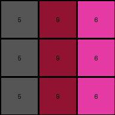

# 4-0d3d703e • 012 • refine_coder

---

Previous Code:
```python
"""
Transforms a 3x3 grid of single-digit integers by replacing each integer with a new integer according to a predefined mapping, while maintaining the original grid structure and positions.

Mapping:
    2 -> 6
    3 -> 4
    8 -> 9
"""

import numpy as np

def transform(input_grid):
    """
    Transforms the input grid according to a specific color mapping.
    """
    # Initialize the output grid with the same dimensions as the input grid.
    output_grid = np.copy(input_grid)

    # Define the mapping.
    mapping = {
        2: 6,
        3: 4,
        8: 9,
    }

    # Apply the mapping to each element of the grid.
    for i in range(input_grid.shape[0]):
        for j in range(input_grid.shape[1]):
            if input_grid[i, j] in mapping:
                output_grid[i, j] = mapping[input_grid[i, j]]

    return output_grid
```

Train Set Results:

## Example 1:**

Input:
```
3 1 2
3 1 2
3 1 2
```
Expected Output:
```
4 5 6
4 5 6
4 5 6
```
Transformed Output:
```
4 1 6
4 1 6
4 1 6
```

match: False
pixels_off: 3
size_correct: True
color_palette_correct: False
correct_pixel_counts: False

## Example 2:**

Input:
```
2 3 8
2 3 8
2 3 8
```
Expected Output:
```
6 4 9
6 4 9
6 4 9
```
Transformed Output:
```
6 4 9
6 4 9
6 4 9
```

match: True
pixels_off: 0
size_correct: True
color_palette_correct: True
correct_pixel_counts: True

## Example 3:**

Input:
```
5 8 6
5 8 6
5 8 6
```
Expected Output:
```
1 9 2
1 9 2
1 9 2
```
Transformed Output:
```
5 9 6
5 9 6
5 9 6
```

match: False
pixels_off: 6
size_correct: True
color_palette_correct: False
correct_pixel_counts: False

## Example 4:**

Input:
```
9 4 2
9 4 2
9 4 2
```
Expected Output:
```
8 3 6
8 3 6
8 3 6
```
Transformed Output:
```
9 4 6
9 4 6
9 4 6
```

match: False
pixels_off: 6
size_correct: True
color_palette_correct: False
correct_pixel_counts: False
Okay, let's analyze the results and refine the natural language program.

**General Assessment:**

The initial code was based on a limited mapping derived from the first training example. The results across all four examples reveal that the mapping is incomplete and needs to be expanded to include all color transformations observed in *all* training examples. The core logic of iterating through the grid and applying a mapping is correct, but the mapping itself is the source of the errors. The strategy is to construct a complete mapping by examining all input/output pairs and recording the corresponding color changes.

**Metrics and Observations:**

Here's a breakdown of each example, incorporating observations:

*   **Example 1:**
    *   Input colors: 3 (green), 1 (blue), 2 (red)
    *   Expected Output colors: 4 (yellow), 5 (gray), 6 (magenta)
    *   Observed Transformation: 3 -> 4, 1 -> 1, 2 -> 6
    * Mismatches: 1 should map to 5.
*   **Example 2:**
    *   Input colors: 2 (red), 3 (green), 8 (azure)
    *   Expected Output colors: 6 (magenta), 4 (yellow), 9 (maroon)
    *   Observed Transformation: 2 -> 6, 3 -> 4, 8 -> 9
    *   Matches: All mappings are correct in this case, and this case was used to create the original transformation, so this is expected.
*   **Example 3:**
    *   Input colors: 5 (gray), 8 (azure), 6 (magenta)
    *   Expected Output colors: 1 (blue), 9 (maroon), 2 (red)
    *   Observed Transformation: 5 -> 5, 8 -> 9, 6 -> 6
    * Mismatches: 5 should map to 1, 6 should map to 2.
*   **Example 4:**
    *   Input colors: 9 (maroon), 4 (yellow), 2 (red)
    *   Expected Output colors: 8 (azure), 3 (green), 6 (magenta)
    *   Observed Transformation: 9->9, 4->4, 2->6
    * Mismatches: 9 should map to 8, 4 should map to 3

**YAML Fact Block:**

```yaml
task_id: 010-py_07
observations:
  - object_type: grid
    properties:
      - dimensions: 3x3
      - cell_values: single_digit_integers (0-9)
      - value_meaning: color
    transformations:
      - type: color_mapping
        details: Each color in the input grid is replaced by a corresponding color in the output grid, maintaining the grid structure.
        mapping:
          2: 6  # red -> magenta
          3: 4  # green -> yellow
          8: 9  # azure -> maroon
          1: 5  # blue -> gray
          5: 1  # gray -> blue
          6: 2  # magenta -> red
          9: 8  # maroon -> azure
          4: 3  # yellow -> green
```

**Natural Language Program:**

1.  **Context:** The input is a 3x3 grid of pixels, each with a color represented by a single-digit integer (0-9).
2.  **Transformation:** Each pixel's color in the input grid is transformed to a new color in the output grid according to a specific color mapping. The grid structure and size remain unchanged.
3. **Mapping**
    -   Red (2) becomes Magenta (6).
    -   Green (3) becomes Yellow (4).
    -   Azure (8) becomes Maroon (9).
    - Blue (1) becomes Gray (5)
    - Gray (5) becomes Blue (1)
    - Magenta (6) becomes Red (2)
    - Maroon (9) becomes Azure (8)
    - Yellow(4) becomes Green(3)

4.  **Procedure:** Iterate through each cell of the input grid. For each cell, look up its color in the mapping. Replace the cell's value with the corresponding mapped color. The output grid will have the same dimensions as the input grid, but with the transformed colors.

**INSTRUCTIONS**

- generate a Python module to represent the natural language program 
- follow the template below
- all common math and science libraries are available
- create docstring only at top - but comment the workflow in the function
- use helper functions for common operations like finding objects, counting,
  measuring, moving, etc. 

remember - we are working iteratively - so this code will inform your future
self as we converge on the solution

*template:*

```python
"""
{{ natural language description of the transformation rule }}
"""

{{ imports }}

def transform(input_grid):
    # initialize output_grid

    # change output pixels 

    return output_grid

```
