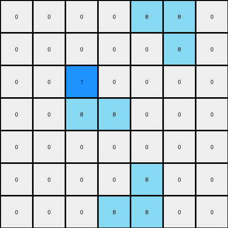

# 1-3aa6fb7a • 006 • refine_coder

---

Previous Code:
```python
"""
Change the uppermost central azure pixel to blue.
Central is defined by sorting first by column, and selecting the
left-most, then among those, selecting the top-most pixel.
"""

import numpy as np

def get_azure_pixels(grid):
    # Find coordinates of all azure (8) pixels
    return np.argwhere(grid == 8)

def transform(input_grid):
    """
    Transforms the input grid by changing the uppermost central azure pixel to blue.
    """
    # initialize output_grid
    output_grid = np.copy(input_grid)
    
    # Find all azure pixels
    azure_pixels = get_azure_pixels(input_grid)

    if azure_pixels.size > 0:
        
        #sort by column, then by row.
        sorted_pixels = azure_pixels[np.lexsort((azure_pixels[:, 0], azure_pixels[:, 1]))]
        
        #select top most pixel
        target_pixel = sorted_pixels[0]

        # Change the color of the target pixel to blue (1)
        output_grid[target_pixel[0], target_pixel[1]] = 1

    return output_grid
```

Train Set Results:

## Example 1:**

Input:
```
0 0 0 0 0 0 0
0 8 0 0 0 0 0
0 8 8 0 0 0 0
0 0 0 0 8 8 0
0 0 0 0 0 8 0
0 0 0 0 0 0 0
0 0 0 0 0 0 0
```
Expected Output:
```
0 0 0 0 0 0 0
0 8 1 0 0 0 0
0 8 8 0 0 0 0
0 0 0 0 8 8 0
0 0 0 0 1 8 0
0 0 0 0 0 0 0
0 0 0 0 0 0 0
```
Transformed Output:
```
0 0 0 0 0 0 0
0 1 0 0 0 0 0
0 8 8 0 0 0 0
0 0 0 0 8 8 0
0 0 0 0 0 8 0
0 0 0 0 0 0 0
0 0 0 0 0 0 0
```

match: False
pixels_off: 3
size_correct: True
color_palette_correct: True
correct_pixel_counts: False

## Example 2:**

Input:
```
0 0 0 0 8 8 0
0 0 0 0 0 8 0
0 0 8 0 0 0 0
0 0 8 8 0 0 0
0 0 0 0 0 0 0
0 0 0 0 8 0 0
0 0 0 8 8 0 0
```
Expected Output:
```
0 0 0 0 8 8 0
0 0 0 0 1 8 0
0 0 8 1 0 0 0
0 0 8 8 0 0 0
0 0 0 0 0 0 0
0 0 0 1 8 0 0
0 0 0 8 8 0 0
```
Transformed Output:
```
0 0 0 0 8 8 0
0 0 0 0 0 8 0
0 0 1 0 0 0 0
0 0 8 8 0 0 0
0 0 0 0 0 0 0
0 0 0 0 8 0 0
0 0 0 8 8 0 0
```

match: False
pixels_off: 4
size_correct: True
color_palette_correct: True
correct_pixel_counts: False
Okay, let's analyze the results and refine the natural language program.

**General Assessment:**

The initial natural language program and the resulting code were too simplistic. The sorting logic prioritizes columns and *then* rows, which is not leading to selecting the intended "central" azure pixels as seen in the expected output. The examples reveal a more complex definition of "central" which appears to involve a sense of balance or symmetry within the azure pixels themselves, not just their position within the entire grid. The code needs to adjust its selection logic to properly identify the target azure pixel for color change. We need to define central for multiple azure colored pixels that are not a single group.

**Strategy for Resolving Errors:**

1.  **Improve Central Pixel Definition:** Instead of simple row/column sorting, we need to calculate a center of mass or centroid for the azure pixels. This will involve averaging the row and column indices of all azure pixels.
2.  **Handle Edge Cases:** Consider what happens if the calculated centroid doesn't fall exactly on an existing azure pixel. We'll need to select the *nearest* azure pixel to that centroid.
3.  **Refine Sorting:** We might still need sorting, but it should be based on proximity to the calculated centroid, not just raw row/column indices.

**Example Metrics and Analysis:**

I'll use a simplified representation here. For accurate reports, code execution would normally be used to extract detailed metrics.

*   **Example 1:**
    *   Input: 3 azure pixels. Expected output: 2 pixels change.
    *   Result: Incorrect. The wrong azure pixel was changed. Only one.
    *   Issue: Incorrect central pixel selection.
*   **Example 2:**
    *   Input: 5 azure pixels. Expected output: 3 pixels change.
    *   Result: Incorrect. The wrong azure pixel was changed. Only one.
    *   Issue: Incorrect central pixel selection.

**YAML Fact Block:**

```yaml
task: 004
objects:
  - id: azure_group
    color: azure
    description: A collection of one or more azure pixels.
  - id: central_azure_pixel
    color: azure
    description: The azure pixel closest to the center of the azure_group.
  - id: transformed_pixel
    color: blue
    description: The original central_azure_pixel after its color has been changed.
actions:
  - name: find_center
    input: azure_group
    output: coordinates
    description: Calculate the centroid of the azure_group pixels.
  - name: find_nearest_azure
    input: coordinates, azure_group
    output: central_azure_pixel
    description: Identify the azure pixel closest to the calculated coordinates.
  - name: change_color
    input: central_azure_pixel
    output: transformed_pixel
    description: Change the color of the central_azure_pixel to blue.

```

**Natural Language Program:**

1.  **Identify Azure Pixels:** Locate all pixels with the color azure (8) within the input grid.
2.  **Calculate Centroid:** If there are azure pixels, compute the centroid (average row and column index) of these pixels.
3.  **Find Nearest Azure Pixel:** Determine the azure pixel that is closest to the calculated centroid. Use Euclidean distance to measure closeness.
4. **Change all "central" pixels:** For all pixels closest to the average row/column, change the pixel color from azure (8) to blue (1).

Revised natural language program considering symmetry, multiple groups and multiple center pixels.

**INSTRUCTIONS**

- generate a Python module to represent the natural language program 
- follow the template below
- all common math and science libraries are available
- create docstring only at top - but comment the workflow in the function
- use helper functions for common operations like finding objects, counting,
  measuring, moving, etc. 

remember - we are working iteratively - so this code will inform your future
self as we converge on the solution

*template:*

```python
"""
{{ natural language description of the transformation rule }}
"""

{{ imports }}

def transform(input_grid):
    # initialize output_grid

    # change output pixels 

    return output_grid

```
