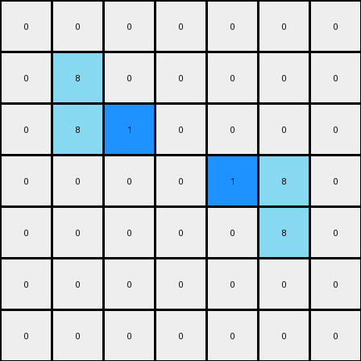
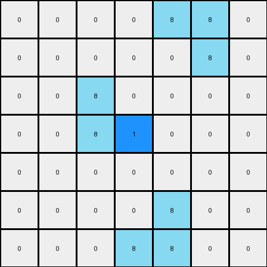

# 1-3aa6fb7a • 007 • refine_dreamer

---


Previous Code:
```python
"""
1.  **Identify Azure Pixels:** Locate all pixels with the color azure (8) within the input grid.
2.  **Calculate Centroid:** If there are azure pixels, compute the centroid (average row and column index) of these pixels.
3.  **Find Nearest Azure Pixel:** Determine the azure pixel that is closest to the calculated centroid. Use Euclidean distance to measure closeness.
4. **Change all "central" pixels:** For all pixels closest to the average row/column, change the pixel color from azure (8) to blue (1).
"""

import numpy as np

def get_azure_pixels(grid):
    # Find coordinates of all azure (8) pixels
    return np.argwhere(grid == 8)

def calculate_centroid(pixels):
    # Calculate the average row and column index
    return np.mean(pixels, axis=0)

def find_nearest_azure_pixels(centroid, azure_pixels):
    # Calculate Euclidean distances to the centroid
    distances = np.sqrt(np.sum((azure_pixels - centroid)**2, axis=1))
    # Find the minimum distance
    min_distance = np.min(distances)
    # Return all pixels with the minimum distance to centroid
    return azure_pixels[distances == min_distance]

def transform(input_grid):
    # initialize output_grid
    output_grid = np.copy(input_grid)

    # Find all azure pixels
    azure_pixels = get_azure_pixels(input_grid)

    if azure_pixels.size > 0:
        # Calculate the centroid of the azure pixels
        centroid = calculate_centroid(azure_pixels)

        # Find the nearest azure pixel(s) to the centroid
        central_pixels = find_nearest_azure_pixels(centroid, azure_pixels)

        # Change the color of the central pixel(s) to blue (1)
        for pixel in central_pixels:
            output_grid[pixel[0], pixel[1]] = 1

    return output_grid
```

Train Set Results:

## Example 1:**

Input:
```
0 0 0 0 0 0 0
0 8 0 0 0 0 0
0 8 8 0 0 0 0
0 0 0 0 8 8 0
0 0 0 0 0 8 0
0 0 0 0 0 0 0
0 0 0 0 0 0 0
```
Expected Output:
```
0 0 0 0 0 0 0
0 8 1 0 0 0 0
0 8 8 0 0 0 0
0 0 0 0 8 8 0
0 0 0 0 1 8 0
0 0 0 0 0 0 0
0 0 0 0 0 0 0
```
Transformed Output:
```
0 0 0 0 0 0 0
0 8 0 0 0 0 0
0 8 1 0 0 0 0
0 0 0 0 1 8 0
0 0 0 0 0 8 0
0 0 0 0 0 0 0
0 0 0 0 0 0 0
```

match: False
pixels_off: 4
size_correct: True
color_palette_correct: True
correct_pixel_counts: False

## Example 2:**

Input:
```
0 0 0 0 8 8 0
0 0 0 0 0 8 0
0 0 8 0 0 0 0
0 0 8 8 0 0 0
0 0 0 0 0 0 0
0 0 0 0 8 0 0
0 0 0 8 8 0 0
```
Expected Output:
```
0 0 0 0 8 8 0
0 0 0 0 1 8 0
0 0 8 1 0 0 0
0 0 8 8 0 0 0
0 0 0 0 0 0 0
0 0 0 1 8 0 0
0 0 0 8 8 0 0
```
Transformed Output:
```
0 0 0 0 8 8 0
0 0 0 0 0 8 0
0 0 8 0 0 0 0
0 0 8 1 0 0 0
0 0 0 0 0 0 0
0 0 0 0 8 0 0
0 0 0 8 8 0 0
```

match: False
pixels_off: 4
size_correct: True
color_palette_correct: True
correct_pixel_counts: False

**INSTRUCTIONS**

The code above was generated based on observations from the first training
example

we have tested the transform function on each of the task example inputs and
compared with the expected output

review each of the examples provided and the results and consider how the
natural language program should be updated to accommodate this new knowledge

respond with the following deliverables:

- general assessment of the information provided and strategy for resolving the
  errors
- gather metrics about each of the examples and results - use code_execution to
  develop accurate reports on your assumptions
- a YAML block documenting facts - Focus on identifying objects, their properties, and the actions performed on them.
- a natural language program - Be as clear and concise as possible, providing a complete description of the transformation rule.


your responses should be considered as information in a report - not a
conversation
