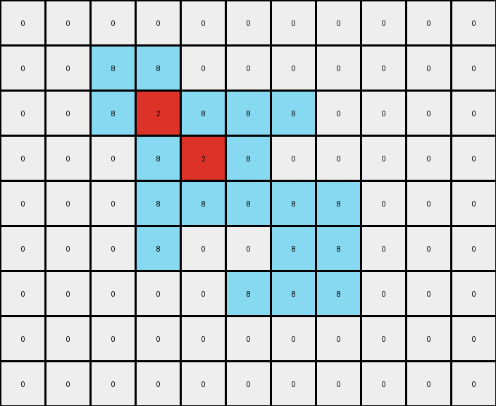

# 5-150deff5 • 005 • refine_dreamer

---


Previous Code:
```python
"""
The transformation rule is as follows:
1. Identify contiguous shapes of gray (5) pixels in the input grid.
2. Outline the outermost layer of the shape:
   - A gray pixel is considered part of the outline if it is directly adjacent (up, down, left, or right) to a pixel that is *not* gray (including out-of-bounds).
   - Replace these outline pixels with azure (8).
3. Fill the interior of the outlined shape:
   - Any gray pixel that is *not* part of the outline is considered interior.
   - Replace these interior pixels with red (2).
4. Preserve the white (0) background.
"""

import numpy as np

def is_part_of_shape(grid, r, c, shape_color):
    """Checks if a pixel is within bounds and of the specified color."""
    rows, cols = grid.shape
    return 0 <= r < rows and 0 <= c < cols and grid[r, c] == shape_color

def is_outermost(grid, row, col, shape_color):
    """
    Checks if a pixel at (row, col) is on the outermost layer of the shape.
    A pixel is outermost if it's part of the shape and has at least one 
    neighbor (up, down, left, right) that is not part of the shape.
    """
    rows, cols = grid.shape
    if not is_part_of_shape(grid, row, col, shape_color):
        return False

    for dr, dc in [(-1, 0), (1, 0), (0, -1), (0, 1)]:
        nr, nc = row + dr, col + dc
        if not is_part_of_shape(grid, nr, nc, shape_color):
            return True  # Directly adjacent to a non-shape pixel or edge

    return False

def transform(input_grid):
    # Initialize output_grid with the same dimensions and background as input_grid.
    output_grid = np.copy(input_grid)
    rows, cols = input_grid.shape
    shape_color = 5

    # Iterate through all pixels to find and process the shape.
    for row in range(rows):
        for col in range(cols):
            if is_outermost(input_grid, row, col, shape_color):
                output_grid[row, col] = 8  # Azure for outline
            elif input_grid[row,col] == shape_color:
                output_grid[row, col] = 2  # Red for fill

    return output_grid
```

Train Set Results:

## Example 1:**

Input:
```
0 0 0 0 0 0 0 0 0 0 0
0 0 5 5 0 0 0 0 0 0 0
0 0 5 5 5 5 5 0 0 0 0
0 0 0 5 5 5 0 0 0 0 0
0 0 0 5 5 5 5 5 0 0 0
0 0 0 5 0 0 5 5 0 0 0
0 0 0 0 0 5 5 5 0 0 0
0 0 0 0 0 0 0 0 0 0 0
0 0 0 0 0 0 0 0 0 0 0
```
Expected Output:
```
0 0 0 0 0 0 0 0 0 0 0
0 0 8 8 0 0 0 0 0 0 0
0 0 8 8 2 2 2 0 0 0 0
0 0 0 2 8 8 0 0 0 0 0
0 0 0 2 8 8 8 8 0 0 0
0 0 0 2 0 0 8 8 0 0 0
0 0 0 0 0 2 2 2 0 0 0
0 0 0 0 0 0 0 0 0 0 0
0 0 0 0 0 0 0 0 0 0 0
```
Transformed Output:
```
0 0 0 0 0 0 0 0 0 0 0
0 0 8 8 0 0 0 0 0 0 0
0 0 8 2 8 8 8 0 0 0 0
0 0 0 8 2 8 0 0 0 0 0
0 0 0 8 8 8 8 8 0 0 0
0 0 0 8 0 0 8 8 0 0 0
0 0 0 0 0 8 8 8 0 0 0
0 0 0 0 0 0 0 0 0 0 0
0 0 0 0 0 0 0 0 0 0 0
```

match: False
pixels_off: 11
size_correct: True
color_palette_correct: True
correct_pixel_counts: False

## Example 2:**

Input:
```
0 0 0 0 0 0 0 0 0 0
0 5 5 5 5 5 5 0 0 0
0 5 5 5 5 5 5 0 0 0
0 0 0 5 0 0 5 0 0 0
0 0 0 0 5 5 5 0 0 0
0 0 0 0 5 5 5 0 0 0
0 0 0 0 5 0 0 0 0 0
0 0 0 0 0 0 0 0 0 0
```
Expected Output:
```
0 0 0 0 0 0 0 0 0 0
0 8 8 2 8 8 2 0 0 0
0 8 8 2 8 8 2 0 0 0
0 0 0 2 0 0 2 0 0 0
0 0 0 0 2 8 8 0 0 0
0 0 0 0 2 8 8 0 0 0
0 0 0 0 2 0 0 0 0 0
0 0 0 0 0 0 0 0 0 0
```
Transformed Output:
```
0 0 0 0 0 0 0 0 0 0
0 8 8 8 8 8 8 0 0 0
0 8 8 2 8 8 8 0 0 0
0 0 0 8 0 0 8 0 0 0
0 0 0 0 8 8 8 0 0 0
0 0 0 0 8 8 8 0 0 0
0 0 0 0 8 0 0 0 0 0
0 0 0 0 0 0 0 0 0 0
```

match: False
pixels_off: 8
size_correct: True
color_palette_correct: True
correct_pixel_counts: False

## Example 3:**

Input:
```
0 0 0 0 0 0 0 0 0
0 5 5 5 5 5 0 0 0
0 0 0 0 5 5 0 0 0
0 0 0 5 0 0 0 0 0
0 0 0 5 5 5 0 0 0
0 0 0 5 5 5 0 0 0
0 0 0 0 0 0 0 0 0
0 0 0 0 0 0 0 0 0
```
Expected Output:
```
0 0 0 0 0 0 0 0 0
0 2 2 2 8 8 0 0 0
0 0 0 0 8 8 0 0 0
0 0 0 2 0 0 0 0 0
0 0 0 2 8 8 0 0 0
0 0 0 2 8 8 0 0 0
0 0 0 0 0 0 0 0 0
0 0 0 0 0 0 0 0 0
```
Transformed Output:
```
0 0 0 0 0 0 0 0 0
0 8 8 8 8 8 0 0 0
0 0 0 0 8 8 0 0 0
0 0 0 8 0 0 0 0 0
0 0 0 8 8 8 0 0 0
0 0 0 8 8 8 0 0 0
0 0 0 0 0 0 0 0 0
0 0 0 0 0 0 0 0 0
```

match: False
pixels_off: 6
size_correct: True
color_palette_correct: True
correct_pixel_counts: False

**INSTRUCTIONS**

The code above was generated based on observations from the first training
example

we have tested the transform function on each of the task example inputs and
compared with the expected output

review each of the examples provided and the results and consider how the
natural language program should be updated to accommodate this new knowledge

respond with the following deliverables:

- general assessment of the information provided and strategy for resolving the
  errors
- gather metrics about each of the examples and results - use code_execution to
  develop accurate reports on your assumptions
- a YAML block documenting facts - Focus on identifying objects, their properties, and the actions performed on them.
- a natural language program - Be as clear and concise as possible, providing a complete description of the transformation rule.


your responses should be considered as information in a report - not a
conversation
