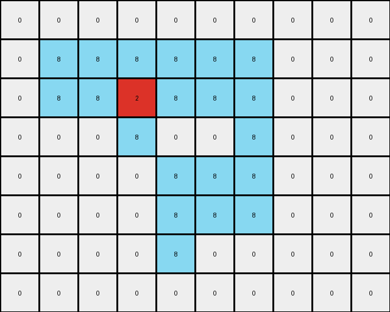
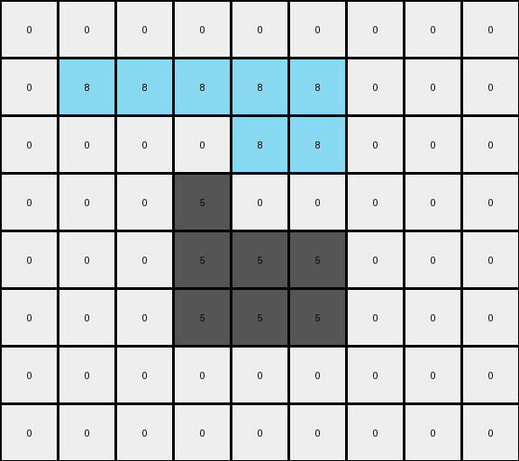

# 5-150deff5 • 015 • refine_dreamer

---

Previous Code:
```python
"""
1.  **Identify the Foreground:** Find the contiguous region of gray (5) pixels. This constitutes the foreground shape.

2.  **Identify the Background:** All pixels that are *not* part of the foreground shape are considered the background. The background does not change.

3.  **Determine the Outline:** A gray pixel is part of the *outline* if it's directly adjacent (up, down, left, or right) to at least one non-gray pixel.

4.  **Determine the Inside:** A gray pixel is part of the *inside* if:
    *   It is part of the foreground shape, AND
    *   It is NOT part of the outline, AND
    *    It is completely surrounded by outline or other inside pixels, meaning all 4 neighbors are other "inside" pixels, outline pixels, or outside of grid bounds. This is the key improvement - a flood-fill like approach is suggested.

5.  **Recolor the Outline:** Change the color of all outline pixels to azure (8).

6.  **Recolor the Inside:** Change the color of all inside pixels to red (2).

7.  **Preserve Background:** Ensure all non-gray input pixels remain unchanged in the output.
"""

import numpy as np

def get_contiguous_regions(grid, color):
    visited = np.zeros_like(grid, dtype=bool)
    regions = []

    def dfs(row, col, current_region):
        if (
            row < 0
            or row >= grid.shape[0]
            or col < 0
            or col >= grid.shape[1]
            or visited[row, col]
            or grid[row, col] != color
        ):
            return

        visited[row, col] = True
        current_region.append((row, col))

        dfs(row + 1, col, current_region)
        dfs(row - 1, col, current_region)
        dfs(row, col + 1, current_region)
        dfs(row, col - 1, current_region)

    for row in range(grid.shape[0]):
        for col in range(grid.shape[1]):
            if grid[row, col] == color and not visited[row, col]:
                current_region = []
                dfs(row, col, current_region)
                regions.append(current_region)
    return regions

def is_inside(grid, row, col, outline_pixels):
    # Check if the pixel is within the grid bounds and is gray
    if not (0 <= row < grid.shape[0] and 0 <= col < grid.shape[1] and grid[row,col] == 5):
        return False
    
    # Check if it is in outline
    if (row,col) in outline_pixels:
        return False

    neighbors = [
        (row - 1, col),
        (row + 1, col),
        (row, col - 1),
        (row, col + 1),
    ]

    for nr, nc in neighbors:
        if (0 <= nr < grid.shape[0] and 0 <= nc < grid.shape[1] and grid[nr,nc] != 5 ):
            return False # if a neighbor isn't 5 and is not out of bounds, it should be outline, so it is false
    return True

def transform(input_grid):
    # initialize output_grid
    output_grid = np.copy(input_grid)

    # Identify the Foreground Shape
    gray_regions = get_contiguous_regions(input_grid, 5)
    if not gray_regions:  # Handle cases with no gray regions
        return output_grid
    gray_pixels = gray_regions[0] # Assume only 1 region

    # Determine the Outline
    outline_pixels = []
    for r, c in gray_pixels:
        neighbors = [
            (r - 1, c),
            (r + 1, c),
            (r, c - 1),
            (r, c + 1),
        ]
        is_outline = False
        for nr, nc in neighbors:
            if (
                nr < 0
                or nr >= input_grid.shape[0]
                or nc < 0
                or nc >= input_grid.shape[1]
                or input_grid[nr, nc] != 5
            ):
                is_outline = True
                break
        if is_outline:
            outline_pixels.append((r, c))

    # Determine the Inside
    inside_pixels = []
    for r, c in gray_pixels:
        if is_inside(input_grid, r, c, outline_pixels):
           inside_pixels.append((r,c))
    
    # Recolor the outline
    for r, c in outline_pixels:
        output_grid[r, c] = 8
        
    # Recolor the inside
    for r, c in inside_pixels:
        output_grid[r, c] = 2
        

    return output_grid
```

Train Set Results:

## Example 1:**

Input:
```
0 0 0 0 0 0 0 0 0 0 0
0 0 5 5 0 0 0 0 0 0 0
0 0 5 5 5 5 5 0 0 0 0
0 0 0 5 5 5 0 0 0 0 0
0 0 0 5 5 5 5 5 0 0 0
0 0 0 5 0 0 5 5 0 0 0
0 0 0 0 0 5 5 5 0 0 0
0 0 0 0 0 0 0 0 0 0 0
0 0 0 0 0 0 0 0 0 0 0
```
Expected Output:
```
0 0 0 0 0 0 0 0 0 0 0
0 0 8 8 0 0 0 0 0 0 0
0 0 8 8 2 2 2 0 0 0 0
0 0 0 2 8 8 0 0 0 0 0
0 0 0 2 8 8 8 8 0 0 0
0 0 0 2 0 0 8 8 0 0 0
0 0 0 0 0 2 2 2 0 0 0
0 0 0 0 0 0 0 0 0 0 0
0 0 0 0 0 0 0 0 0 0 0
```
Transformed Output:
```
0 0 0 0 0 0 0 0 0 0 0
0 0 8 8 0 0 0 0 0 0 0
0 0 8 2 8 8 8 0 0 0 0
0 0 0 8 2 8 0 0 0 0 0
0 0 0 8 8 8 8 8 0 0 0
0 0 0 8 0 0 8 8 0 0 0
0 0 0 0 0 8 8 8 0 0 0
0 0 0 0 0 0 0 0 0 0 0
0 0 0 0 0 0 0 0 0 0 0
```

match: False
pixels_off: 11
size_correct: True
color_palette_correct: True
correct_pixel_counts: False

## Example 2:**

Input:
```
0 0 0 0 0 0 0 0 0 0
0 5 5 5 5 5 5 0 0 0
0 5 5 5 5 5 5 0 0 0
0 0 0 5 0 0 5 0 0 0
0 0 0 0 5 5 5 0 0 0
0 0 0 0 5 5 5 0 0 0
0 0 0 0 5 0 0 0 0 0
0 0 0 0 0 0 0 0 0 0
```
Expected Output:
```
0 0 0 0 0 0 0 0 0 0
0 8 8 2 8 8 2 0 0 0
0 8 8 2 8 8 2 0 0 0
0 0 0 2 0 0 2 0 0 0
0 0 0 0 2 8 8 0 0 0
0 0 0 0 2 8 8 0 0 0
0 0 0 0 2 0 0 0 0 0
0 0 0 0 0 0 0 0 0 0
```
Transformed Output:
```
0 0 0 0 0 0 0 0 0 0
0 8 8 8 8 8 8 0 0 0
0 8 8 2 8 8 8 0 0 0
0 0 0 8 0 0 8 0 0 0
0 0 0 0 8 8 8 0 0 0
0 0 0 0 8 8 8 0 0 0
0 0 0 0 8 0 0 0 0 0
0 0 0 0 0 0 0 0 0 0
```

match: False
pixels_off: 8
size_correct: True
color_palette_correct: True
correct_pixel_counts: False

## Example 3:**

Input:
```
0 0 0 0 0 0 0 0 0
0 5 5 5 5 5 0 0 0
0 0 0 0 5 5 0 0 0
0 0 0 5 0 0 0 0 0
0 0 0 5 5 5 0 0 0
0 0 0 5 5 5 0 0 0
0 0 0 0 0 0 0 0 0
0 0 0 0 0 0 0 0 0
```
Expected Output:
```
0 0 0 0 0 0 0 0 0
0 2 2 2 8 8 0 0 0
0 0 0 0 8 8 0 0 0
0 0 0 2 0 0 0 0 0
0 0 0 2 8 8 0 0 0
0 0 0 2 8 8 0 0 0
0 0 0 0 0 0 0 0 0
0 0 0 0 0 0 0 0 0
```
Transformed Output:
```
0 0 0 0 0 0 0 0 0
0 8 8 8 8 8 0 0 0
0 0 0 0 8 8 0 0 0
0 0 0 5 0 0 0 0 0
0 0 0 5 5 5 0 0 0
0 0 0 5 5 5 0 0 0
0 0 0 0 0 0 0 0 0
0 0 0 0 0 0 0 0 0
```

match: False
pixels_off: 10
size_correct: True
color_palette_correct: False
correct_pixel_counts: False
**INSTRUCTIONS**

The code above was generated based on observations from the first training
example

we have tested the transform function on each of the task example inputs and
compared with the expected output

review each of the examples provided and the results and consider how the
natural language program should be updated to accommodate this new knowledge

respond with the following deliverables:

- general assessment of the information provided and strategy for resolving the
  errors
- gather metrics about each of the examples and results - use code_execution to
  develop accurate reports on your assumptions
- a YAML block documenting facts - Focus on identifying objects, their properties, and the actions performed on them.
- a natural language program - Be as clear and concise as possible, providing a complete description of the transformation rule.


your responses should be considered as information in a report - not a
conversation
