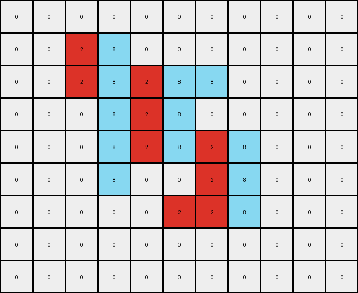

# 5-150deff5 • 023 • refine_dreamer

---


Previous Code:
```python
"""
1.  **Identify** the white (0) background and preserve its position in the output grid.
2.  **Identify** the contiguous gray (5) object in the input grid.
3.  **Segment** the gray object into distinct vertical segments. A segment is defined as a contiguous set of gray pixels in one or more adjacent columns. There may or may not be a single white pixel separating the object into segments.
4.  **Alternate Colors:** Starting with the leftmost segment, color it red (2). Color the next segment azure (8). Continue alternating red and azure for all segments of the gray object.
5. **Place** the colored segments to the output grid in place of the gray object.
"""

import numpy as np

def get_vertical_segments(grid, color):
    """
    Identifies distinct vertical segments of a specified color within the grid.
    Returns a list of lists, where each inner list contains the coordinates
    of a segment.
    """
    rows, cols = grid.shape
    segments = []
    visited = set()

    def is_valid(r, c):
        return 0 <= r < rows and 0 <= c < cols

    def dfs(r, c, current_segment):
        if (r, c) in visited or not is_valid(r, c) or grid[r, c] != color:
            return
        visited.add((r, c))
        current_segment.append((r, c))
        # Explore vertically
        dfs(r + 1, c, current_segment)
        dfs(r - 1, c, current_segment)
        

    for c in range(cols):
        for r in range(rows):
            if grid[r, c] == color and (r, c) not in visited:
                current_segment = []
                dfs(r, c, current_segment)
                # Check adjacent columns to see if this continues a previous segment
                if current_segment:
                    
                    segments.append(current_segment)

    return segments

def transform(input_grid):
    # initialize output_grid
    output_grid = np.copy(input_grid)
    rows, cols = output_grid.shape

    # get the gray object segments
    gray_segments = get_vertical_segments(input_grid, 5)

    # if no gray object exists, return a copy of the original
    if not gray_segments:
      return output_grid

    # set all the gray pixels to white
    for segment in gray_segments:
      for r,c in segment:
        output_grid[r,c] = 0

    # alternate coloring of segments
    color_index = 0
    colors = [2, 8]  # Red and Azure
    for segment in gray_segments:
        current_color = colors[color_index % 2]
        for r, c in segment:
            output_grid[r, c] = current_color
        color_index += 1

    return output_grid
```

Train Set Results:

## Example 1:**

Input:
```
0 0 0 0 0 0 0 0 0 0 0
0 0 5 5 0 0 0 0 0 0 0
0 0 5 5 5 5 5 0 0 0 0
0 0 0 5 5 5 0 0 0 0 0
0 0 0 5 5 5 5 5 0 0 0
0 0 0 5 0 0 5 5 0 0 0
0 0 0 0 0 5 5 5 0 0 0
0 0 0 0 0 0 0 0 0 0 0
0 0 0 0 0 0 0 0 0 0 0
```
Expected Output:
```
0 0 0 0 0 0 0 0 0 0 0
0 0 8 8 0 0 0 0 0 0 0
0 0 8 8 2 2 2 0 0 0 0
0 0 0 2 8 8 0 0 0 0 0
0 0 0 2 8 8 8 8 0 0 0
0 0 0 2 0 0 8 8 0 0 0
0 0 0 0 0 2 2 2 0 0 0
0 0 0 0 0 0 0 0 0 0 0
0 0 0 0 0 0 0 0 0 0 0
```
Transformed Output:
```
0 0 0 0 0 0 0 0 0 0 0
0 0 2 8 0 0 0 0 0 0 0
0 0 2 8 2 8 8 0 0 0 0
0 0 0 8 2 8 0 0 0 0 0
0 0 0 8 2 8 2 8 0 0 0
0 0 0 8 0 0 2 8 0 0 0
0 0 0 0 0 2 2 8 0 0 0
0 0 0 0 0 0 0 0 0 0 0
0 0 0 0 0 0 0 0 0 0 0
```

match: False
pixels_off: 12
size_correct: True
color_palette_correct: True
correct_pixel_counts: True

## Example 2:**

Input:
```
0 0 0 0 0 0 0 0 0 0
0 5 5 5 5 5 5 0 0 0
0 5 5 5 5 5 5 0 0 0
0 0 0 5 0 0 5 0 0 0
0 0 0 0 5 5 5 0 0 0
0 0 0 0 5 5 5 0 0 0
0 0 0 0 5 0 0 0 0 0
0 0 0 0 0 0 0 0 0 0
```
Expected Output:
```
0 0 0 0 0 0 0 0 0 0
0 8 8 2 8 8 2 0 0 0
0 8 8 2 8 8 2 0 0 0
0 0 0 2 0 0 2 0 0 0
0 0 0 0 2 8 8 0 0 0
0 0 0 0 2 8 8 0 0 0
0 0 0 0 2 0 0 0 0 0
0 0 0 0 0 0 0 0 0 0
```
Transformed Output:
```
0 0 0 0 0 0 0 0 0 0
0 2 8 2 8 8 8 0 0 0
0 2 8 2 8 8 8 0 0 0
0 0 0 2 0 0 8 0 0 0
0 0 0 0 2 2 8 0 0 0
0 0 0 0 2 2 8 0 0 0
0 0 0 0 2 0 0 0 0 0
0 0 0 0 0 0 0 0 0 0
```

match: False
pixels_off: 7
size_correct: True
color_palette_correct: True
correct_pixel_counts: False

## Example 3:**

Input:
```
0 0 0 0 0 0 0 0 0
0 5 5 5 5 5 0 0 0
0 0 0 0 5 5 0 0 0
0 0 0 5 0 0 0 0 0
0 0 0 5 5 5 0 0 0
0 0 0 5 5 5 0 0 0
0 0 0 0 0 0 0 0 0
0 0 0 0 0 0 0 0 0
```
Expected Output:
```
0 0 0 0 0 0 0 0 0
0 2 2 2 8 8 0 0 0
0 0 0 0 8 8 0 0 0
0 0 0 2 0 0 0 0 0
0 0 0 2 8 8 0 0 0
0 0 0 2 8 8 0 0 0
0 0 0 0 0 0 0 0 0
0 0 0 0 0 0 0 0 0
```
Transformed Output:
```
0 0 0 0 0 0 0 0 0
0 2 8 2 2 2 0 0 0
0 0 0 0 2 2 0 0 0
0 0 0 8 0 0 0 0 0
0 0 0 8 8 8 0 0 0
0 0 0 8 8 8 0 0 0
0 0 0 0 0 0 0 0 0
0 0 0 0 0 0 0 0 0
```

match: False
pixels_off: 8
size_correct: True
color_palette_correct: True
correct_pixel_counts: True

**INSTRUCTIONS**

The code above was generated based on observations from the first training
example

we have tested the transform function on each of the task example inputs and
compared with the expected output

review each of the examples provided and the results and consider how the
natural language program should be updated to accommodate this new knowledge

respond with the following deliverables:

- general assessment of the information provided and strategy for resolving the
  errors
- gather metrics about each of the examples and results - use code_execution to
  develop accurate reports on your assumptions
- a YAML block documenting facts - Focus on identifying objects, their properties, and the actions performed on them.
- a natural language program - Be as clear and concise as possible, providing a complete description of the transformation rule.


your responses should be considered as information in a report - not a
conversation
