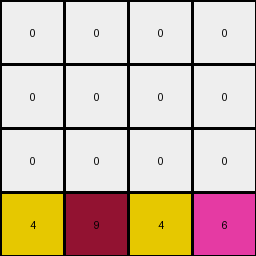
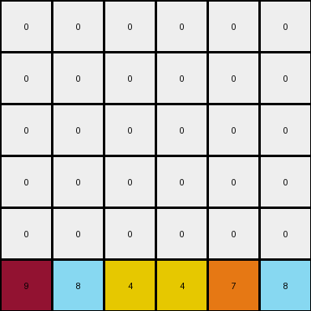

# 3-1e0a9b12 • 003 • refine_dreamer

---

Previous Code:
```python
"""
Extracts all non-zero pixels from the input grid and places them in the last row of the output grid, maintaining their original order. The rest of the cells are made or remain zero.
"""

import numpy as np

def transform(input_grid):
    # Initialize the output grid as a copy of the input grid, then set it all to zero
    output_grid = np.zeros_like(input_grid)
    
    # Find all non-zero pixels in the input grid
    non_zero_pixels = []
    for r in range(input_grid.shape[0]):
        for c in range(input_grid.shape[1]):
            if input_grid[r, c] != 0:
                non_zero_pixels.append(input_grid[r, c])

    # Place the non-zero pixel values into the last row of the output grid
    for i, value in enumerate(non_zero_pixels):
        if i < output_grid.shape[1]:  # Ensure we don't go out of bounds
           output_grid[-1, i] = value
    
    return output_grid
```

Train Set Results:

## Example 1:**

Input:
```
0 4 0 9
0 0 0 0
0 4 6 0
1 0 0 0
```
Expected Output:
```
0 0 0 0
0 0 0 0
0 4 0 0
1 4 6 9
```
Transformed Output:
```
0 0 0 0
0 0 0 0
0 0 0 0
4 9 4 6
```

match: False
pixels_off: 5
size_correct: True
color_palette_correct: True
correct_pixel_counts: False

## Example 2:**

Input:
```
0 0 0 0 0 9
0 0 0 8 0 0
0 0 0 0 0 0
4 0 0 0 0 0
4 0 7 8 0 0
4 0 7 0 0 0
```
Expected Output:
```
0 0 0 0 0 0
0 0 0 0 0 0
0 0 0 0 0 0
4 0 0 0 0 0
4 0 7 8 0 0
4 0 7 8 0 9
```
Transformed Output:
```
0 0 0 0 0 0
0 0 0 0 0 0
0 0 0 0 0 0
0 0 0 0 0 0
0 0 0 0 0 0
9 8 4 4 7 8
```

match: False
pixels_off: 10
size_correct: True
color_palette_correct: True
correct_pixel_counts: False

## Example 3:**

Input:
```
0 0 0 1 0
0 3 0 0 0
0 3 0 1 2
6 0 0 0 0
0 3 0 0 0
```
Expected Output:
```
0 0 0 0 0
0 0 0 0 0
0 3 0 0 0
0 3 0 1 0
6 3 0 1 2
```
Transformed Output:
```
0 0 0 0 0
0 0 0 0 0
0 0 0 0 0
0 0 0 0 0
1 3 3 1 2
```

match: False
pixels_off: 5
size_correct: True
color_palette_correct: True
correct_pixel_counts: False
**INSTRUCTIONS**

The code above was generated based on observations from the first training
example

we have tested the transform function on each of the task example inputs and
compared with the expected output

review each of the examples provided and the results and consider how the
natural language program should be updated to accommodate this new knowledge

respond with the following deliverables:

- general assessment of the information provided and strategy for resolving the
  errors
- gather metrics about each of the examples and results - use code_execution to
  develop accurate reports on your assumptions
- a YAML block documenting facts - Focus on identifying objects, their properties, and the actions performed on them.
- a natural language program - Be as clear and concise as possible, providing a complete description of the transformation rule.


your responses should be considered as information in a report - not a
conversation
