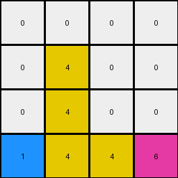
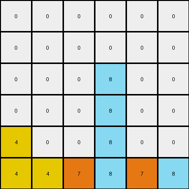
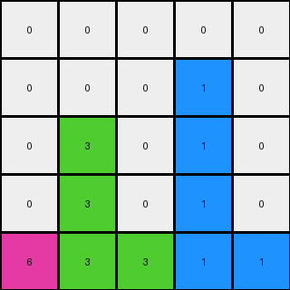

# 3-1e0a9b12 • 005 • refine_dreamer

---

Previous Code:
```python
"""
Iterates through each non-zero pixel in the input grid. Attempts to move each pixel down as far as possible within its original column. If the pixel cannot move down in its original column (bottom of grid reached or another non-zero pixel blocks it), then, if all cells below in that column are zero, it's moved to the last row of the output grid, maintaining the original horizontal order with other moved pixels.
"""

import numpy as np

def transform(input_grid):
    output_grid = np.zeros_like(input_grid)
    moved_to_last_row = []
    last_row_index = 0

    for r in range(input_grid.shape[0]):
        for c in range(input_grid.shape[1]):
            if input_grid[r, c] != 0:
                pixel_value = input_grid[r, c]
                moved_down = False

                # Check if the entire column below is empty
                all_zeros_below = True
                for row_below in range(r + 1, input_grid.shape[0]):
                    if input_grid[row_below, c] != 0:
                        all_zeros_below = False
                        break

                if all_zeros_below:
                  moved_to_last_row.append((pixel_value, (r,c)))
                  continue


                # Try to move down within the same column
                for target_r in range(r + 1, input_grid.shape[0]):
                    if output_grid[target_r, c] == 0:
                        output_grid[target_r, c] = pixel_value
                        moved_down = True

                        if target_r == input_grid.shape[0] -1:
                            break
                    else:

                        break

                if not moved_down:
                    output_grid[r,c] = pixel_value
    #process pixels to move to last row
    moved_to_last_row.sort(key=lambda x: x[1][1])  # Sort by original column
    for pixel_info in moved_to_last_row:
        pixel_value = pixel_info[0]
        while last_row_index < output_grid.shape[1] and output_grid[-1, last_row_index] != 0 :
              last_row_index += 1
        if last_row_index < output_grid.shape[1]:
          output_grid[-1, last_row_index] = pixel_value


    return output_grid
```

Train Set Results:

## Example 1:**

Input:
```
0 4 0 9
0 0 0 0
0 4 6 0
1 0 0 0
```
Expected Output:
```
0 0 0 0
0 0 0 0
0 4 0 0
1 4 6 9
```
Transformed Output:
```
0 0 0 0
0 4 0 0
0 4 0 0
1 4 4 6
```

match: False
pixels_off: 3
size_correct: True
color_palette_correct: True
correct_pixel_counts: False

## Example 2:**

Input:
```
0 0 0 0 0 9
0 0 0 8 0 0
0 0 0 0 0 0
4 0 0 0 0 0
4 0 7 8 0 0
4 0 7 0 0 0
```
Expected Output:
```
0 0 0 0 0 0
0 0 0 0 0 0
0 0 0 0 0 0
4 0 0 0 0 0
4 0 7 8 0 0
4 0 7 8 0 9
```
Transformed Output:
```
0 0 0 0 0 0
0 0 0 0 0 0
0 0 0 8 0 0
0 0 0 8 0 0
4 0 0 8 0 0
4 4 7 8 7 8
```

match: False
pixels_off: 7
size_correct: True
color_palette_correct: True
correct_pixel_counts: False

## Example 3:**

Input:
```
0 0 0 1 0
0 3 0 0 0
0 3 0 1 2
6 0 0 0 0
0 3 0 0 0
```
Expected Output:
```
0 0 0 0 0
0 0 0 0 0
0 3 0 0 0
0 3 0 1 0
6 3 0 1 2
```
Transformed Output:
```
0 0 0 0 0
0 0 0 1 0
0 3 0 1 0
0 3 0 1 0
6 3 3 1 1
```

match: False
pixels_off: 4
size_correct: True
color_palette_correct: True
correct_pixel_counts: False
**INSTRUCTIONS**

The code above was generated based on observations from the first training
example

we have tested the transform function on each of the task example inputs and
compared with the expected output

review each of the examples provided and the results and consider how the
natural language program should be updated to accommodate this new knowledge

respond with the following deliverables:

- general assessment of the information provided and strategy for resolving the
  errors
- gather metrics about each of the examples and results - use code_execution to
  develop accurate reports on your assumptions
- a YAML block documenting facts - Focus on identifying objects, their properties, and the actions performed on them.
- a natural language program - Be as clear and concise as possible, providing a complete description of the transformation rule.


your responses should be considered as information in a report - not a
conversation
