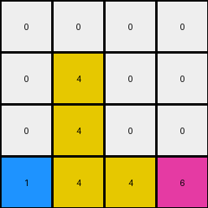
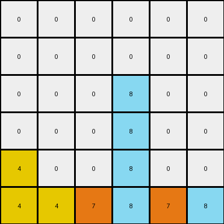

# 3-1e0a9b12 • 006 • refine_coder

---

Previous Code:
```python
"""
Iterates through each non-zero pixel in the input grid. Attempts to move each pixel down as far as possible within its original column. If the pixel cannot move down in its original column (bottom of grid reached or another non-zero pixel blocks it), then, if all cells below in that column are zero, it's moved to the last row of the output grid, maintaining the original horizontal order with other moved pixels.
"""

import numpy as np

def transform(input_grid):
    output_grid = np.zeros_like(input_grid)
    moved_to_last_row = []
    last_row_index = 0

    for r in range(input_grid.shape[0]):
        for c in range(input_grid.shape[1]):
            if input_grid[r, c] != 0:
                pixel_value = input_grid[r, c]
                moved_down = False

                # Check if the entire column below is empty
                all_zeros_below = True
                for row_below in range(r + 1, input_grid.shape[0]):
                    if input_grid[row_below, c] != 0:
                        all_zeros_below = False
                        break

                if all_zeros_below:
                  moved_to_last_row.append((pixel_value, (r,c)))
                  continue


                # Try to move down within the same column
                for target_r in range(r + 1, input_grid.shape[0]):
                    if output_grid[target_r, c] == 0:
                        output_grid[target_r, c] = pixel_value
                        moved_down = True

                        if target_r == input_grid.shape[0] -1:
                            break
                    else:

                        break

                if not moved_down:
                    output_grid[r,c] = pixel_value
    #process pixels to move to last row
    moved_to_last_row.sort(key=lambda x: x[1][1])  # Sort by original column
    for pixel_info in moved_to_last_row:
        pixel_value = pixel_info[0]
        while last_row_index < output_grid.shape[1] and output_grid[-1, last_row_index] != 0 :
              last_row_index += 1
        if last_row_index < output_grid.shape[1]:
          output_grid[-1, last_row_index] = pixel_value


    return output_grid
```

Train Set Results:

## Example 1:**

Input:
```
0 4 0 9
0 0 0 0
0 4 6 0
1 0 0 0
```
Expected Output:
```
0 0 0 0
0 0 0 0
0 4 0 0
1 4 6 9
```
Transformed Output:
```
0 0 0 0
0 4 0 0
0 4 0 0
1 4 4 6
```

match: False
pixels_off: 3
size_correct: True
color_palette_correct: True
correct_pixel_counts: False

## Example 2:**

Input:
```
0 0 0 0 0 9
0 0 0 8 0 0
0 0 0 0 0 0
4 0 0 0 0 0
4 0 7 8 0 0
4 0 7 0 0 0
```
Expected Output:
```
0 0 0 0 0 0
0 0 0 0 0 0
0 0 0 0 0 0
4 0 0 0 0 0
4 0 7 8 0 0
4 0 7 8 0 9
```
Transformed Output:
```
0 0 0 0 0 0
0 0 0 0 0 0
0 0 0 8 0 0
0 0 0 8 0 0
4 0 0 8 0 0
4 4 7 8 7 8
```

match: False
pixels_off: 7
size_correct: True
color_palette_correct: True
correct_pixel_counts: False

## Example 3:**

Input:
```
0 0 0 1 0
0 3 0 0 0
0 3 0 1 2
6 0 0 0 0
0 3 0 0 0
```
Expected Output:
```
0 0 0 0 0
0 0 0 0 0
0 3 0 0 0
0 3 0 1 0
6 3 0 1 2
```
Transformed Output:
```
0 0 0 0 0
0 0 0 1 0
0 3 0 1 0
0 3 0 1 0
6 3 3 1 1
```

match: False
pixels_off: 4
size_correct: True
color_palette_correct: True
correct_pixel_counts: False
Okay, here's a breakdown of the situation and a plan to refine the approach:

**General Assessment:**

The initial code was based on a "gravity" concept, attempting to move non-zero pixels downwards. It also included a special case to handle columns that are entirely zero below a given pixel.  However, the results across multiple examples show inconsistencies. The "gravity" concept is partially correct, but the logic for handling blocked pixels and placing them in the last row is flawed, and causes pixel duplication or misplacement, shown by pixel count differences.

The strategy needs to focus on correctly handling the cases where a pixel's downward movement is blocked. The current implementation's "move to last row" logic seems to misinterpret the conditions, applying to the wrong pixels. We need to correct last row placement and correctly handle the columns blocked by other non-zero pixels.

**Metrics and Observations (Example-Specific):**

Here is a refined breakdown of each example:

*   **Example 1:**
    *   Input Shape: (4, 4)
    *   Output Shape: (4, 4)
    *   Objects: Yellow (4), Maroon (9), Blue (1), Magenta (6)
    *   Issue: The yellow (4) pixel in the first row, second column is duplicated, moving down correctly but then also being included when last_row is processed. The 9 and 6 pixels are dropped.
*   **Example 2:**
    *   Input Shape: (6, 6)
    *   Output Shape: (6, 6)
    *   Objects: Yellow (4), Green (7), Orange (8), Maroon(9)
    *   Issue: Similar to Example 1, several pixels incorrectly move and are duplicated in the last row.
*   **Example 3:**
    *   Input Shape: (5, 5)
    *   Output Shape: (5, 5)
    *   Objects: Blue (1), Green (3), Red(2), Gray (6)
    *   Issue: The blue (1) and green (3) are also incorrectly moved and are duplicated.

**YAML Fact Block:**

```yaml
objects:
  - description: Non-zero pixels in the grid.
    properties:
      color: Represented by a digit (0-9).
      initial_position: (row, column) in the input grid.
      final_position: (row, column) in the output grid.
      movement: Attempts to move downwards.
      blocked: True if another non-zero pixel is directly below it, False otherwise.
actions:
  - name: MoveDown
    description: Move a pixel down to the lowest available position in its column.
    conditions:
      - The target cell is empty (value 0).
      - No non-zero pixel blocks.
  - name: MoveToLastRowIfColumnClear
    description: if the entire column below the pixel is clear (all zeros) then move the pixels to last row
    conditions:
      - all cells below the pixel are empty.
  - name: KeepInPlace
    description: maintain original position
    conditions:
       - downward movement is blocked and column below is not clear.
```

**Natural Language Program:**

1.  **Iterate** through each cell of the input grid, examining each pixel.
2.  **Identify** non-zero pixels.
3.  For each non-zero pixel, attempt to **move it down** within its current column as far as possible.
    *   A move is valid if the target cell below is empty (value 0).
    *   Stop moving downward when the bottom of the grid is reached or a non-zero pixel is encountered.
4. Check if all cells below a pixel are zero.
    * If all cells below are zero, move these pixels to the last row, while maintaining the original column order.
5. **KeepInPlace** If the pixel cannot move down because it's blocked by another non-zero pixel and it's not in a clear column. The final output should be the result of all successful downward movements.


**INSTRUCTIONS**

- generate a Python module to represent the natural language program 
- follow the template below
- all common math and science libraries are available
- create docstring only at top - but comment the workflow in the function
- use helper functions for common operations like finding objects, counting,
  measuring, moving, etc. 

remember - we are working iteratively - so this code will inform your future
self as we converge on the solution

*template:*

```python
"""
{{ natural language description of the transformation rule }}
"""

{{ imports }}

def transform(input_grid):
    # initialize output_grid

    # change output pixels 

    return output_grid

```
