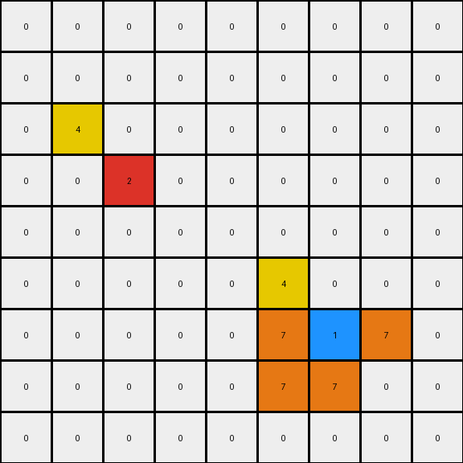
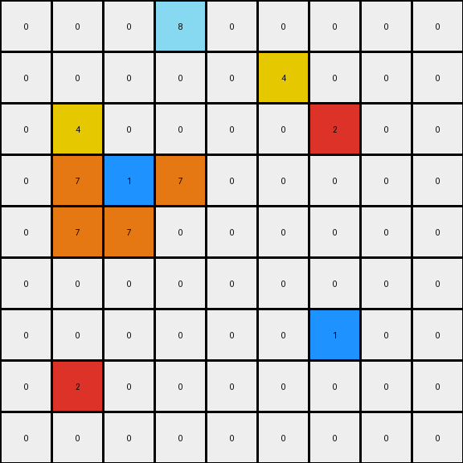

# 2-0ca9ddb6 • 020 • refine_coder

---

Previous Code:
```python
"""
1.  **Identify Key Pixels:** Locate the blue pixel (color 1), the red pixel (color 2) and the magenta pixel (color 6) within the input grid.

2.  **Add Yellow Around Blue and Red**: Place a yellow pixel above and one to the left of the blue pixel. Place a yellow pixel above and one to the left of the red pixel.

3.  **Add Orange Around Blue:** Place orange pixels (color 7) to form an "L" pattern centered on the blue pixel, as follow: one to its left, one below, one to its right and one below that one.

4.  **Preserve original non-zero pixels:** All other pixels from the input grid, except zero, should remain in the same position and retain their original color in the output grid. Zero value pixels remain the same unless transformed.
"""

import numpy as np

def find_pixel(grid, color):
    """Finds the coordinates of the first pixel of a given color."""
    rows, cols = np.where(grid == color)
    if len(rows) > 0:
        return (rows[0], cols[0])
    return None

def transform(input_grid):
    # Initialize output_grid as a copy of the input_grid
    output_grid = input_grid.copy()

    # Find key pixels
    blue_pos = find_pixel(input_grid, 1)
    red_pos = find_pixel(input_grid, 2)
    magenta_pos = find_pixel(input_grid, 6)

    # Add yellow around blue and red
    if blue_pos:
        row, col = blue_pos
        if row > 0 and col > 0:
            output_grid[row - 1, col -1] = 4
    if red_pos:
        row, col = red_pos
        if row > 0 and col > 0:
            output_grid[row-1, col - 1] = 4
    
    # Add orange around blue
    if blue_pos:
        row, col = blue_pos
        if col > 0:
             output_grid[row, col - 1] = 7  # Left
        if row < output_grid.shape[0] -1:
            output_grid[row + 1, col] = 7  # Below
        if col < output_grid.shape[1] - 1:
             output_grid[row, col + 1] = 7  # right
        if row < output_grid.shape[0] - 1 and col < output_grid.shape[1] - 1:
            output_grid[row + 1, col + 1] = 0 # clear diagonal below and to the right.
        if row < output_grid.shape[0] -1 and col > 0:
             output_grid[row+1, col-1] = 7 #below and left
    

    return output_grid
```

Train Set Results:

## Example 1:**

Input:
```
0 0 0 0 0 0 0 0 0
0 0 0 0 0 0 0 0 0
0 0 0 0 0 0 0 0 0
0 0 2 0 0 0 0 0 0
0 0 0 0 0 0 0 0 0
0 0 0 0 0 0 0 0 0
0 0 0 0 0 0 1 0 0
0 0 0 0 0 0 0 0 0
0 0 0 0 0 0 0 0 0
```
Expected Output:
```
0 0 0 0 0 0 0 0 0
0 0 0 0 0 0 0 0 0
0 4 0 4 0 0 0 0 0
0 0 2 0 0 0 0 0 0
0 4 0 4 0 0 0 0 0
0 0 0 0 0 0 7 0 0
0 0 0 0 0 7 1 7 0
0 0 0 0 0 0 7 0 0
0 0 0 0 0 0 0 0 0
```
Transformed Output:
```
0 0 0 0 0 0 0 0 0
0 0 0 0 0 0 0 0 0
0 4 0 0 0 0 0 0 0
0 0 2 0 0 0 0 0 0
0 0 0 0 0 0 0 0 0
0 0 0 0 0 4 0 0 0
0 0 0 0 0 7 1 7 0
0 0 0 0 0 7 7 0 0
0 0 0 0 0 0 0 0 0
```

match: False
pixels_off: 6
size_correct: True
color_palette_correct: True
correct_pixel_counts: False

## Example 2:**

Input:
```
0 0 0 8 0 0 0 0 0
0 0 0 0 0 0 0 0 0
0 0 0 0 0 0 2 0 0
0 0 1 0 0 0 0 0 0
0 0 0 0 0 0 0 0 0
0 0 0 0 0 0 0 0 0
0 0 0 0 0 0 1 0 0
0 2 0 0 0 0 0 0 0
0 0 0 0 0 0 0 0 0
```
Expected Output:
```
0 0 0 8 0 0 0 0 0
0 0 0 0 0 4 0 4 0
0 0 7 0 0 0 2 0 0
0 7 1 7 0 4 0 4 0
0 0 7 0 0 0 0 0 0
0 0 0 0 0 0 7 0 0
4 0 4 0 0 7 1 7 0
0 2 0 0 0 0 7 0 0
4 0 4 0 0 0 0 0 0
```
Transformed Output:
```
0 0 0 8 0 0 0 0 0
0 0 0 0 0 4 0 0 0
0 4 0 0 0 0 2 0 0
0 7 1 7 0 0 0 0 0
0 7 7 0 0 0 0 0 0
0 0 0 0 0 0 0 0 0
0 0 0 0 0 0 1 0 0
0 2 0 0 0 0 0 0 0
0 0 0 0 0 0 0 0 0
```

match: False
pixels_off: 14
size_correct: True
color_palette_correct: True
correct_pixel_counts: False

## Example 3:**

Input:
```
0 0 0 0 0 0 0 0 0
0 0 0 0 0 0 0 0 0
0 0 2 0 0 0 0 0 0
0 0 0 0 0 0 0 0 0
0 0 0 0 0 0 0 0 0
0 0 0 0 0 0 6 0 0
0 0 0 0 0 0 0 0 0
0 0 0 1 0 0 0 0 0
0 0 0 0 0 0 0 0 0
```
Expected Output:
```
0 0 0 0 0 0 0 0 0
0 4 0 4 0 0 0 0 0
0 0 2 0 0 0 0 0 0
0 4 0 4 0 0 0 0 0
0 0 0 0 0 0 0 0 0
0 0 0 0 0 0 6 0 0
0 0 0 7 0 0 0 0 0
0 0 7 1 7 0 0 0 0
0 0 0 7 0 0 0 0 0
```
Transformed Output:
```
0 0 0 0 0 0 0 0 0
0 4 0 0 0 0 0 0 0
0 0 2 0 0 0 0 0 0
0 0 0 0 0 0 0 0 0
0 0 0 0 0 0 0 0 0
0 0 0 0 0 0 6 0 0
0 0 4 0 0 0 0 0 0
0 0 7 1 7 0 0 0 0
0 0 7 7 0 0 0 0 0
```

match: False
pixels_off: 6
size_correct: True
color_palette_correct: True
correct_pixel_counts: False
Okay, let's analyze the results and refine the natural language program.

**General Assessment:**

The initial program was based on observations from the first example, and it's clear that it doesn't generalize well to the other examples. The core issue is that the program is too rigid in how it applies the transformations, specifically around the placement of yellow and orange pixels. It's not correctly interpreting the *relative* positioning and the conditions under which these colors should be added. It places the yellow pixels above and to the left of the blue and red pixels, where as it looks like they are mirroring it. The original program also makes several errors with how it renders the Orange L, it misplaces, or doesn't place, orange pixels.

**Strategy for Resolving Errors:**

1.  **Re-evaluate Yellow Placement:** The yellow placement rule needs to be clarified. It seems to be creating a reflection, mirroring the blue and red pixels, or a symmetric pattern, not just above and to the left.
2.  **Re-evaluate Orange Placement:** The "L" shape around the blue pixel is not consistent. We need to define its orientation and extent precisely. The original program attempted to do this, but it's clear it needs further refinement.
3.  **Conditions:** Ensure the rules only apply under the correct conditions. For instance, don't add colors outside the grid boundaries. While the code does handle boundaries, the application of those boundaries, and the surrounding logic, needs to be more precise.
4. **Magenta**: It appears the magenta pixel must be preserved, the rule in the natural language program correctly specifies this.

**Metrics and Observations:**

Here's a breakdown of each example, incorporating observations:

*   **Example 1:**
    *   Blue at (6, 6), Red at (3, 2), Magenta absent.
    *   Yellow incorrectly placed. It's rendered above and to the left of the key pixels, but not mirroring.
    *  Orange incorrectly placed below and to the right of the blue pixel.
    *   Pixels off: 6

*   **Example 2:**
    *   Blue at (3, 2) and (6,6), Red at (7, 1) and (2,6), Magenta absent.
    *   Yellow incorrectly placed around blue and red.
    *   Orange is rendered correctly around only one of the Blue Pixels.
    *   Pixels off: 14

*   **Example 3:**
    *   Blue at (7, 3), Red at (2, 2), Magenta at (5,6).
    *  Yellow is incorrectly placed for blue, and correctly omitted for magenta.
    *  Orange shape is correct.
    *   Pixels off: 6

**YAML Block (Facts):**

```yaml
objects:
  blue_pixel:
    color: 1
    shape: single pixel
    actions:
      - mirrored by yellow
      - surrounded by orange in L shape
  red_pixel:
    color: 2
    shape: single pixel
    actions:
      - mirrored by yellow
  magenta_pixel:
    color: 6
    shape: single pixel
    actions: []
  yellow_pixel:
    color: 4
    shape: single pixel
    actions: []
  orange_pixel:
    color: 7
    shape: single pixel
    actions: []
  background:
      color: 0
      actions: []
grid:
  shape: rectangular
  boundary_check: required

actions:
    mirror_red:
        yellow pixel placed at mirror of red pixel
    mirror_blue:
         yellow pixel placed at mirror of blue pixel
    orange_l: |
        orange pixels create an "L" shape, with one to its left, one below, one to
        its right, and one diagonally below and to the left of the blue
        pixel.
```

**Natural Language Program:**

1.  **Identify Key Pixels:** Locate all blue pixels (color 1), red pixels (color 2), and magenta pixels (color 6) within the input grid.

2. **Mirror Red and Blue With Yellow:** For *each* red and *each* blue pixel, place a yellow pixel in the mirrored position. If the blue or red pixel is at location (row, col), place a yellow pixel at location(row-1, col -1).

3. **Orange L Around Blue:** For *each* blue pixel, place orange pixels (color 7) to form an "L" pattern:
   *   One orange pixel to the left of the blue pixel.
   *   One orange pixel below the blue pixel.
   *   One orange pixel to the right of the blue pixel.
   *  One Orange pixel diagonal and to the left of the blue pixel.

4.  **Preserve Magenta and Other Colors:** All pixels from the input grid, including magenta (color 6), should remain in their original positions and retain their original colors unless transformed by rules 2 and 3. Zero valued (black) pixels remain the same, unless replaced.

5. **Boundary Conditions**: Do not attempt to place colors out of bounds, ignore color placements if they are off the grid.

**INSTRUCTIONS**

- generate a Python module to represent the natural language program 
- follow the template below
- all common math and science libraries are available
- create docstring only at top - but comment the workflow in the function
- use helper functions for common operations like finding objects, counting,
  measuring, moving, etc. 

remember - we are working iteratively - so this code will inform your future
self as we converge on the solution

*template:*

```python
"""
{{ natural language description of the transformation rule }}
"""

{{ imports }}

def transform(input_grid):
    # initialize output_grid

    # change output pixels 

    return output_grid

```
