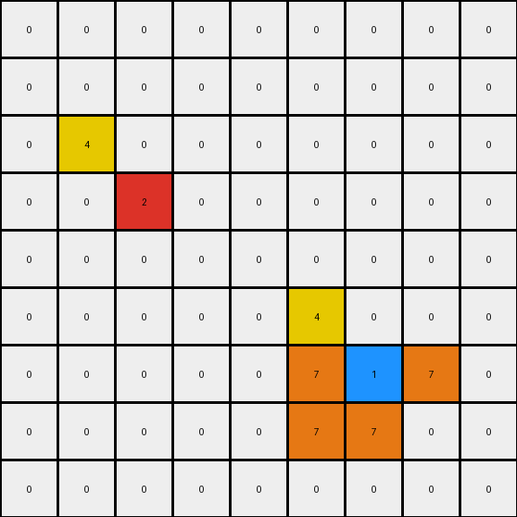
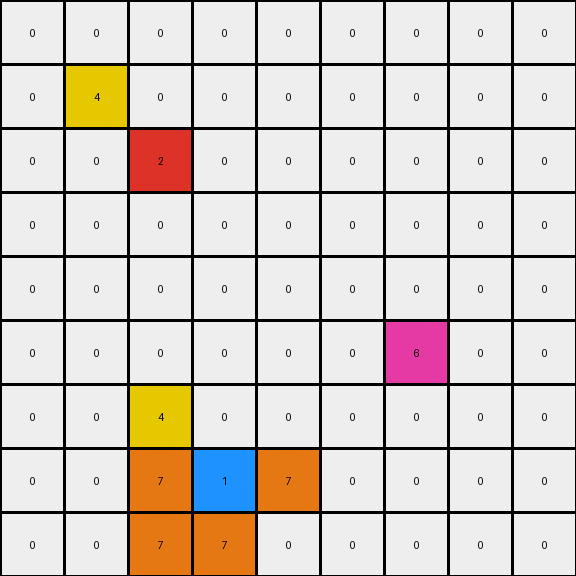

# 2-0ca9ddb6 • 021 • refine_dreamer

---


Previous Code:
```python
"""
1.  **Identify Key Pixels:** Locate all blue pixels (color 1), red pixels (color 2), and magenta pixels (color 6) within the input grid.

2. **Mirror Red and Blue With Yellow:** For *each* red and *each* blue pixel, place a yellow pixel in the mirrored position. If the blue or red pixel is at location (row, col), place a yellow pixel at location(row-1, col -1).

3. **Orange L Around Blue:** For *each* blue pixel, place orange pixels (color 7) to form an "L" shape:
   *   One orange pixel to the left of the blue pixel.
   *   One orange pixel below the blue pixel.
   *   One orange pixel to the right of the blue pixel.
   *  One Orange pixel diagonal and to the left of the blue pixel.

4.  **Preserve Magenta and Other Colors:** All pixels from the input grid, including magenta (color 6), should remain in their original positions and retain their original colors unless transformed by rules 2 and 3. Zero valued (black) pixels remain the same, unless replaced.

5. **Boundary Conditions**: Do not attempt to place colors out of bounds, ignore color placements if they are off the grid.
"""

import numpy as np

def find_all_pixels(grid, color):
    """Finds the coordinates of all pixels of a given color."""
    rows, cols = np.where(grid == color)
    return list(zip(rows, cols))

def transform(input_grid):
    # Initialize output_grid as a copy of the input_grid
    output_grid = input_grid.copy()
    height, width = output_grid.shape

    # Find key pixels
    blue_pixels = find_all_pixels(input_grid, 1)
    red_pixels = find_all_pixels(input_grid, 2)

    # Mirror red and blue with yellow
    for row, col in blue_pixels + red_pixels:
        if row > 0 and col > 0:
            output_grid[row - 1, col - 1] = 4

    # Orange L around blue
    for row, col in blue_pixels:
        # Left
        if col > 0:
            output_grid[row, col - 1] = 7
        # Below
        if row < height - 1:
            output_grid[row + 1, col] = 7
        # Right
        if col < width - 1:
            output_grid[row, col + 1] = 7
        # Diagonal below and left
        if row < height - 1 and col > 0:
            output_grid[row + 1, col - 1] = 7

    return output_grid
```

Train Set Results:

## Example 1:**

Input:
```
0 0 0 0 0 0 0 0 0
0 0 0 0 0 0 0 0 0
0 0 0 0 0 0 0 0 0
0 0 2 0 0 0 0 0 0
0 0 0 0 0 0 0 0 0
0 0 0 0 0 0 0 0 0
0 0 0 0 0 0 1 0 0
0 0 0 0 0 0 0 0 0
0 0 0 0 0 0 0 0 0
```
Expected Output:
```
0 0 0 0 0 0 0 0 0
0 0 0 0 0 0 0 0 0
0 4 0 4 0 0 0 0 0
0 0 2 0 0 0 0 0 0
0 4 0 4 0 0 0 0 0
0 0 0 0 0 0 7 0 0
0 0 0 0 0 7 1 7 0
0 0 0 0 0 0 7 0 0
0 0 0 0 0 0 0 0 0
```
Transformed Output:
```
0 0 0 0 0 0 0 0 0
0 0 0 0 0 0 0 0 0
0 4 0 0 0 0 0 0 0
0 0 2 0 0 0 0 0 0
0 0 0 0 0 0 0 0 0
0 0 0 0 0 4 0 0 0
0 0 0 0 0 7 1 7 0
0 0 0 0 0 7 7 0 0
0 0 0 0 0 0 0 0 0
```

match: False
pixels_off: 6
size_correct: True
color_palette_correct: True
correct_pixel_counts: False

## Example 2:**

Input:
```
0 0 0 8 0 0 0 0 0
0 0 0 0 0 0 0 0 0
0 0 0 0 0 0 2 0 0
0 0 1 0 0 0 0 0 0
0 0 0 0 0 0 0 0 0
0 0 0 0 0 0 0 0 0
0 0 0 0 0 0 1 0 0
0 2 0 0 0 0 0 0 0
0 0 0 0 0 0 0 0 0
```
Expected Output:
```
0 0 0 8 0 0 0 0 0
0 0 0 0 0 4 0 4 0
0 0 7 0 0 0 2 0 0
0 7 1 7 0 4 0 4 0
0 0 7 0 0 0 0 0 0
0 0 0 0 0 0 7 0 0
4 0 4 0 0 7 1 7 0
0 2 0 0 0 0 7 0 0
4 0 4 0 0 0 0 0 0
```
Transformed Output:
```
0 0 0 8 0 0 0 0 0
0 0 0 0 0 4 0 0 0
0 4 0 0 0 0 2 0 0
0 7 1 7 0 0 0 0 0
0 7 7 0 0 0 0 0 0
0 0 0 0 0 4 0 0 0
4 0 0 0 0 7 1 7 0
0 2 0 0 0 7 7 0 0
0 0 0 0 0 0 0 0 0
```

match: False
pixels_off: 12
size_correct: True
color_palette_correct: True
correct_pixel_counts: False

## Example 3:**

Input:
```
0 0 0 0 0 0 0 0 0
0 0 0 0 0 0 0 0 0
0 0 2 0 0 0 0 0 0
0 0 0 0 0 0 0 0 0
0 0 0 0 0 0 0 0 0
0 0 0 0 0 0 6 0 0
0 0 0 0 0 0 0 0 0
0 0 0 1 0 0 0 0 0
0 0 0 0 0 0 0 0 0
```
Expected Output:
```
0 0 0 0 0 0 0 0 0
0 4 0 4 0 0 0 0 0
0 0 2 0 0 0 0 0 0
0 4 0 4 0 0 0 0 0
0 0 0 0 0 0 0 0 0
0 0 0 0 0 0 6 0 0
0 0 0 7 0 0 0 0 0
0 0 7 1 7 0 0 0 0
0 0 0 7 0 0 0 0 0
```
Transformed Output:
```
0 0 0 0 0 0 0 0 0
0 4 0 0 0 0 0 0 0
0 0 2 0 0 0 0 0 0
0 0 0 0 0 0 0 0 0
0 0 0 0 0 0 0 0 0
0 0 0 0 0 0 6 0 0
0 0 4 0 0 0 0 0 0
0 0 7 1 7 0 0 0 0
0 0 7 7 0 0 0 0 0
```

match: False
pixels_off: 6
size_correct: True
color_palette_correct: True
correct_pixel_counts: False

**INSTRUCTIONS**

The code above was generated based on observations from the first training
example

we have tested the transform function on each of the task example inputs and
compared with the expected output

review each of the examples provided and the results and consider how the
natural language program should be updated to accommodate this new knowledge

respond with the following deliverables:

- general assessment of the information provided and strategy for resolving the
  errors
- gather metrics about each of the examples and results - use code_execution to
  develop accurate reports on your assumptions
- a YAML block documenting facts - Focus on identifying objects, their properties, and the actions performed on them.
- a natural language program - Be as clear and concise as possible, providing a complete description of the transformation rule.


your responses should be considered as information in a report - not a
conversation
