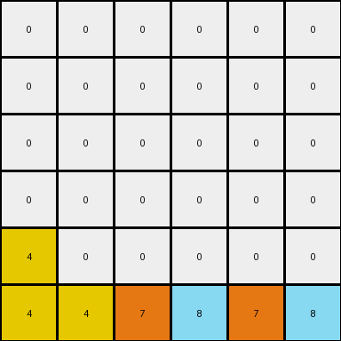
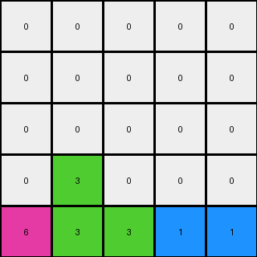

# 3-1e0a9b12 • 007 • refine_dreamer

---

Previous Code:
```python
"""
Iterates through each non-zero pixel in the input grid. Attempts to move each pixel down as far as possible within its original column. If a pixel is blocked by another non-zero pixel and column is not clear, it remains in its original position. If the entire column below the pixel consists of zeros, then the pixel is moved to the last row of the output grid, preserving original column order.
"""

import numpy as np

def transform(input_grid):
    output_grid = np.zeros_like(input_grid)
    last_row_pixels = []

    # Iterate through each cell
    for r in range(input_grid.shape[0]):
        for c in range(input_grid.shape[1]):
            pixel_value = input_grid[r, c]
            if pixel_value != 0:
                # Check for clear column below
                all_zeros_below = True
                for row_below in range(r + 1, input_grid.shape[0]):
                    if input_grid[row_below, c] != 0:
                        all_zeros_below = False
                        break

                if all_zeros_below:
                    last_row_pixels.append((pixel_value, c)) # Store pixel and its column
                else:
                    # Try to move down within column
                    target_r = r
                    for check_r in range(r + 1, input_grid.shape[0]):
                        if output_grid[check_r, c] == 0:
                            target_r = check_r
                        else:
                            break
                    output_grid[target_r, c] = pixel_value

    # Process last row pixels
    last_row_pixels.sort(key=lambda x: x[1])  # Sort by original column
    last_row_col_index = 0
    for pixel_value, _ in last_row_pixels:
        while last_row_col_index < output_grid.shape[1] and output_grid[-1, last_row_col_index] != 0:
            last_row_col_index += 1
        if last_row_col_index < output_grid.shape[1]:
            output_grid[-1, last_row_col_index] = pixel_value


    return output_grid
```

Train Set Results:

## Example 1:**

Input:
```
0 4 0 9
0 0 0 0
0 4 6 0
1 0 0 0
```
Expected Output:
```
0 0 0 0
0 0 0 0
0 4 0 0
1 4 6 9
```
Transformed Output:
```
0 0 0 0
0 0 0 0
0 0 0 0
1 4 4 6
```

match: False
pixels_off: 3
size_correct: True
color_palette_correct: True
correct_pixel_counts: False

## Example 2:**

Input:
```
0 0 0 0 0 9
0 0 0 8 0 0
0 0 0 0 0 0
4 0 0 0 0 0
4 0 7 8 0 0
4 0 7 0 0 0
```
Expected Output:
```
0 0 0 0 0 0
0 0 0 0 0 0
0 0 0 0 0 0
4 0 0 0 0 0
4 0 7 8 0 0
4 0 7 8 0 9
```
Transformed Output:
```
0 0 0 0 0 0
0 0 0 0 0 0
0 0 0 0 0 0
0 0 0 0 0 0
4 0 0 0 0 0
4 4 7 8 7 8
```

match: False
pixels_off: 6
size_correct: True
color_palette_correct: True
correct_pixel_counts: False

## Example 3:**

Input:
```
0 0 0 1 0
0 3 0 0 0
0 3 0 1 2
6 0 0 0 0
0 3 0 0 0
```
Expected Output:
```
0 0 0 0 0
0 0 0 0 0
0 3 0 0 0
0 3 0 1 0
6 3 0 1 2
```
Transformed Output:
```
0 0 0 0 0
0 0 0 0 0
0 0 0 0 0
0 3 0 0 0
6 3 3 1 1
```

match: False
pixels_off: 4
size_correct: True
color_palette_correct: True
correct_pixel_counts: False
**INSTRUCTIONS**

The code above was generated based on observations from the first training
example

we have tested the transform function on each of the task example inputs and
compared with the expected output

review each of the examples provided and the results and consider how the
natural language program should be updated to accommodate this new knowledge

respond with the following deliverables:

- general assessment of the information provided and strategy for resolving the
  errors
- gather metrics about each of the examples and results - use code_execution to
  develop accurate reports on your assumptions
- a YAML block documenting facts - Focus on identifying objects, their properties, and the actions performed on them.
- a natural language program - Be as clear and concise as possible, providing a complete description of the transformation rule.


your responses should be considered as information in a report - not a
conversation
