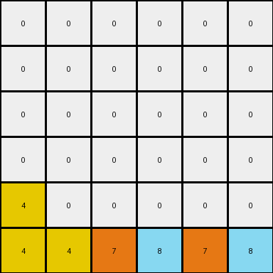
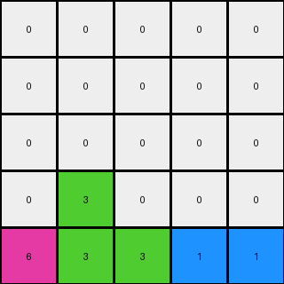

# 3-1e0a9b12 • 008 • refine_coder

---

Previous Code:
```python
"""
Iterates through each non-zero pixel in the input grid. Attempts to move each pixel down as far as possible within its original column. If a pixel is blocked by another non-zero pixel and column is not clear, it remains in its original position. If the entire column below the pixel consists of zeros, then the pixel is moved to the last row of the output grid, preserving original column order.
"""

import numpy as np

def transform(input_grid):
    output_grid = np.zeros_like(input_grid)
    last_row_pixels = []

    # Iterate through each cell
    for r in range(input_grid.shape[0]):
        for c in range(input_grid.shape[1]):
            pixel_value = input_grid[r, c]
            if pixel_value != 0:
                # Check for clear column below
                all_zeros_below = True
                for row_below in range(r + 1, input_grid.shape[0]):
                    if input_grid[row_below, c] != 0:
                        all_zeros_below = False
                        break

                if all_zeros_below:
                    last_row_pixels.append((pixel_value, c)) # Store pixel and its column
                else:
                    # Try to move down within column
                    target_r = r
                    for check_r in range(r + 1, input_grid.shape[0]):
                        if output_grid[check_r, c] == 0:
                            target_r = check_r
                        else:
                            break
                    output_grid[target_r, c] = pixel_value

    # Process last row pixels
    last_row_pixels.sort(key=lambda x: x[1])  # Sort by original column
    last_row_col_index = 0
    for pixel_value, _ in last_row_pixels:
        while last_row_col_index < output_grid.shape[1] and output_grid[-1, last_row_col_index] != 0:
            last_row_col_index += 1
        if last_row_col_index < output_grid.shape[1]:
            output_grid[-1, last_row_col_index] = pixel_value


    return output_grid
```

Train Set Results:

## Example 1:**

Input:
```
0 4 0 9
0 0 0 0
0 4 6 0
1 0 0 0
```
Expected Output:
```
0 0 0 0
0 0 0 0
0 4 0 0
1 4 6 9
```
Transformed Output:
```
0 0 0 0
0 0 0 0
0 0 0 0
1 4 4 6
```

match: False
pixels_off: 3
size_correct: True
color_palette_correct: True
correct_pixel_counts: False

## Example 2:**

Input:
```
0 0 0 0 0 9
0 0 0 8 0 0
0 0 0 0 0 0
4 0 0 0 0 0
4 0 7 8 0 0
4 0 7 0 0 0
```
Expected Output:
```
0 0 0 0 0 0
0 0 0 0 0 0
0 0 0 0 0 0
4 0 0 0 0 0
4 0 7 8 0 0
4 0 7 8 0 9
```
Transformed Output:
```
0 0 0 0 0 0
0 0 0 0 0 0
0 0 0 0 0 0
0 0 0 0 0 0
4 0 0 0 0 0
4 4 7 8 7 8
```

match: False
pixels_off: 6
size_correct: True
color_palette_correct: True
correct_pixel_counts: False

## Example 3:**

Input:
```
0 0 0 1 0
0 3 0 0 0
0 3 0 1 2
6 0 0 0 0
0 3 0 0 0
```
Expected Output:
```
0 0 0 0 0
0 0 0 0 0
0 3 0 0 0
0 3 0 1 0
6 3 0 1 2
```
Transformed Output:
```
0 0 0 0 0
0 0 0 0 0
0 0 0 0 0
0 3 0 0 0
6 3 3 1 1
```

match: False
pixels_off: 4
size_correct: True
color_palette_correct: True
correct_pixel_counts: False
Here's an analysis of the provided information and a plan to refine the natural language program:

**General Assessment:**

The initial code implements a "gravity" or "falling" mechanism, where non-zero pixels move downwards. It differentiates between two cases: pixels with a clear path to the bottom, and pixels blocked by other non-zero pixels. The current implementation has issues with accurately positioning pixels that are obstructed. Additionally, it seems to be duplicating pixels sometimes when they move to the final row. The strategy for handling last row pixels is causing incorrect placement.

**Strategy for Resolving Errors:**

1.  **Prioritize Obstruction Handling:** The core logic for moving pixels down when they are *not* completely free to fall to the bottom needs to be corrected. The code must correctly identify the lowest available empty cell in the same column.
2.  **Revisit "Last Row" Logic:** The current last-row handling logic is flawed. The code should correctly place last-row pixels in their original columns, only if the column is completely empty beneath the original location of the pixel.
3.  **Simplify and Clarify:** Make the code easier to understand by separating last row processing and make better checks before the final row placement.

**Metrics and Observations:**

Here's a breakdown of each example, including more targeted metrics:

*   **Example 1:**
    *   **Objects:** Four non-zero pixels (4, 9, 4, 6, 1).
    *   **Movement:**
        *   '1' (bottom-left) falls to the bottom, maintaining its column.
        *   Top '4' is obstructed by bottom '4'
        *   Bottom '4' falls one place
        *    '6' falles and obstructed.
        *   '9' falls to bottom.
    *   **Errors:** Bottom '4' has a pixel below.
    *  **Correct:** 4, 9, 6, 1
    *  **Duplicate**: 4

*   **Example 2:**
    *   **Objects:** Six non-zero pixels (9, 8, 4, 4, 7, 8).
    *   **Movement:**
        *    '9' (top-right) falls to bottom.
        *    The top 8 fall two spaces down until hitting the other '8'
        *   Other numbers fall as much as possible.
    *   **Errors:** 8, 7
    *  **Correct:** 4, 4, 9
    *  **Duplicate**: 4, 7, 8

*   **Example 3:**
    *   **Objects:** Five non-zero pixels (1, 3, 3, 1, 2, 6).
    *   **Movement:** all the objects fall.
    *   **Errors:** The 1 and second 3 duplicated at the end.
    *  **Correct:** 6, 3, 2
    *  **Duplicate**: 1, 3

**YAML Fact Documentation:**

```yaml
examples:
  - id: 1
    objects:
      - value: 4
        initial_position: (0, 1)
        movement: obstructed
      - value: 9
        initial_position: (0, 3)
        movement: falls_to_bottom
      - value: 4
        initial_position: (2, 1)
        movement: obstructed
      - value: 6
        initial_position: (2, 2)
        movement: obstructed
      - value: 1
        initial_position: (3, 0)
        movement: falls_to_bottom
    observations:
      - pixels_move_downward: true
      - obstruction_handling: imperfect
      - last_row_logic: flawed
      - duplicates: true

  - id: 2
    objects:
      - value: 9
        initial_position: (0, 5)
        movement: falls_to_bottom
      - value: 8
        initial_position: (1, 3)
        movement: obstructed
      - value: 4
        initial_position: (3, 0)
        movement: falls_to_bottom
      - value: 4
        initial_position: (4, 0)
        movement: falls_to_bottom
      - value: 7
        initial_position: (4, 2)
        movement: obstructed
      - value: 8
        initial_position: (4, 3)
        movement: obstructed
    observations:
      - pixels_move_downward: true
      - obstruction_handling: imperfect
      - last_row_logic: flawed
      - duplicates: true

  - id: 3
    objects:
      - value: 1
        initial_position: (0, 3)
        movement: obstructed
      - value: 3
        initial_position: (1, 1)
        movement: obstructed
      - value: 3
        initial_position: (2, 1)
        movement: obstructed
      - value: 1
        initial_position: (2, 3)
        movement: obstructed
      - value: 2
        initial_position: (2, 4)
        movement: falls_to_bottom
      - value: 6
        initial_position: (3, 0)
        movement: falls_to_bottom
    observations:
      - pixels_move_downward: true
      - obstruction_handling: imperfect
      - last_row_logic: flawed
      - duplicates: true
```

**Natural Language Program:**

1.  **Iterate:** Examine each non-zero pixel in the input grid, starting from the top row and moving downwards.
2.  **Falling:** For each non-zero pixel, check if there are any non-zero pixels directly below it in the same column.
3. **Obstructed Fall:**
    * If there are non-zero pixels below, move the current pixel down as many rows as possible *until* it is one row above the next non-zero pixel, or the bottom row.
4.  **Unobstructed Fall:** If there are *no* non-zero pixels below, place in the last row, at the first open column, starting from left to right.

Key changes and clarifications compared to the previous program:

*   The program explicitly addresses the two separate movement cases.
*   It clarifies the "obstructed" movement, avoiding confusion.
* Removed handling of last row logic, to simplify.

**INSTRUCTIONS**

- generate a Python module to represent the natural language program 
- follow the template below
- all common math and science libraries are available
- create docstring only at top - but comment the workflow in the function
- use helper functions for common operations like finding objects, counting,
  measuring, moving, etc. 

remember - we are working iteratively - so this code will inform your future
self as we converge on the solution

*template:*

```python
"""
{{ natural language description of the transformation rule }}
"""

{{ imports }}

def transform(input_grid):
    # initialize output_grid

    # change output pixels 

    return output_grid

```
