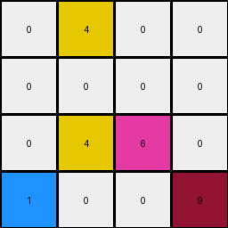
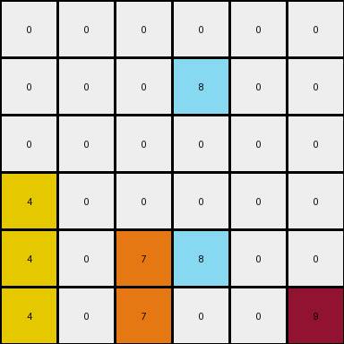

# 3-1e0a9b12 • 011 • refine_dreamer

---


Previous Code:
```python
"""
1. Locate the maroon (9) pixel in the input grid. Move this pixel to the bottom row, maintaining its original column.
2. Locate instances of azure (8) in the grid that are above one another, combine them in the lower cell.
3. All other colored pixels (yellow and orange) remain in their original positions.
4. All other empty (white/0) cells remain empty.
"""

import numpy as np

def find_pixel_by_color(grid, color):
    # Find the coordinates of a pixel of the specified color.  Returns the first one found.
    rows, cols = np.where(grid == color)
    if len(rows) > 0:
        return rows[0], cols[0]
    return None

def find_pixels_by_color(grid, color):
    # Find all coordinates of a specific color
    rows, cols = np.where(grid == color)
    return list(zip(rows,cols))

def transform(input_grid):
    # Initialize output_grid as a copy of the input_grid
    output_grid = np.copy(input_grid)
    input_grid_rows = len(input_grid)

    # 1. Move the maroon (9) pixel
    maroon_pixel = find_pixel_by_color(input_grid, 9)
    if maroon_pixel:
        output_grid[maroon_pixel[0], maroon_pixel[1]] = 0  # Clear original position
        output_grid[input_grid_rows -1, maroon_pixel[1]] = 9  # Move to bottom row

    # 2. Combine vertically stacked azure (8) pixels.
    azure_pixels = find_pixels_by_color(input_grid, 8)
    
    for row in range(input_grid_rows - 1):
       for col in range(len(input_grid[0])):
            if input_grid[row][col] == 8 and input_grid[row+1][col] == 8:
                output_grid[row][col] = 0

    return output_grid
```

Train Set Results:

## Example 1:**

Input:
```
0 4 0 9
0 0 0 0
0 4 6 0
1 0 0 0
```
Expected Output:
```
0 0 0 0
0 0 0 0
0 4 0 0
1 4 6 9
```
Transformed Output:
```
0 4 0 0
0 0 0 0
0 4 6 0
1 0 0 9
```

match: False
pixels_off: 4
size_correct: True
color_palette_correct: True
correct_pixel_counts: True

## Example 2:**

Input:
```
0 0 0 0 0 9
0 0 0 8 0 0
0 0 0 0 0 0
4 0 0 0 0 0
4 0 7 8 0 0
4 0 7 0 0 0
```
Expected Output:
```
0 0 0 0 0 0
0 0 0 0 0 0
0 0 0 0 0 0
4 0 0 0 0 0
4 0 7 8 0 0
4 0 7 8 0 9
```
Transformed Output:
```
0 0 0 0 0 0
0 0 0 8 0 0
0 0 0 0 0 0
4 0 0 0 0 0
4 0 7 8 0 0
4 0 7 0 0 9
```

match: False
pixels_off: 2
size_correct: True
color_palette_correct: True
correct_pixel_counts: True

## Example 3:**

Input:
```
0 0 0 1 0
0 3 0 0 0
0 3 0 1 2
6 0 0 0 0
0 3 0 0 0
```
Expected Output:
```
0 0 0 0 0
0 0 0 0 0
0 3 0 0 0
0 3 0 1 0
6 3 0 1 2
```
Transformed Output:
```
0 0 0 1 0
0 3 0 0 0
0 3 0 1 2
6 0 0 0 0
0 3 0 0 0
```

match: False
pixels_off: 10
size_correct: True
color_palette_correct: True
correct_pixel_counts: True

**INSTRUCTIONS**

The code above was generated based on observations from the first training
example

we have tested the transform function on each of the task example inputs and
compared with the expected output

review each of the examples provided and the results and consider how the
natural language program should be updated to accommodate this new knowledge

respond with the following deliverables:

- general assessment of the information provided and strategy for resolving the
  errors
- gather metrics about each of the examples and results - use code_execution to
  develop accurate reports on your assumptions
- a YAML block documenting facts - Focus on identifying objects, their properties, and the actions performed on them.
- a natural language program - Be as clear and concise as possible, providing a complete description of the transformation rule.


your responses should be considered as information in a report - not a
conversation
