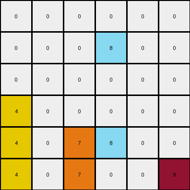

# 3-1e0a9b12 • 012 • refine_coder

---

Previous Code:
```python
"""
1. Locate the maroon (9) pixel in the input grid. Move this pixel to the bottom row, maintaining its original column.
2. Locate instances of azure (8) in the grid that are above one another, combine them in the lower cell.
3. All other colored pixels (yellow and orange) remain in their original positions.
4. All other empty (white/0) cells remain empty.
"""

import numpy as np

def find_pixel_by_color(grid, color):
    # Find the coordinates of a pixel of the specified color.  Returns the first one found.
    rows, cols = np.where(grid == color)
    if len(rows) > 0:
        return rows[0], cols[0]
    return None

def find_pixels_by_color(grid, color):
    # Find all coordinates of a specific color
    rows, cols = np.where(grid == color)
    return list(zip(rows,cols))

def transform(input_grid):
    # Initialize output_grid as a copy of the input_grid
    output_grid = np.copy(input_grid)
    input_grid_rows = len(input_grid)

    # 1. Move the maroon (9) pixel
    maroon_pixel = find_pixel_by_color(input_grid, 9)
    if maroon_pixel:
        output_grid[maroon_pixel[0], maroon_pixel[1]] = 0  # Clear original position
        output_grid[input_grid_rows -1, maroon_pixel[1]] = 9  # Move to bottom row

    # 2. Combine vertically stacked azure (8) pixels.
    azure_pixels = find_pixels_by_color(input_grid, 8)
    
    for row in range(input_grid_rows - 1):
       for col in range(len(input_grid[0])):
            if input_grid[row][col] == 8 and input_grid[row+1][col] == 8:
                output_grid[row][col] = 0

    return output_grid
```

Train Set Results:

## Example 1:**

Input:
```
0 4 0 9
0 0 0 0
0 4 6 0
1 0 0 0
```
Expected Output:
```
0 0 0 0
0 0 0 0
0 4 0 0
1 4 6 9
```
Transformed Output:
```
0 4 0 0
0 0 0 0
0 4 6 0
1 0 0 9
```

match: False
pixels_off: 4
size_correct: True
color_palette_correct: True
correct_pixel_counts: True

## Example 2:**

Input:
```
0 0 0 0 0 9
0 0 0 8 0 0
0 0 0 0 0 0
4 0 0 0 0 0
4 0 7 8 0 0
4 0 7 0 0 0
```
Expected Output:
```
0 0 0 0 0 0
0 0 0 0 0 0
0 0 0 0 0 0
4 0 0 0 0 0
4 0 7 8 0 0
4 0 7 8 0 9
```
Transformed Output:
```
0 0 0 0 0 0
0 0 0 8 0 0
0 0 0 0 0 0
4 0 0 0 0 0
4 0 7 8 0 0
4 0 7 0 0 9
```

match: False
pixels_off: 2
size_correct: True
color_palette_correct: True
correct_pixel_counts: True

## Example 3:**

Input:
```
0 0 0 1 0
0 3 0 0 0
0 3 0 1 2
6 0 0 0 0
0 3 0 0 0
```
Expected Output:
```
0 0 0 0 0
0 0 0 0 0
0 3 0 0 0
0 3 0 1 0
6 3 0 1 2
```
Transformed Output:
```
0 0 0 1 0
0 3 0 0 0
0 3 0 1 2
6 0 0 0 0
0 3 0 0 0
```

match: False
pixels_off: 10
size_correct: True
color_palette_correct: True
correct_pixel_counts: True
Okay, here's a breakdown of the situation and a plan to improve the transformation logic:

**General Assessment:**

The initial natural language program and the resulting code captured some aspects of the transformation but failed to generalize correctly across all examples. The primary issue is that the code is too specific to the initial example and doesn't fully account for the movement and combination rules implied across the entire training set. The code correctly identifies and moves the maroon pixel, but the logic for combining the azure pixels and moving other colored pixels needs to be refined. It seems there is vertical movement of colored blocks.

**Strategy:**

1.  **Analyze Results:** Carefully review the input, expected output, and transformed output for each example. Note the discrepancies and identify patterns in how the code's logic deviates from the expected behavior. Metrics for each example input size, color palette, counts for each color, and other information.
2.  **Refine Object Identification:** The current code treats individual pixels. Instead consider "objects" which are contiguous blocks of the same color.
3.  **Update Movement Rules:** Re-evaluate the conditions under which colors are moved or combined. The rule isn't just about azure pixels stacked on top of each other, but appears to consider how to compress all objects to the bottom.
4.  **Iterative Refinement:** Update the natural language program and code, then re-test on all training examples. Repeat this process until the code accurately transforms all training inputs to their expected outputs.

**Metrics and Observations from Examples:**

Here is the information about each of the examples.

**Example 1:**

*   **Input Size:** 4x4
*   **Color Palette:** 0, 1, 4, 6, 9
*   **Color Counts:**
    *   0: 11
    *   1: 1
    *   4: 2
    *   6: 1
    *   9: 1
*    **Observations**: The transformation moves non-zero color pixels to bottom rows, preserving column positions.

**Example 2:**

*   **Input Size:** 6x6
*   **Color Palette:** 0, 4, 7, 8, 9
*   **Color Counts:**
    *   0: 29
    *   4: 3
    *   7: 2
    *   8: 2
    *   9: 1
*    **Observations**: Two azure (8) pixels in the same column. Lower one maintained, upper one is cleared. The single maroon (9) moves down.

**Example 3:**

*   **Input Size:** 5x5
*   **Color Palette:** 0, 1, 2, 3, 6
*   **Color Counts:**
    *   0: 18
    *   1: 2
    *   2: 1
    *   3: 3
    *   6: 1

*    **Observations**: All colored blocks move down, keeping their columns.

**YAML Fact Identification:**

```yaml
objects:
  - name: maroon_pixel
    color: 9
    behavior: moves to the bottom row, maintaining column
  - name: azure_pixels
    color: 8
    behavior: vertically stacked instances consolidate to the lower cell, maintaining columns
  - name: other_colored_pixels
    colors: [1, 2, 3, 4, 6, 7]
    behavior: move downwards, maintaining original columns, stacking on the bottom-most available row, or on top of other objects.

actions:
  - name: move_down
    description: Objects move to the lowest available row in their original column.
  - name: consolidate
    description:  If multiple objects of the same color are stacked vertically, they merge into the lowest occupied position.
```

**Natural Language Program:**

1.  Identify all contiguous blocks of non-zero (colored) pixels. These are our "objects."
2.  For each column, starting from the bottom row and moving upwards, iterate through the identified objects.
3.  Move each object downwards as far as possible within its original column, stopping when it hits the bottom of the grid or another object. If multiple instances of an object of the same color exist, stack vertically, merging from top down.
4.  Empty/white (0) cells remain empty.


**INSTRUCTIONS**

- generate a Python module to represent the natural language program 
- follow the template below
- all common math and science libraries are available
- create docstring only at top - but comment the workflow in the function
- use helper functions for common operations like finding objects, counting,
  measuring, moving, etc. 

remember - we are working iteratively - so this code will inform your future
self as we converge on the solution

*template:*

```python
"""
{{ natural language description of the transformation rule }}
"""

{{ imports }}

def transform(input_grid):
    # initialize output_grid

    # change output pixels 

    return output_grid

```
