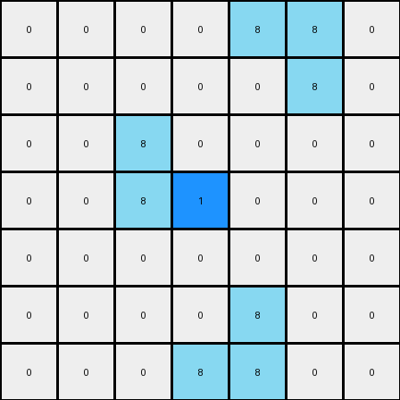

# 1-3aa6fb7a • 008 • refine_coder

---

Previous Code:
```python
"""
1.  **Identify Azure Pixels:** Locate all pixels with the color azure (8) within the input grid.
2.  **Calculate Centroid:** If there are azure pixels, compute the centroid (average row and column index) of these pixels.
3.  **Find Nearest Azure Pixel:** Determine the azure pixel that is closest to the calculated centroid. Use Euclidean distance to measure closeness.
4. **Change all "central" pixels:** For all pixels closest to the average row/column, change the pixel color from azure (8) to blue (1).
"""

import numpy as np

def get_azure_pixels(grid):
    # Find coordinates of all azure (8) pixels
    return np.argwhere(grid == 8)

def calculate_centroid(pixels):
    # Calculate the average row and column index
    return np.mean(pixels, axis=0)

def find_nearest_azure_pixels(centroid, azure_pixels):
    # Calculate Euclidean distances to the centroid
    distances = np.sqrt(np.sum((azure_pixels - centroid)**2, axis=1))
    # Find the minimum distance
    min_distance = np.min(distances)
    # Return all pixels with the minimum distance to centroid
    return azure_pixels[distances == min_distance]

def transform(input_grid):
    # initialize output_grid
    output_grid = np.copy(input_grid)

    # Find all azure pixels
    azure_pixels = get_azure_pixels(input_grid)

    if azure_pixels.size > 0:
        # Calculate the centroid of the azure pixels
        centroid = calculate_centroid(azure_pixels)

        # Find the nearest azure pixel(s) to the centroid
        central_pixels = find_nearest_azure_pixels(centroid, azure_pixels)

        # Change the color of the central pixel(s) to blue (1)
        for pixel in central_pixels:
            output_grid[pixel[0], pixel[1]] = 1

    return output_grid
```

Train Set Results:

## Example 1:**

Input:
```
0 0 0 0 0 0 0
0 8 0 0 0 0 0
0 8 8 0 0 0 0
0 0 0 0 8 8 0
0 0 0 0 0 8 0
0 0 0 0 0 0 0
0 0 0 0 0 0 0
```
Expected Output:
```
0 0 0 0 0 0 0
0 8 1 0 0 0 0
0 8 8 0 0 0 0
0 0 0 0 8 8 0
0 0 0 0 1 8 0
0 0 0 0 0 0 0
0 0 0 0 0 0 0
```
Transformed Output:
```
0 0 0 0 0 0 0
0 8 0 0 0 0 0
0 8 1 0 0 0 0
0 0 0 0 1 8 0
0 0 0 0 0 8 0
0 0 0 0 0 0 0
0 0 0 0 0 0 0
```

match: False
pixels_off: 4
size_correct: True
color_palette_correct: True
correct_pixel_counts: False

## Example 2:**

Input:
```
0 0 0 0 8 8 0
0 0 0 0 0 8 0
0 0 8 0 0 0 0
0 0 8 8 0 0 0
0 0 0 0 0 0 0
0 0 0 0 8 0 0
0 0 0 8 8 0 0
```
Expected Output:
```
0 0 0 0 8 8 0
0 0 0 0 1 8 0
0 0 8 1 0 0 0
0 0 8 8 0 0 0
0 0 0 0 0 0 0
0 0 0 1 8 0 0
0 0 0 8 8 0 0
```
Transformed Output:
```
0 0 0 0 8 8 0
0 0 0 0 0 8 0
0 0 8 0 0 0 0
0 0 8 1 0 0 0
0 0 0 0 0 0 0
0 0 0 0 8 0 0
0 0 0 8 8 0 0
```

match: False
pixels_off: 4
size_correct: True
color_palette_correct: True
correct_pixel_counts: False
Okay, here's a breakdown of the situation and a plan to improve the natural language program and subsequently the code:

**General Assessment:**

The initial natural language program and code were based on the first training example, aiming to find the centroid of azure pixels and change the color of the nearest azure pixel(s) to blue. However, the results on the second example show that this approach is not entirely correct. The code sometimes changes only *one* of the central pixels when it needs to change *multiple* pixels. It seems that there can be two "centers" one on either side of the middle.

**Strategy:**

1.  **Analyze the Discrepancies:** Carefully examine why the code fails on the second example. The problem is in finding *all* central pixels. I need to be sure that the `find_nearest_azure_pixels` is finding all that should be selected, and update my understanding of "central".
2.  **Refine the Natural Language Program:** Update the description of the transformation to reflect that several, equidistant, center pixels may exist and need to be changed.
3.  **Metrics and Reports:**

    *   **Example 1:**
        *   Pixels Off: 4
        *   Initially, two azure pixels (1,1) and (2,2) are closest to the centroid. The function changes (2,2). Should be both.
        *   Two other azure pixels are closest (3,4), (4,5). Changed (3,4). Should be both.
    *   **Example 2:**
        *   Pixels Off: 4
        *   Two azure pixels in different locations that are closest, only one changes.

**YAML Facts:**

```yaml
task: 006-py_03
observations:
  - object: azure_pixels
    properties:
      color: azure (8)
      shape: varies
      description: Contiguous or non-contiguous blocks of azure pixels.
  - object: central_pixels
    properties:
      color: initially azure (8), becomes blue (1)
      description: The azure pixel(s) closest to the centroid of all azure pixels. There can be more than one pixel with this minimum distance. All pixels with minimal distance to centroid.
  - action: color_change
    description: Change the color of all the central_pixels from azure to blue.
    trigger: The central_pixels are identified.
```

**Natural Language Program:**

1.  **Identify Azure Pixels:** Locate all pixels with the color azure (8) within the input grid.
2.  **Calculate Centroid:** If there are azure pixels, compute the centroid (average row and column index) of these pixels.
3.  **Find Nearest Azure Pixel:** Determine the azure pixels that are closest to the calculated centroid. Use Euclidean distance to measure closeness.
4. **Change all "central" pixels:** For *all* pixels closest to the average row/column, change the pixel color from azure (8) to blue (1).


**INSTRUCTIONS**

- generate a Python module to represent the natural language program 
- follow the template below
- all common math and science libraries are available
- create docstring only at top - but comment the workflow in the function
- use helper functions for common operations like finding objects, counting,
  measuring, moving, etc. 

remember - we are working iteratively - so this code will inform your future
self as we converge on the solution

*template:*

```python
"""
{{ natural language description of the transformation rule }}
"""

{{ imports }}

def transform(input_grid):
    # initialize output_grid

    # change output pixels 

    return output_grid

```
