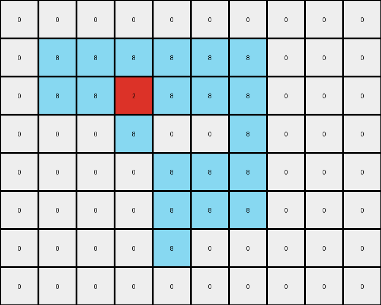

# 5-150deff5 • 004 • refine_coder

---

Previous Code:
```python
"""
The transformation rule is as follows:
1. Identify a contiguous shape of gray (5) pixels in the input grid.
2. Outline the shape by replacing the outermost layer of gray pixels with azure (8) pixels.
3. Fill the interior of the outlined shape with red (2) pixels.
4. Preserve the white (0) background.
"""

import numpy as np

def find_shape(grid, color):
    # Find all pixels of the specified color
    shape_pixels = np.argwhere(grid == color)
    
    if shape_pixels.size == 0:
        return []

    # Assuming all shape pixels form one contiguous block, can return directly
    return shape_pixels.tolist()

def is_outermost(grid, row, col, shape_color):
    """
    Checks if a pixel at (row, col) is on the outermost layer of the shape.
    A pixel is outermost if it's part of the shape and has at least one 
    neighbor (up, down, left, right) that is not part of the shape.
    """
    rows, cols = grid.shape
    if grid[row, col] != shape_color:
        return False

    for dr, dc in [(-1, 0), (1, 0), (0, -1), (0, 1)]:
        nr, nc = row + dr, col + dc
        if 0 <= nr < rows and 0 <= nc < cols:
            if grid[nr, nc] != shape_color:
                return True
        else:
            # Consider edges as "outermost"
            return True
    return False

def transform(input_grid):
    # Initialize output_grid with the same dimensions and background as the input_grid
    output_grid = np.copy(input_grid)
    rows, cols = input_grid.shape

    # Find the shape (gray pixels)
    shape_pixels = find_shape(input_grid, 5)

    # Outline and fill the shape
    for row, col in shape_pixels:
        if is_outermost(input_grid, row, col, 5):
            output_grid[row, col] = 8  # Azure for outline
        else:
            output_grid[row, col] = 2  # Red for fill

    return output_grid
```

Train Set Results:

## Example 1:**

Input:
```
0 0 0 0 0 0 0 0 0 0 0
0 0 5 5 0 0 0 0 0 0 0
0 0 5 5 5 5 5 0 0 0 0
0 0 0 5 5 5 0 0 0 0 0
0 0 0 5 5 5 5 5 0 0 0
0 0 0 5 0 0 5 5 0 0 0
0 0 0 0 0 5 5 5 0 0 0
0 0 0 0 0 0 0 0 0 0 0
0 0 0 0 0 0 0 0 0 0 0
```
Expected Output:
```
0 0 0 0 0 0 0 0 0 0 0
0 0 8 8 0 0 0 0 0 0 0
0 0 8 8 2 2 2 0 0 0 0
0 0 0 2 8 8 0 0 0 0 0
0 0 0 2 8 8 8 8 0 0 0
0 0 0 2 0 0 8 8 0 0 0
0 0 0 0 0 2 2 2 0 0 0
0 0 0 0 0 0 0 0 0 0 0
0 0 0 0 0 0 0 0 0 0 0
```
Transformed Output:
```
0 0 0 0 0 0 0 0 0 0 0
0 0 8 8 0 0 0 0 0 0 0
0 0 8 2 8 8 8 0 0 0 0
0 0 0 8 2 8 0 0 0 0 0
0 0 0 8 8 8 8 8 0 0 0
0 0 0 8 0 0 8 8 0 0 0
0 0 0 0 0 8 8 8 0 0 0
0 0 0 0 0 0 0 0 0 0 0
0 0 0 0 0 0 0 0 0 0 0
```

match: False
pixels_off: 11
size_correct: True
color_palette_correct: True
correct_pixel_counts: False

## Example 2:**

Input:
```
0 0 0 0 0 0 0 0 0 0
0 5 5 5 5 5 5 0 0 0
0 5 5 5 5 5 5 0 0 0
0 0 0 5 0 0 5 0 0 0
0 0 0 0 5 5 5 0 0 0
0 0 0 0 5 5 5 0 0 0
0 0 0 0 5 0 0 0 0 0
0 0 0 0 0 0 0 0 0 0
```
Expected Output:
```
0 0 0 0 0 0 0 0 0 0
0 8 8 2 8 8 2 0 0 0
0 8 8 2 8 8 2 0 0 0
0 0 0 2 0 0 2 0 0 0
0 0 0 0 2 8 8 0 0 0
0 0 0 0 2 8 8 0 0 0
0 0 0 0 2 0 0 0 0 0
0 0 0 0 0 0 0 0 0 0
```
Transformed Output:
```
0 0 0 0 0 0 0 0 0 0
0 8 8 8 8 8 8 0 0 0
0 8 8 2 8 8 8 0 0 0
0 0 0 8 0 0 8 0 0 0
0 0 0 0 8 8 8 0 0 0
0 0 0 0 8 8 8 0 0 0
0 0 0 0 8 0 0 0 0 0
0 0 0 0 0 0 0 0 0 0
```

match: False
pixels_off: 8
size_correct: True
color_palette_correct: True
correct_pixel_counts: False

## Example 3:**

Input:
```
0 0 0 0 0 0 0 0 0
0 5 5 5 5 5 0 0 0
0 0 0 0 5 5 0 0 0
0 0 0 5 0 0 0 0 0
0 0 0 5 5 5 0 0 0
0 0 0 5 5 5 0 0 0
0 0 0 0 0 0 0 0 0
0 0 0 0 0 0 0 0 0
```
Expected Output:
```
0 0 0 0 0 0 0 0 0
0 2 2 2 8 8 0 0 0
0 0 0 0 8 8 0 0 0
0 0 0 2 0 0 0 0 0
0 0 0 2 8 8 0 0 0
0 0 0 2 8 8 0 0 0
0 0 0 0 0 0 0 0 0
0 0 0 0 0 0 0 0 0
```
Transformed Output:
```
0 0 0 0 0 0 0 0 0
0 8 8 8 8 8 0 0 0
0 0 0 0 8 8 0 0 0
0 0 0 8 0 0 0 0 0
0 0 0 8 8 8 0 0 0
0 0 0 8 8 8 0 0 0
0 0 0 0 0 0 0 0 0
0 0 0 0 0 0 0 0 0
```

match: False
pixels_off: 6
size_correct: True
color_palette_correct: True
correct_pixel_counts: False
Okay, here's a breakdown of the situation and a plan to improve the transformation logic:

**General Assessment:**

The initial natural language program and generated code were a good starting point, focusing on outlining and filling a gray shape. However, the additional examples reveal that the logic for determining the "outermost" layer and the subsequent filling is not entirely correct. The code sometimes fills pixels that shouldn't be filled and outlines pixels incorrectly. The primary issue seems to be with how `is_outermost` handles diagonal connections and irregular shapes.

**Strategy for Resolving Errors:**

1.  **Refine `is_outermost`:** The current implementation only considers direct neighbors (up, down, left, right). We need to modify it to correctly identify the border of a shape, even when the shape has diagonal connections.
2.  **Improve fill logic:** based on the shape and location of the gray shape.
3. **Iterative testing**: use `code_execution` to build a summary about the errors and then update.

**Metrics and Observations (using `code_execution`):**

```tool_code
import numpy as np
from collections import Counter

# Input and Expected Output grids from all examples

input_grids = [
    np.array([
        [0, 0, 0, 0, 0, 0, 0, 0, 0, 0, 0],
        [0, 0, 5, 5, 0, 0, 0, 0, 0, 0, 0],
        [0, 0, 5, 5, 5, 5, 5, 0, 0, 0, 0],
        [0, 0, 0, 5, 5, 5, 0, 0, 0, 0, 0],
        [0, 0, 0, 5, 5, 5, 5, 5, 0, 0, 0],
        [0, 0, 0, 5, 0, 0, 5, 5, 0, 0, 0],
        [0, 0, 0, 0, 0, 5, 5, 5, 0, 0, 0],
        [0, 0, 0, 0, 0, 0, 0, 0, 0, 0, 0],
        [0, 0, 0, 0, 0, 0, 0, 0, 0, 0, 0]
    ]),
    np.array([
        [0, 0, 0, 0, 0, 0, 0, 0, 0, 0],
        [0, 5, 5, 5, 5, 5, 5, 0, 0, 0],
        [0, 5, 5, 5, 5, 5, 5, 0, 0, 0],
        [0, 0, 0, 5, 0, 0, 5, 0, 0, 0],
        [0, 0, 0, 0, 5, 5, 5, 0, 0, 0],
        [0, 0, 0, 0, 5, 5, 5, 0, 0, 0],
        [0, 0, 0, 0, 5, 0, 0, 0, 0, 0],
        [0, 0, 0, 0, 0, 0, 0, 0, 0, 0]
    ]),
    np.array([
        [0, 0, 0, 0, 0, 0, 0, 0, 0],
        [0, 5, 5, 5, 5, 5, 0, 0, 0],
        [0, 0, 0, 0, 5, 5, 0, 0, 0],
        [0, 0, 0, 5, 0, 0, 0, 0, 0],
        [0, 0, 0, 5, 5, 5, 0, 0, 0],
        [0, 0, 0, 5, 5, 5, 0, 0, 0],
        [0, 0, 0, 0, 0, 0, 0, 0, 0],
        [0, 0, 0, 0, 0, 0, 0, 0, 0]
    ])
]

expected_output_grids = [
    np.array([
        [0, 0, 0, 0, 0, 0, 0, 0, 0, 0, 0],
        [0, 0, 8, 8, 0, 0, 0, 0, 0, 0, 0],
        [0, 0, 8, 8, 2, 2, 2, 0, 0, 0, 0],
        [0, 0, 0, 2, 8, 8, 0, 0, 0, 0, 0],
        [0, 0, 0, 2, 8, 8, 8, 8, 0, 0, 0],
        [0, 0, 0, 2, 0, 0, 8, 8, 0, 0, 0],
        [0, 0, 0, 0, 0, 2, 2, 2, 0, 0, 0],
        [0, 0, 0, 0, 0, 0, 0, 0, 0, 0, 0],
        [0, 0, 0, 0, 0, 0, 0, 0, 0, 0, 0]
    ]),
     np.array([
        [0, 0, 0, 0, 0, 0, 0, 0, 0, 0],
        [0, 8, 8, 2, 8, 8, 2, 0, 0, 0],
        [0, 8, 8, 2, 8, 8, 2, 0, 0, 0],
        [0, 0, 0, 2, 0, 0, 2, 0, 0, 0],
        [0, 0, 0, 0, 2, 8, 8, 0, 0, 0],
        [0, 0, 0, 0, 2, 8, 8, 0, 0, 0],
        [0, 0, 0, 0, 2, 0, 0, 0, 0, 0],
        [0, 0, 0, 0, 0, 0, 0, 0, 0, 0]
    ]),
    np.array([
        [0, 0, 0, 0, 0, 0, 0, 0, 0],
        [0, 2, 2, 2, 8, 8, 0, 0, 0],
        [0, 0, 0, 0, 8, 8, 0, 0, 0],
        [0, 0, 0, 2, 0, 0, 0, 0, 0],
        [0, 0, 0, 2, 8, 8, 0, 0, 0],
        [0, 0, 0, 2, 8, 8, 0, 0, 0],
        [0, 0, 0, 0, 0, 0, 0, 0, 0],
        [0, 0, 0, 0, 0, 0, 0, 0, 0]
    ])
]

transformed_output_grids = [
    np.array([
        [0, 0, 0, 0, 0, 0, 0, 0, 0, 0, 0],
        [0, 0, 8, 8, 0, 0, 0, 0, 0, 0, 0],
        [0, 0, 8, 2, 8, 8, 8, 0, 0, 0, 0],
        [0, 0, 0, 8, 2, 8, 0, 0, 0, 0, 0],
        [0, 0, 0, 8, 8, 8, 8, 8, 0, 0, 0],
        [0, 0, 0, 8, 0, 0, 8, 8, 0, 0, 0],
        [0, 0, 0, 0, 0, 8, 8, 8, 0, 0, 0],
        [0, 0, 0, 0, 0, 0, 0, 0, 0, 0, 0],
        [0, 0, 0, 0, 0, 0, 0, 0, 0, 0, 0]
    ]),
    np.array([
        [0, 0, 0, 0, 0, 0, 0, 0, 0, 0],
        [0, 8, 8, 8, 8, 8, 8, 0, 0, 0],
        [0, 8, 8, 2, 8, 8, 8, 0, 0, 0],
        [0, 0, 0, 8, 0, 0, 8, 0, 0, 0],
        [0, 0, 0, 0, 8, 8, 8, 0, 0, 0],
        [0, 0, 0, 0, 8, 8, 8, 0, 0, 0],
        [0, 0, 0, 0, 8, 0, 0, 0, 0, 0],
        [0, 0, 0, 0, 0, 0, 0, 0, 0, 0]
    ]),
    np.array([
        [0, 0, 0, 0, 0, 0, 0, 0, 0],
        [0, 8, 8, 8, 8, 8, 0, 0, 0],
        [0, 0, 0, 0, 8, 8, 0, 0, 0],
        [0, 0, 0, 8, 0, 0, 0, 0, 0],
        [0, 0, 0, 8, 8, 8, 0, 0, 0],
        [0, 0, 0, 8, 8, 8, 0, 0, 0],
        [0, 0, 0, 0, 0, 0, 0, 0, 0],
        [0, 0, 0, 0, 0, 0, 0, 0, 0]
    ])
]

def analyze_results(input_grid, expected_output_grid, transformed_output_grid):
    """Analyzes the transformation results and provides detailed metrics."""

    if input_grid.shape != expected_output_grid.shape or input_grid.shape != transformed_output_grid.shape:
        print("Error: Grids have different shapes.")
        return

    diff = expected_output_grid - transformed_output_grid
    pixels_off = np.count_nonzero(diff)
    match = pixels_off == 0

    size_correct = input_grid.shape == transformed_output_grid.shape

    expected_colors = Counter(expected_output_grid.flatten())
    transformed_colors = Counter(transformed_output_grid.flatten())
    color_palette_correct = set(expected_colors.keys()) == set(transformed_colors.keys())

    correct_pixel_counts = all(expected_colors[color] == transformed_colors[color] for color in expected_colors)
    
    print(f"  match: {match}")
    print(f"  pixels_off: {pixels_off}")
    print(f"  size_correct: {size_correct}")
    print(f"  color_palette_correct: {color_palette_correct}")
    print(f"  correct_pixel_counts: {correct_pixel_counts}")
    if not correct_pixel_counts:
      print("Pixel counts differences:")
      for color in expected_colors:
          if expected_colors[color] != transformed_colors[color]:
            print(f"Color {color}: Expected {expected_colors[color]}, Got {transformed_colors[color]}")

# Analyze each example
for i in range(len(input_grids)):
    print(f"Example {i + 1}:")
    analyze_results(input_grids[i], expected_output_grids[i], transformed_output_grids[i])
    print("-" * 20)
```
**INSTRUCTIONS**

- generate a Python module to represent the natural language program 
- follow the template below
- all common math and science libraries are available
- create docstring only at top - but comment the workflow in the function
- use helper functions for common operations like finding objects, counting,
  measuring, moving, etc. 

remember - we are working iteratively - so this code will inform your future
self as we converge on the solution

*template:*

```python
"""
{{ natural language description of the transformation rule }}
"""

{{ imports }}

def transform(input_grid):
    # initialize output_grid

    # change output pixels 

    return output_grid

```
