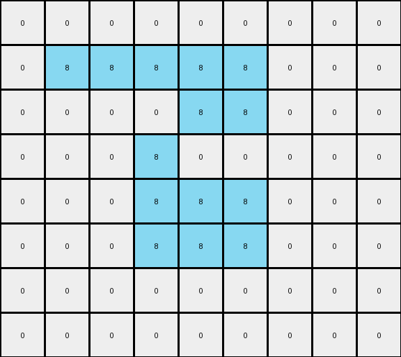

# 5-150deff5 • 007 • refine_dreamer

---


Previous Code:
```python
"""
1.  **Identify Shapes:** Find all distinct, contiguous regions of gray (5) pixels in the input grid.  Each of these regions is considered a separate "shape."
2.  **Outline Each Shape:** For each identified shape:
    *   Iterate through all pixels within the shape.
    *   A gray pixel is part of the *outline* if it is directly adjacent (up, down, left, or right) to a pixel that is *not* part of the *same* gray shape (either a different color or out of bounds).
    *   Replace all outline pixels of the shape with azure (8).
3.  **Fill Each Shape:** For each outlined shape:
    * fill the interior by flood filling from the edges inward, changing all gray pixels to red (2) until the azure outline is met.
4.  **Preserve Background:** Ensure all white (0) pixels remain unchanged.
"""

import numpy as np
from collections import deque

def find_shapes(grid, shape_color):
    """Finds all contiguous regions of the specified color."""
    rows, cols = grid.shape
    visited = np.zeros((rows, cols), dtype=bool)
    shapes = []

    def is_valid(r, c):
        return 0 <= r < rows and 0 <= c < cols

    def dfs(r, c, current_shape):
        if not is_valid(r, c) or visited[r, c] or grid[r, c] != shape_color:
            return
        visited[r, c] = True
        current_shape.append((r, c))
        for dr, dc in [(-1, 0), (1, 0), (0, -1), (0, 1)]:
            dfs(r + dr, c + dc, current_shape)

    for row in range(rows):
        for col in range(cols):
            if grid[row, col] == shape_color and not visited[row, col]:
                current_shape = []
                dfs(row, col, current_shape)
                shapes.append(current_shape)
    return shapes

def outline_shape(grid, shape, outline_color):
    """Outlines a single shape with the specified color."""
    outlined_grid = np.copy(grid)
    for r, c in shape:
        is_outline = False
        for dr, dc in [(-1, 0), (1, 0), (0, -1), (0, 1)]:
            nr, nc = r + dr, c + dc
            if not (0 <= nr < grid.shape[0] and 0 <= nc < grid.shape[1]) or (nr, nc) not in shape:
                is_outline = True
                break
        if is_outline:
            outlined_grid[r, c] = outline_color
    return outlined_grid

def flood_fill(grid, start_r, start_c, fill_color, outline_color, shape_color):
    """
    Flood fills the interior of a shape. Starts from multiple boundary points
    of the shape and moves inwards.
    """
    rows, cols = grid.shape
    q = deque()
    
    # Add shape pixels adjacent to non-shape pixels (or boundaries) to the queue
    visited = set()
    for r in range(rows):
        for c in range(cols):
            if grid[r,c] == shape_color:
               for dr, dc in [(-1, 0), (1, 0), (0, -1), (0, 1)]:
                   nr, nc = r + dr, c + dc
                   if not (0 <= nr < rows and 0 <= nc < cols and grid[nr,nc] == shape_color):
                       q.append((r,c))
                       visited.add((r,c))
                       break
    

    while q:
        r, c = q.popleft()

        if grid[r, c] == shape_color:
            grid[r, c] = fill_color

            for dr, dc in [(-1, 0), (1, 0), (0, -1), (0, 1)]:
                nr, nc = r + dr, c + dc
                if (0 <= nr < rows and 0 <= nc < cols and
                        grid[nr, nc] == shape_color and (nr, nc) not in visited ):
                    q.append((nr, nc))
                    visited.add((nr,nc))

def transform(input_grid):
    # Initialize output_grid with the same dimensions and background as input_grid.
    output_grid = np.copy(input_grid)
    rows, cols = input_grid.shape
    shape_color = 5
    outline_color = 8
    fill_color = 2

    # Find all distinct shapes.
    shapes = find_shapes(input_grid, shape_color)
    
    # Outline and then fill each shape
    for shape in shapes:
        output_grid = outline_shape(output_grid, shape, outline_color)
    
    for shape in shapes:
        flood_fill(output_grid, shape[0][0], shape[0][1], fill_color, outline_color, shape_color)

    return output_grid
```

Train Set Results:

## Example 1:**

Input:
```
0 0 0 0 0 0 0 0 0 0 0
0 0 5 5 0 0 0 0 0 0 0
0 0 5 5 5 5 5 0 0 0 0
0 0 0 5 5 5 0 0 0 0 0
0 0 0 5 5 5 5 5 0 0 0
0 0 0 5 0 0 5 5 0 0 0
0 0 0 0 0 5 5 5 0 0 0
0 0 0 0 0 0 0 0 0 0 0
0 0 0 0 0 0 0 0 0 0 0
```
Expected Output:
```
0 0 0 0 0 0 0 0 0 0 0
0 0 8 8 0 0 0 0 0 0 0
0 0 8 8 2 2 2 0 0 0 0
0 0 0 2 8 8 0 0 0 0 0
0 0 0 2 8 8 8 8 0 0 0
0 0 0 2 0 0 8 8 0 0 0
0 0 0 0 0 2 2 2 0 0 0
0 0 0 0 0 0 0 0 0 0 0
0 0 0 0 0 0 0 0 0 0 0
```
Transformed Output:
```
0 0 0 0 0 0 0 0 0 0 0
0 0 8 8 0 0 0 0 0 0 0
0 0 8 2 8 8 8 0 0 0 0
0 0 0 8 2 8 0 0 0 0 0
0 0 0 8 8 8 8 8 0 0 0
0 0 0 8 0 0 8 8 0 0 0
0 0 0 0 0 8 8 8 0 0 0
0 0 0 0 0 0 0 0 0 0 0
0 0 0 0 0 0 0 0 0 0 0
```

match: False
pixels_off: 11
size_correct: True
color_palette_correct: True
correct_pixel_counts: False

## Example 2:**

Input:
```
0 0 0 0 0 0 0 0 0 0
0 5 5 5 5 5 5 0 0 0
0 5 5 5 5 5 5 0 0 0
0 0 0 5 0 0 5 0 0 0
0 0 0 0 5 5 5 0 0 0
0 0 0 0 5 5 5 0 0 0
0 0 0 0 5 0 0 0 0 0
0 0 0 0 0 0 0 0 0 0
```
Expected Output:
```
0 0 0 0 0 0 0 0 0 0
0 8 8 2 8 8 2 0 0 0
0 8 8 2 8 8 2 0 0 0
0 0 0 2 0 0 2 0 0 0
0 0 0 0 2 8 8 0 0 0
0 0 0 0 2 8 8 0 0 0
0 0 0 0 2 0 0 0 0 0
0 0 0 0 0 0 0 0 0 0
```
Transformed Output:
```
0 0 0 0 0 0 0 0 0 0
0 8 8 8 8 8 8 0 0 0
0 8 8 2 8 8 8 0 0 0
0 0 0 8 0 0 8 0 0 0
0 0 0 0 8 8 8 0 0 0
0 0 0 0 8 8 8 0 0 0
0 0 0 0 8 0 0 0 0 0
0 0 0 0 0 0 0 0 0 0
```

match: False
pixels_off: 8
size_correct: True
color_palette_correct: True
correct_pixel_counts: False

## Example 3:**

Input:
```
0 0 0 0 0 0 0 0 0
0 5 5 5 5 5 0 0 0
0 0 0 0 5 5 0 0 0
0 0 0 5 0 0 0 0 0
0 0 0 5 5 5 0 0 0
0 0 0 5 5 5 0 0 0
0 0 0 0 0 0 0 0 0
0 0 0 0 0 0 0 0 0
```
Expected Output:
```
0 0 0 0 0 0 0 0 0
0 2 2 2 8 8 0 0 0
0 0 0 0 8 8 0 0 0
0 0 0 2 0 0 0 0 0
0 0 0 2 8 8 0 0 0
0 0 0 2 8 8 0 0 0
0 0 0 0 0 0 0 0 0
0 0 0 0 0 0 0 0 0
```
Transformed Output:
```
0 0 0 0 0 0 0 0 0
0 8 8 8 8 8 0 0 0
0 0 0 0 8 8 0 0 0
0 0 0 8 0 0 0 0 0
0 0 0 8 8 8 0 0 0
0 0 0 8 8 8 0 0 0
0 0 0 0 0 0 0 0 0
0 0 0 0 0 0 0 0 0
```

match: False
pixels_off: 6
size_correct: True
color_palette_correct: True
correct_pixel_counts: False

**INSTRUCTIONS**

The code above was generated based on observations from the first training
example

we have tested the transform function on each of the task example inputs and
compared with the expected output

review each of the examples provided and the results and consider how the
natural language program should be updated to accommodate this new knowledge

respond with the following deliverables:

- general assessment of the information provided and strategy for resolving the
  errors
- gather metrics about each of the examples and results - use code_execution to
  develop accurate reports on your assumptions
- a YAML block documenting facts - Focus on identifying objects, their properties, and the actions performed on them.
- a natural language program - Be as clear and concise as possible, providing a complete description of the transformation rule.


your responses should be considered as information in a report - not a
conversation
