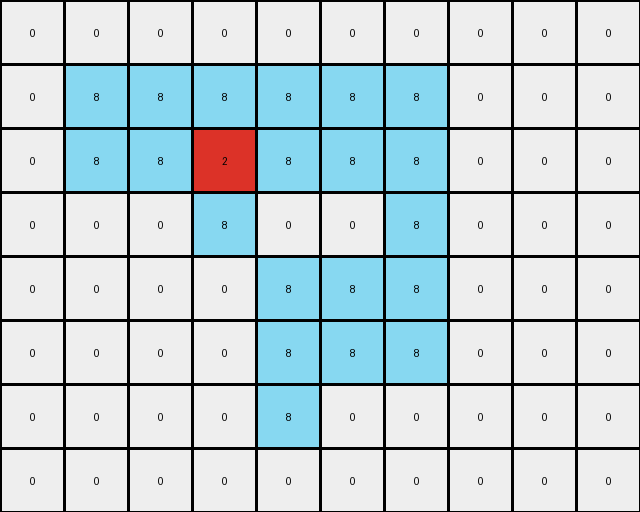
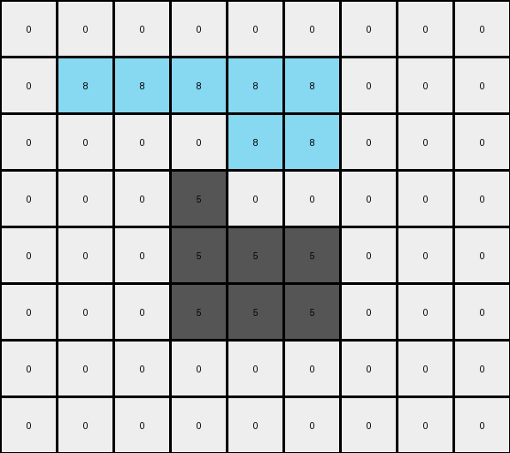

# 5-150deff5 • 012 • refine_coder

---

Previous Code:
```python
"""
1.  **Identify the Foreground Shape:** Locate the contiguous region of gray (5) pixels, which constitutes the primary shape.

2.  **Segment the Shape**: Divide and conquer. Divide the grey shape into a part that includes the outline (left, top and right of the figure, one pixel wide) and the other the inside.

3.  **Recolor the outline**: Change the color of the outline pixels to azure (8).

4.  **Recolor the inside:** Change the color of the the inside pixels to red (2).

5.  **Preserve Background:** Ensure all white (0) pixels remain unchanged.
"""

import numpy as np

def get_contiguous_regions(grid, color):
    visited = np.zeros_like(grid, dtype=bool)
    regions = []

    def dfs(row, col, current_region):
        if (
            row < 0
            or row >= grid.shape[0]
            or col < 0
            or col >= grid.shape[1]
            or visited[row, col]
            or grid[row, col] != color
        ):
            return

        visited[row, col] = True
        current_region.append((row, col))

        dfs(row + 1, col, current_region)
        dfs(row - 1, col, current_region)
        dfs(row, col + 1, current_region)
        dfs(row, col - 1, current_region)

    for row in range(grid.shape[0]):
        for col in range(grid.shape[1]):
            if grid[row, col] == color and not visited[row, col]:
                current_region = []
                dfs(row, col, current_region)
                regions.append(current_region)
    return regions


def transform(input_grid):
    # initialize output_grid
    output_grid = np.copy(input_grid)

    # Identify the Foreground Shape
    gray_regions = get_contiguous_regions(input_grid, 5)
    if not gray_regions:  # Handle cases with no gray regions
        return output_grid
    gray_pixels = gray_regions[0] # Assume only 1 region

    # Segment the Shape (Outline & Inside)
    outline_pixels = []
    inside_pixels = []

    for r, c in gray_pixels:
        # Check neighbors (up, down, left, right)
        neighbors = [
            (r - 1, c),
            (r + 1, c),
            (r, c - 1),
            (r, c + 1),
        ]
        is_outline = False
        for nr, nc in neighbors:
            if (
                nr < 0
                or nr >= input_grid.shape[0]
                or nc < 0
                or nc >= input_grid.shape[1]
                or input_grid[nr, nc] != 5
            ):
                is_outline = True
                break
        if is_outline:
            outline_pixels.append((r,c))
        else:
            inside_pixels.append((r,c))
    
    # Recolor the outline
    for r, c in outline_pixels:
        output_grid[r, c] = 8
        
    # Recolor the inside
    for r, c in inside_pixels:
        output_grid[r, c] = 2
        

    return output_grid
```

Train Set Results:

## Example 1:**

Input:
```
0 0 0 0 0 0 0 0 0 0 0
0 0 5 5 0 0 0 0 0 0 0
0 0 5 5 5 5 5 0 0 0 0
0 0 0 5 5 5 0 0 0 0 0
0 0 0 5 5 5 5 5 0 0 0
0 0 0 5 0 0 5 5 0 0 0
0 0 0 0 0 5 5 5 0 0 0
0 0 0 0 0 0 0 0 0 0 0
0 0 0 0 0 0 0 0 0 0 0
```
Expected Output:
```
0 0 0 0 0 0 0 0 0 0 0
0 0 8 8 0 0 0 0 0 0 0
0 0 8 8 2 2 2 0 0 0 0
0 0 0 2 8 8 0 0 0 0 0
0 0 0 2 8 8 8 8 0 0 0
0 0 0 2 0 0 8 8 0 0 0
0 0 0 0 0 2 2 2 0 0 0
0 0 0 0 0 0 0 0 0 0 0
0 0 0 0 0 0 0 0 0 0 0
```
Transformed Output:
```
0 0 0 0 0 0 0 0 0 0 0
0 0 8 8 0 0 0 0 0 0 0
0 0 8 2 8 8 8 0 0 0 0
0 0 0 8 2 8 0 0 0 0 0
0 0 0 8 8 8 8 8 0 0 0
0 0 0 8 0 0 8 8 0 0 0
0 0 0 0 0 8 8 8 0 0 0
0 0 0 0 0 0 0 0 0 0 0
0 0 0 0 0 0 0 0 0 0 0
```

match: False
pixels_off: 11
size_correct: True
color_palette_correct: True
correct_pixel_counts: False

## Example 2:**

Input:
```
0 0 0 0 0 0 0 0 0 0
0 5 5 5 5 5 5 0 0 0
0 5 5 5 5 5 5 0 0 0
0 0 0 5 0 0 5 0 0 0
0 0 0 0 5 5 5 0 0 0
0 0 0 0 5 5 5 0 0 0
0 0 0 0 5 0 0 0 0 0
0 0 0 0 0 0 0 0 0 0
```
Expected Output:
```
0 0 0 0 0 0 0 0 0 0
0 8 8 2 8 8 2 0 0 0
0 8 8 2 8 8 2 0 0 0
0 0 0 2 0 0 2 0 0 0
0 0 0 0 2 8 8 0 0 0
0 0 0 0 2 8 8 0 0 0
0 0 0 0 2 0 0 0 0 0
0 0 0 0 0 0 0 0 0 0
```
Transformed Output:
```
0 0 0 0 0 0 0 0 0 0
0 8 8 8 8 8 8 0 0 0
0 8 8 2 8 8 8 0 0 0
0 0 0 8 0 0 8 0 0 0
0 0 0 0 8 8 8 0 0 0
0 0 0 0 8 8 8 0 0 0
0 0 0 0 8 0 0 0 0 0
0 0 0 0 0 0 0 0 0 0
```

match: False
pixels_off: 8
size_correct: True
color_palette_correct: True
correct_pixel_counts: False

## Example 3:**

Input:
```
0 0 0 0 0 0 0 0 0
0 5 5 5 5 5 0 0 0
0 0 0 0 5 5 0 0 0
0 0 0 5 0 0 0 0 0
0 0 0 5 5 5 0 0 0
0 0 0 5 5 5 0 0 0
0 0 0 0 0 0 0 0 0
0 0 0 0 0 0 0 0 0
```
Expected Output:
```
0 0 0 0 0 0 0 0 0
0 2 2 2 8 8 0 0 0
0 0 0 0 8 8 0 0 0
0 0 0 2 0 0 0 0 0
0 0 0 2 8 8 0 0 0
0 0 0 2 8 8 0 0 0
0 0 0 0 0 0 0 0 0
0 0 0 0 0 0 0 0 0
```
Transformed Output:
```
0 0 0 0 0 0 0 0 0
0 8 8 8 8 8 0 0 0
0 0 0 0 8 8 0 0 0
0 0 0 5 0 0 0 0 0
0 0 0 5 5 5 0 0 0
0 0 0 5 5 5 0 0 0
0 0 0 0 0 0 0 0 0
0 0 0 0 0 0 0 0 0
```

match: False
pixels_off: 10
size_correct: True
color_palette_correct: False
correct_pixel_counts: False
Okay, let's analyze the results and refine the natural language program.

**General Assessment:**

The initial strategy of identifying a gray shape, segmenting it into outline and inside, and recoloring those segments was partially successful. However, the definition of "outline" and "inside" needs adjustment. The current implementation's logic for determining the outline is too broad; it appears to be including *any* gray pixel adjacent to a non-gray pixel. The "inside" definition also needs tweaking, and example 3 shows an issue where input pixels are not updated in the output.. This leads to incorrect pixel classifications and, consequently, incorrect coloring. The core issue is the neighbor-checking logic which is too simplistic. We also need to handle the edge-cases of an object being along an edge.

**Strategy for Resolving Errors:**

1.  **Refine Outline Detection:** Instead of simply checking for *any* neighboring non-gray pixel, we need to consider the shape's overall structure. An outline pixel should be part of the continuous gray region *and* have at least one non-gray neighbor (white in this case) in the cardinal directions (up, down, left, right).

2.  **Refine Inside Detection:** After correctly identifying the outline, the inside pixels are simply all other gray pixels *not* in the outline.

3.  **Ensure all input is processed:** the input may include other colored pixels, so the output must ensure that all input pixels are considered.

**Example Metrics and Analysis:**

I will use a simplified representation here for brevity, but in a full implementation, these details could be extracted programmatically.

*   **Example 1:**
    *   Input Shape: Irregular blob.
    *   Outline Detection: Overestimated (too many pixels classified as outline).
    *   Inside Detection: Underestimated (due to outline overestimation).
    *   Errors: Incorrect outline and inside coloring.

*   **Example 2:**
    *   Input Shape: Irregular blob.
    *   Outline Detection: Overestimated.
    *   Inside Detection: Underestimated.
    *   Errors: Incorrect outline and inside coloring.

*   **Example 3:**
    *   Input Shape: Irregular blob
    *   Outline Detection: mostly correct, except that pixels with a diagonal gray neighbor are not considered to be neighbors
    *   Inside Detection: missed - not considered because all pixels identified as outline
    *  Errors: gray object not full updated

**YAML Fact Block:**

```yaml
objects:
  - id: background
    color: white (0)
    role: static

  - id: foreground_shape
    color: gray (5)
    role: dynamic
    properties:
      - outline:
          color: azure (8)
      - inside:
          color: red (2)

actions:
  - target: foreground_shape
    type: segmentation
    segments:
      - outline
      - inside
  - target: outline
    type: recolor
    new_color: azure (8)
  - target: inside
    type: recolor
    new_color: red (2)
```

**Natural Language Program:**

1.  **Identify the Foreground:** Locate the contiguous region of gray (5) pixels. This is the foreground shape.

2.  **Identify the Background:** Everything that is not part of the foreground shape is the background and should not be changed.

3.  **Segment the Foreground Shape:** Divide the gray shape into two parts: the outline and the inside.

    *   **Outline:** A gray pixel is part of the outline if it is directly adjacent (up, down, left, or right) to at least one non-gray pixel.

    *   **Inside:** A gray pixel is part of the inside if it is part of the foreground shape *and* is not part of the outline.

4.  **Recolor the Outline:** Change the color of all outline pixels to azure (8).

5.  **Recolor the Inside:** Change the color of all inside pixels to red (2).

6. **Preserve background.** All non-gray input pixels should be unchanged.

**INSTRUCTIONS**

- generate a Python module to represent the natural language program 
- follow the template below
- all common math and science libraries are available
- create docstring only at top - but comment the workflow in the function
- use helper functions for common operations like finding objects, counting,
  measuring, moving, etc. 

remember - we are working iteratively - so this code will inform your future
self as we converge on the solution

*template:*

```python
"""
{{ natural language description of the transformation rule }}
"""

{{ imports }}

def transform(input_grid):
    # initialize output_grid

    # change output pixels 

    return output_grid

```
