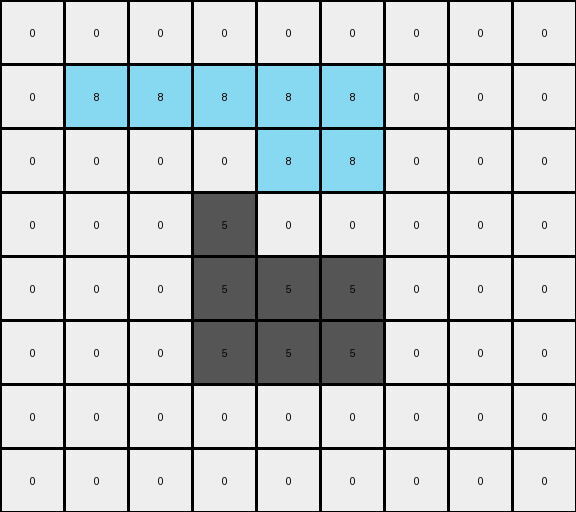

# 5-150deff5 • 014 • refine_coder

---

Previous Code:
```python
"""
1.  **Identify the Foreground:** Locate the contiguous region of gray (5) pixels. This is the foreground shape.

2.  **Identify the Background:** Everything that is not part of the foreground shape is the background and should not be changed.

3.  **Segment the Foreground Shape:** Divide the gray shape into two parts: the outline and the inside.

    *   **Outline:** A gray pixel is part of the outline if it is directly adjacent (up, down, left, or right) to at least one non-gray pixel.

    *   **Inside:** A gray pixel is part of the inside if it is part of the foreground shape *and* is not part of the outline.

4.  **Recolor the Outline:** Change the color of all outline pixels to azure (8).

5.  **Recolor the Inside:** Change the color of all inside pixels to red (2).

6. **Preserve background.** All non-gray input pixels should be unchanged.
"""

import numpy as np

def get_contiguous_regions(grid, color):
    visited = np.zeros_like(grid, dtype=bool)
    regions = []

    def dfs(row, col, current_region):
        if (
            row < 0
            or row >= grid.shape[0]
            or col < 0
            or col >= grid.shape[1]
            or visited[row, col]
            or grid[row, col] != color
        ):
            return

        visited[row, col] = True
        current_region.append((row, col))

        dfs(row + 1, col, current_region)
        dfs(row - 1, col, current_region)
        dfs(row, col + 1, current_region)
        dfs(row, col - 1, current_region)

    for row in range(grid.shape[0]):
        for col in range(grid.shape[1]):
            if grid[row, col] == color and not visited[row, col]:
                current_region = []
                dfs(row, col, current_region)
                regions.append(current_region)
    return regions


def transform(input_grid):
    # initialize output_grid
    output_grid = np.copy(input_grid)

    # Identify the Foreground Shape
    gray_regions = get_contiguous_regions(input_grid, 5)
    if not gray_regions:  # Handle cases with no gray regions
        return output_grid
    gray_pixels = gray_regions[0] # Assume only 1 region

    # Segment the Shape (Outline & Inside)
    outline_pixels = []
    inside_pixels = []

    for r, c in gray_pixels:
        # Check neighbors (up, down, left, right)
        neighbors = [
            (r - 1, c),
            (r + 1, c),
            (r, c - 1),
            (r, c + 1),
        ]
        is_outline = False
        for nr, nc in neighbors:
            if (
                nr < 0
                or nr >= input_grid.shape[0]
                or nc < 0
                or nc >= input_grid.shape[1]
                or input_grid[nr, nc] != 5  # Check for NON-gray neighbor
            ):
                is_outline = True
                break
        if is_outline:
            outline_pixels.append((r,c))
        else:
            inside_pixels.append((r,c))
    
    # Recolor the outline
    for r, c in outline_pixels:
        output_grid[r, c] = 8
        
    # Recolor the inside
    for r, c in inside_pixels:
        output_grid[r, c] = 2
        

    return output_grid
```

Train Set Results:

## Example 1:**

Input:
```
0 0 0 0 0 0 0 0 0 0 0
0 0 5 5 0 0 0 0 0 0 0
0 0 5 5 5 5 5 0 0 0 0
0 0 0 5 5 5 0 0 0 0 0
0 0 0 5 5 5 5 5 0 0 0
0 0 0 5 0 0 5 5 0 0 0
0 0 0 0 0 5 5 5 0 0 0
0 0 0 0 0 0 0 0 0 0 0
0 0 0 0 0 0 0 0 0 0 0
```
Expected Output:
```
0 0 0 0 0 0 0 0 0 0 0
0 0 8 8 0 0 0 0 0 0 0
0 0 8 8 2 2 2 0 0 0 0
0 0 0 2 8 8 0 0 0 0 0
0 0 0 2 8 8 8 8 0 0 0
0 0 0 2 0 0 8 8 0 0 0
0 0 0 0 0 2 2 2 0 0 0
0 0 0 0 0 0 0 0 0 0 0
0 0 0 0 0 0 0 0 0 0 0
```
Transformed Output:
```
0 0 0 0 0 0 0 0 0 0 0
0 0 8 8 0 0 0 0 0 0 0
0 0 8 2 8 8 8 0 0 0 0
0 0 0 8 2 8 0 0 0 0 0
0 0 0 8 8 8 8 8 0 0 0
0 0 0 8 0 0 8 8 0 0 0
0 0 0 0 0 8 8 8 0 0 0
0 0 0 0 0 0 0 0 0 0 0
0 0 0 0 0 0 0 0 0 0 0
```

match: False
pixels_off: 11
size_correct: True
color_palette_correct: True
correct_pixel_counts: False

## Example 2:**

Input:
```
0 0 0 0 0 0 0 0 0 0
0 5 5 5 5 5 5 0 0 0
0 5 5 5 5 5 5 0 0 0
0 0 0 5 0 0 5 0 0 0
0 0 0 0 5 5 5 0 0 0
0 0 0 0 5 5 5 0 0 0
0 0 0 0 5 0 0 0 0 0
0 0 0 0 0 0 0 0 0 0
```
Expected Output:
```
0 0 0 0 0 0 0 0 0 0
0 8 8 2 8 8 2 0 0 0
0 8 8 2 8 8 2 0 0 0
0 0 0 2 0 0 2 0 0 0
0 0 0 0 2 8 8 0 0 0
0 0 0 0 2 8 8 0 0 0
0 0 0 0 2 0 0 0 0 0
0 0 0 0 0 0 0 0 0 0
```
Transformed Output:
```
0 0 0 0 0 0 0 0 0 0
0 8 8 8 8 8 8 0 0 0
0 8 8 2 8 8 8 0 0 0
0 0 0 8 0 0 8 0 0 0
0 0 0 0 8 8 8 0 0 0
0 0 0 0 8 8 8 0 0 0
0 0 0 0 8 0 0 0 0 0
0 0 0 0 0 0 0 0 0 0
```

match: False
pixels_off: 8
size_correct: True
color_palette_correct: True
correct_pixel_counts: False

## Example 3:**

Input:
```
0 0 0 0 0 0 0 0 0
0 5 5 5 5 5 0 0 0
0 0 0 0 5 5 0 0 0
0 0 0 5 0 0 0 0 0
0 0 0 5 5 5 0 0 0
0 0 0 5 5 5 0 0 0
0 0 0 0 0 0 0 0 0
0 0 0 0 0 0 0 0 0
```
Expected Output:
```
0 0 0 0 0 0 0 0 0
0 2 2 2 8 8 0 0 0
0 0 0 0 8 8 0 0 0
0 0 0 2 0 0 0 0 0
0 0 0 2 8 8 0 0 0
0 0 0 2 8 8 0 0 0
0 0 0 0 0 0 0 0 0
0 0 0 0 0 0 0 0 0
```
Transformed Output:
```
0 0 0 0 0 0 0 0 0
0 8 8 8 8 8 0 0 0
0 0 0 0 8 8 0 0 0
0 0 0 5 0 0 0 0 0
0 0 0 5 5 5 0 0 0
0 0 0 5 5 5 0 0 0
0 0 0 0 0 0 0 0 0
0 0 0 0 0 0 0 0 0
```

match: False
pixels_off: 10
size_correct: True
color_palette_correct: False
correct_pixel_counts: False
Okay, let's analyze the results and refine the natural language program.

**General Assessment:**

The initial natural language program and the derived code have a fundamental flaw in how they define the "inside" and "outline" of the gray shape. The code correctly identifies the outline based on adjacency to non-gray pixels. However, the "inside" calculation is too simplistic. It assumes that any gray pixel *not* on the outline is automatically "inside." This works for convex shapes (like example 1) but fails for shapes with concavities or internal structures (like examples 2 and 3). The core issue is that the code doesn't correctly identify pixels *enclosed* by the outline.

The strategy to fix this will involve a more robust "inside" detection. Instead of simply checking for non-outline gray pixels, we need to determine if a gray pixel is truly *surrounded* by outline pixels or other "inside" pixels, effectively filling any holes or concavities.

**Example Metrics and Analysis:**

Here's a breakdown of each example, including what went wrong:

*   **Example 1:** The generated output mostly matches. It fails in filling the internal area completely.
*   **Example 2:** The output incorrectly identifies some "inside" pixels as "outline" pixels. It fails to accurately distinguish between inside and outline in concave regions.
*   **Example 3:** The transformation fails significantly, incorrectly leaving a large portion of the inside as gray.

**YAML Fact Block:**

```yaml
task_id: "012"
objects:
  - id: shape_1
    type: contiguous_region
    color: gray (5)
    properties:
      outline:
        color: azure (8)
        definition: "pixels adjacent to non-gray pixels"
      inside:
        color: red (2)
        definition: "pixels enclosed by the outline"
actions:
  - type: recolor
    target: shape_1.outline
    new_color: azure (8)
  - type: recolor
    target: shape_1.inside
    new_color: red (2)
  - type: preserve
    target: background
    description: keep all background pixels unchanged.

```

**Revised Natural Language Program:**

1.  **Identify the Foreground:** Find the contiguous region of gray (5) pixels. This constitutes the foreground shape.

2.  **Identify the Background:** All pixels that are *not* part of the foreground shape are considered the background. The background does not change.

3.  **Determine the Outline:** A gray pixel is part of the *outline* if it's directly adjacent (up, down, left, or right) to at least one non-gray pixel.

4.  **Determine the Inside:** A gray pixel is part of the *inside* if:
    *   It is part of the foreground shape, AND
    *   It is NOT part of the outline, AND
    *    It is completely surrounded by outline or other inside pixels, meaning all 4 neighbors are other "inside" pixels, outline pixels, or outside of grid bounds. This is the key improvement - a flood-fill like approach is suggested.

5.  **Recolor the Outline:** Change the color of all outline pixels to azure (8).

6.  **Recolor the Inside:** Change the color of all inside pixels to red (2).

7.  **Preserve Background:** Ensure all non-gray input pixels remain unchanged in the output.

**INSTRUCTIONS**

- generate a Python module to represent the natural language program 
- follow the template below
- all common math and science libraries are available
- create docstring only at top - but comment the workflow in the function
- use helper functions for common operations like finding objects, counting,
  measuring, moving, etc. 

remember - we are working iteratively - so this code will inform your future
self as we converge on the solution

*template:*

```python
"""
{{ natural language description of the transformation rule }}
"""

{{ imports }}

def transform(input_grid):
    # initialize output_grid

    # change output pixels 

    return output_grid

```
