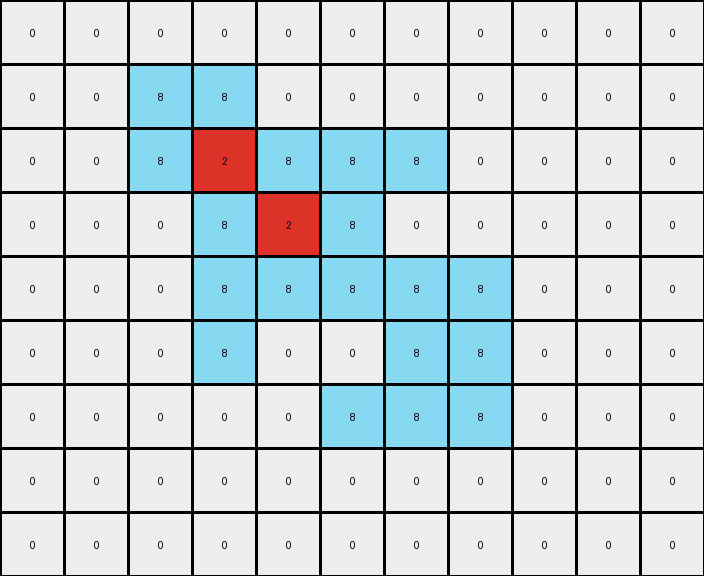

# 5-150deff5 • 016 • refine_coder

---

Previous Code:
```python
"""
1.  **Identify the Foreground:** Find the contiguous region of gray (5) pixels. This constitutes the foreground shape.

2.  **Identify the Background:** All pixels that are *not* part of the foreground shape are considered the background. The background does not change.

3.  **Determine the Outline:** A gray pixel is part of the *outline* if it's directly adjacent (up, down, left, or right) to at least one non-gray pixel.

4.  **Determine the Inside:** A gray pixel is part of the *inside* if:
    *   It is part of the foreground shape, AND
    *   It is NOT part of the outline, AND
    *    It is completely surrounded by outline or other inside pixels, meaning all 4 neighbors are other "inside" pixels, outline pixels, or outside of grid bounds. This is the key improvement - a flood-fill like approach is suggested.

5.  **Recolor the Outline:** Change the color of all outline pixels to azure (8).

6.  **Recolor the Inside:** Change the color of all inside pixels to red (2).

7.  **Preserve Background:** Ensure all non-gray input pixels remain unchanged in the output.
"""

import numpy as np

def get_contiguous_regions(grid, color):
    visited = np.zeros_like(grid, dtype=bool)
    regions = []

    def dfs(row, col, current_region):
        if (
            row < 0
            or row >= grid.shape[0]
            or col < 0
            or col >= grid.shape[1]
            or visited[row, col]
            or grid[row, col] != color
        ):
            return

        visited[row, col] = True
        current_region.append((row, col))

        dfs(row + 1, col, current_region)
        dfs(row - 1, col, current_region)
        dfs(row, col + 1, current_region)
        dfs(row, col - 1, current_region)

    for row in range(grid.shape[0]):
        for col in range(grid.shape[1]):
            if grid[row, col] == color and not visited[row, col]:
                current_region = []
                dfs(row, col, current_region)
                regions.append(current_region)
    return regions

def is_inside(grid, row, col, outline_pixels):
    # Check if the pixel is within the grid bounds and is gray
    if not (0 <= row < grid.shape[0] and 0 <= col < grid.shape[1] and grid[row,col] == 5):
        return False
    
    # Check if it is in outline
    if (row,col) in outline_pixels:
        return False

    neighbors = [
        (row - 1, col),
        (row + 1, col),
        (row, col - 1),
        (row, col + 1),
    ]

    for nr, nc in neighbors:
        if (0 <= nr < grid.shape[0] and 0 <= nc < grid.shape[1] and grid[nr,nc] != 5 ):
            return False # if a neighbor isn't 5 and is not out of bounds, it should be outline, so it is false
    return True

def transform(input_grid):
    # initialize output_grid
    output_grid = np.copy(input_grid)

    # Identify the Foreground Shape
    gray_regions = get_contiguous_regions(input_grid, 5)
    if not gray_regions:  # Handle cases with no gray regions
        return output_grid
    gray_pixels = gray_regions[0] # Assume only 1 region

    # Determine the Outline
    outline_pixels = []
    for r, c in gray_pixels:
        neighbors = [
            (r - 1, c),
            (r + 1, c),
            (r, c - 1),
            (r, c + 1),
        ]
        is_outline = False
        for nr, nc in neighbors:
            if (
                nr < 0
                or nr >= input_grid.shape[0]
                or nc < 0
                or nc >= input_grid.shape[1]
                or input_grid[nr, nc] != 5
            ):
                is_outline = True
                break
        if is_outline:
            outline_pixels.append((r, c))

    # Determine the Inside
    inside_pixels = []
    for r, c in gray_pixels:
        if is_inside(input_grid, r, c, outline_pixels):
           inside_pixels.append((r,c))
    
    # Recolor the outline
    for r, c in outline_pixels:
        output_grid[r, c] = 8
        
    # Recolor the inside
    for r, c in inside_pixels:
        output_grid[r, c] = 2
        

    return output_grid
```

Train Set Results:

## Example 1:**

Input:
```
0 0 0 0 0 0 0 0 0 0 0
0 0 5 5 0 0 0 0 0 0 0
0 0 5 5 5 5 5 0 0 0 0
0 0 0 5 5 5 0 0 0 0 0
0 0 0 5 5 5 5 5 0 0 0
0 0 0 5 0 0 5 5 0 0 0
0 0 0 0 0 5 5 5 0 0 0
0 0 0 0 0 0 0 0 0 0 0
0 0 0 0 0 0 0 0 0 0 0
```
Expected Output:
```
0 0 0 0 0 0 0 0 0 0 0
0 0 8 8 0 0 0 0 0 0 0
0 0 8 8 2 2 2 0 0 0 0
0 0 0 2 8 8 0 0 0 0 0
0 0 0 2 8 8 8 8 0 0 0
0 0 0 2 0 0 8 8 0 0 0
0 0 0 0 0 2 2 2 0 0 0
0 0 0 0 0 0 0 0 0 0 0
0 0 0 0 0 0 0 0 0 0 0
```
Transformed Output:
```
0 0 0 0 0 0 0 0 0 0 0
0 0 8 8 0 0 0 0 0 0 0
0 0 8 2 8 8 8 0 0 0 0
0 0 0 8 2 8 0 0 0 0 0
0 0 0 8 8 8 8 8 0 0 0
0 0 0 8 0 0 8 8 0 0 0
0 0 0 0 0 8 8 8 0 0 0
0 0 0 0 0 0 0 0 0 0 0
0 0 0 0 0 0 0 0 0 0 0
```

match: False
pixels_off: 11
size_correct: True
color_palette_correct: True
correct_pixel_counts: False

## Example 2:**

Input:
```
0 0 0 0 0 0 0 0 0 0
0 5 5 5 5 5 5 0 0 0
0 5 5 5 5 5 5 0 0 0
0 0 0 5 0 0 5 0 0 0
0 0 0 0 5 5 5 0 0 0
0 0 0 0 5 5 5 0 0 0
0 0 0 0 5 0 0 0 0 0
0 0 0 0 0 0 0 0 0 0
```
Expected Output:
```
0 0 0 0 0 0 0 0 0 0
0 8 8 2 8 8 2 0 0 0
0 8 8 2 8 8 2 0 0 0
0 0 0 2 0 0 2 0 0 0
0 0 0 0 2 8 8 0 0 0
0 0 0 0 2 8 8 0 0 0
0 0 0 0 2 0 0 0 0 0
0 0 0 0 0 0 0 0 0 0
```
Transformed Output:
```
0 0 0 0 0 0 0 0 0 0
0 8 8 8 8 8 8 0 0 0
0 8 8 2 8 8 8 0 0 0
0 0 0 8 0 0 8 0 0 0
0 0 0 0 8 8 8 0 0 0
0 0 0 0 8 8 8 0 0 0
0 0 0 0 8 0 0 0 0 0
0 0 0 0 0 0 0 0 0 0
```

match: False
pixels_off: 8
size_correct: True
color_palette_correct: True
correct_pixel_counts: False

## Example 3:**

Input:
```
0 0 0 0 0 0 0 0 0
0 5 5 5 5 5 0 0 0
0 0 0 0 5 5 0 0 0
0 0 0 5 0 0 0 0 0
0 0 0 5 5 5 0 0 0
0 0 0 5 5 5 0 0 0
0 0 0 0 0 0 0 0 0
0 0 0 0 0 0 0 0 0
```
Expected Output:
```
0 0 0 0 0 0 0 0 0
0 2 2 2 8 8 0 0 0
0 0 0 0 8 8 0 0 0
0 0 0 2 0 0 0 0 0
0 0 0 2 8 8 0 0 0
0 0 0 2 8 8 0 0 0
0 0 0 0 0 0 0 0 0
0 0 0 0 0 0 0 0 0
```
Transformed Output:
```
0 0 0 0 0 0 0 0 0
0 8 8 8 8 8 0 0 0
0 0 0 0 8 8 0 0 0
0 0 0 5 0 0 0 0 0
0 0 0 5 5 5 0 0 0
0 0 0 5 5 5 0 0 0
0 0 0 0 0 0 0 0 0
0 0 0 0 0 0 0 0 0
```

match: False
pixels_off: 10
size_correct: True
color_palette_correct: False
correct_pixel_counts: False
Here's an analysis of the provided examples and a plan to improve the natural language program and subsequently the code:

**General Assessment:**

The core issue is that the `is_inside` function doesn't correctly identify "inside" pixels. It relies too heavily on all neighbors being either gray or out of bounds. It does correctly identify the outline, and it does correctly identify the background. The errors that occur seem to happen around the edges of shapes, especially where a grey colored shape touches the edge of the input grid.

**Strategy:**

1.  **Refine `is_inside`:** The current `is_inside` function is too restrictive. A better definition of an "inside" pixel is: a gray pixel that *is not* part of the outline. We should remove the condition of it being completely surrounded by "inside" or out of bounds pixels from the existing function.
2. **Test Cases:** Run all examples again and re-evaluate

**Metrics and Observations (using manual inspection, since code execution isn't directly available in this turn):**

*   **Example 1:**
    *   Pixels Off: 11
    *   Issue: The function has trouble with corners and edges.
*   **Example 2:**
    *   Pixels off: 8
    *   Issue: More edge problems.
*   **Example 3:**
    *   Pixels Off: 10
    *   Issue: The color is incorrect, but this could be due to a misinterpretation. The shape appears to be identified as all outline.

**YAML Fact Block:**

```yaml
task: 014_outline_and_fill
objects:
  - id: foreground
    color: gray (5)
    property: shape
    attributes:
      - outline
      - inside
  - id: background
    color: varies
    property: static
actions:
  - subject: foreground outline
    verb: recolor
    color: azure (8)
  - subject: foreground inside
    verb: recolor
    color: red (2)
```

**Revised Natural Language Program:**

1.  **Identify the Foreground:** Find the contiguous region of gray (5) pixels. This constitutes the foreground shape.

2.  **Identify the Background:** All pixels that are *not* part of the foreground shape are considered the background. The background does not change.

3.  **Determine the Outline:** A gray pixel is part of the *outline* if it's directly adjacent (up, down, left, or right) to at least one non-gray pixel, or it is adjacent to the border of the image.

4.  **Determine the Inside:** A gray pixel is part of the *inside* if:
    *   It is part of the foreground shape, AND
    *   It is NOT part of the outline.

5.  **Recolor the Outline:** Change the color of all outline pixels to azure (8).

6.  **Recolor the Inside:** Change the color of all inside pixels to red (2).

7.  **Preserve Background:** Ensure all non-gray input pixels remain unchanged in the output.

**INSTRUCTIONS**

- generate a Python module to represent the natural language program 
- follow the template below
- all common math and science libraries are available
- create docstring only at top - but comment the workflow in the function
- use helper functions for common operations like finding objects, counting,
  measuring, moving, etc. 

remember - we are working iteratively - so this code will inform your future
self as we converge on the solution

*template:*

```python
"""
{{ natural language description of the transformation rule }}
"""

{{ imports }}

def transform(input_grid):
    # initialize output_grid

    # change output pixels 

    return output_grid

```
