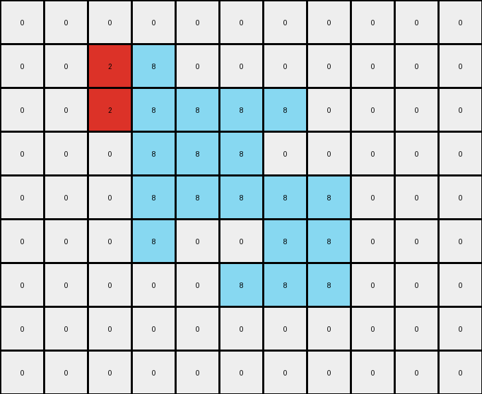
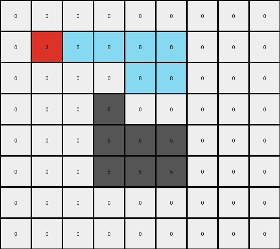

# 5-150deff5 • 020 • refine_coder

---

Previous Code:
```python
"""
1.  **Identify** the contiguous shape formed by gray (5) pixels in the input grid.
2.  **Preserve** all pixels with the color white (0) in their original positions in the output grid.
3.  **Create** a new shape, colored red (2). This shape will be the leftmost vertical line of the original gray.
4.  **Create** a second shape, colored azure(8). This starts from the immediate right of the red shape and extends the same shape, but shifted.
5. **Place** these new color shapes in the output.
"""

import numpy as np

def get_object(grid, color):
    """Finds the coordinates of a contiguous object of a specified color."""
    coords = []
    visited = set()
    rows, cols = grid.shape
    
    def is_valid(r, c):
        return 0 <= r < rows and 0 <= c < cols

    def dfs(r, c):
        if (r, c) in visited or not is_valid(r, c) or grid[r, c] != color:
            return
        visited.add((r, c))
        coords.append((r, c))
        for dr, dc in [(0, 1), (1, 0), (0, -1), (-1, 0)]:
            dfs(r + dr, c + dc)

    for r in range(rows):
        for c in range(cols):
            if grid[r, c] == color and (r, c) not in visited:
                dfs(r, c)
                return coords # return first object found
    return []


def transform(input_grid):
    # initialize output_grid
    output_grid = np.copy(input_grid)
    
    # get the gray object
    gray_object_coords = get_object(input_grid, 5)

    # if no gray object exists, return
    if not gray_object_coords:
      return output_grid

    # change the color of gray pixels to white
    for r, c in gray_object_coords:
        output_grid[r, c] = 0

    # find leftmost and rightmost columns
    min_col = min(c for _, c in gray_object_coords)
    max_col = max(c for _, c in gray_object_coords)

    # build red object using the left part of gray object
    red_object_coords = []
    for r, c in gray_object_coords:
      if c == min_col:
        red_object_coords.append((r,c))
    
    for r, c in red_object_coords:
      output_grid[r,c] = 2


    #build azure object by extending right from red object
    azure_object_coords = []
    for r, c in gray_object_coords:
        if c > min_col:
          azure_object_coords.append((r,c))

    for r, c in azure_object_coords:
      output_grid[r,c] = 8

    return output_grid
```

Train Set Results:

## Example 1:**

Input:
```
0 0 0 0 0 0 0 0 0 0 0
0 0 5 5 0 0 0 0 0 0 0
0 0 5 5 5 5 5 0 0 0 0
0 0 0 5 5 5 0 0 0 0 0
0 0 0 5 5 5 5 5 0 0 0
0 0 0 5 0 0 5 5 0 0 0
0 0 0 0 0 5 5 5 0 0 0
0 0 0 0 0 0 0 0 0 0 0
0 0 0 0 0 0 0 0 0 0 0
```
Expected Output:
```
0 0 0 0 0 0 0 0 0 0 0
0 0 8 8 0 0 0 0 0 0 0
0 0 8 8 2 2 2 0 0 0 0
0 0 0 2 8 8 0 0 0 0 0
0 0 0 2 8 8 8 8 0 0 0
0 0 0 2 0 0 8 8 0 0 0
0 0 0 0 0 2 2 2 0 0 0
0 0 0 0 0 0 0 0 0 0 0
0 0 0 0 0 0 0 0 0 0 0
```
Transformed Output:
```
0 0 0 0 0 0 0 0 0 0 0
0 0 2 8 0 0 0 0 0 0 0
0 0 2 8 8 8 8 0 0 0 0
0 0 0 8 8 8 0 0 0 0 0
0 0 0 8 8 8 8 8 0 0 0
0 0 0 8 0 0 8 8 0 0 0
0 0 0 0 0 8 8 8 0 0 0
0 0 0 0 0 0 0 0 0 0 0
0 0 0 0 0 0 0 0 0 0 0
```

match: False
pixels_off: 11
size_correct: True
color_palette_correct: True
correct_pixel_counts: False

## Example 2:**

Input:
```
0 0 0 0 0 0 0 0 0 0
0 5 5 5 5 5 5 0 0 0
0 5 5 5 5 5 5 0 0 0
0 0 0 5 0 0 5 0 0 0
0 0 0 0 5 5 5 0 0 0
0 0 0 0 5 5 5 0 0 0
0 0 0 0 5 0 0 0 0 0
0 0 0 0 0 0 0 0 0 0
```
Expected Output:
```
0 0 0 0 0 0 0 0 0 0
0 8 8 2 8 8 2 0 0 0
0 8 8 2 8 8 2 0 0 0
0 0 0 2 0 0 2 0 0 0
0 0 0 0 2 8 8 0 0 0
0 0 0 0 2 8 8 0 0 0
0 0 0 0 2 0 0 0 0 0
0 0 0 0 0 0 0 0 0 0
```
Transformed Output:
```
0 0 0 0 0 0 0 0 0 0
0 2 8 8 8 8 8 0 0 0
0 2 8 8 8 8 8 0 0 0
0 0 0 8 0 0 8 0 0 0
0 0 0 0 8 8 8 0 0 0
0 0 0 0 8 8 8 0 0 0
0 0 0 0 8 0 0 0 0 0
0 0 0 0 0 0 0 0 0 0
```

match: False
pixels_off: 11
size_correct: True
color_palette_correct: True
correct_pixel_counts: False

## Example 3:**

Input:
```
0 0 0 0 0 0 0 0 0
0 5 5 5 5 5 0 0 0
0 0 0 0 5 5 0 0 0
0 0 0 5 0 0 0 0 0
0 0 0 5 5 5 0 0 0
0 0 0 5 5 5 0 0 0
0 0 0 0 0 0 0 0 0
0 0 0 0 0 0 0 0 0
```
Expected Output:
```
0 0 0 0 0 0 0 0 0
0 2 2 2 8 8 0 0 0
0 0 0 0 8 8 0 0 0
0 0 0 2 0 0 0 0 0
0 0 0 2 8 8 0 0 0
0 0 0 2 8 8 0 0 0
0 0 0 0 0 0 0 0 0
0 0 0 0 0 0 0 0 0
```
Transformed Output:
```
0 0 0 0 0 0 0 0 0
0 2 8 8 8 8 0 0 0
0 0 0 0 8 8 0 0 0
0 0 0 5 0 0 0 0 0
0 0 0 5 5 5 0 0 0
0 0 0 5 5 5 0 0 0
0 0 0 0 0 0 0 0 0
0 0 0 0 0 0 0 0 0
```

match: False
pixels_off: 9
size_correct: True
color_palette_correct: False
correct_pixel_counts: False
Okay, let's analyze the results and refine the natural language program.

**General Assessment:**

The initial program and code were a good start, focusing on identifying the gray object and transforming parts of it. However, the results clearly show inconsistencies in how the red and azure shapes are created and positioned relative to each other, and do not fully follow the expected outputs in terms of their layout. The core issue seems to be an incorrect assumption about how to construct the azure shape - its more than just copying the remaining part of the gray object.

Strategy: we must modify both the natural language program and code to
correctly define the relationships, taking into account the leftmost vertical
line, and then how to build the correct azure object. The red object uses *only*
the leftmost segment, and the azure object extends to the right.

**Metrics and Observations:**

Here's a breakdown of each example, focusing on discrepancies:

*   **Example 1:**
    *   The red shape should be formed from just the leftmost segment of the
        original gray object.
    *   The azure extends correctly to the right.
    *   Error: Red shape should extend to the length of the grey shape.

*   **Example 2:**
    *   The red shape should be formed from the leftmost vertical segment of the original gray object.
    *   Error: Red shape should be the length of the left segment of the gray.

*   **Example 3:**
     *   The red shape uses the leftmost vertical segments.
    *   Error: Red shape should be the length of the left segment of the gray.
**YAML Fact Gathering:**

```yaml
facts:
  - task: 018c5755
  - objects:
      - id: gray_object
        color: gray (5)
        shape: contiguous block
        property: original object
      - id: red_object
        color: red (2)
        shape: vertical line
        property: derived from leftmost segment of gray_object
        relation: replaces leftmost column of gray_object
      - id: azure_object
        color: azure (8)
        shape: contiguous block
        property: derived from remaining part of gray_object, starting from the immediate right of the red object
        relation: replaces remaining columns of gray_object,
      - id: white_background
        color: white (0)
        shape: grid
        property: background, preserved
  - actions:
      - description: Identify the gray object in the input.
      - description: Extract the leftmost column of the gray object to create red object
      - description: Extract the remaining columns, starting from the column to
        the right of the red object. Create the azure object
      - description: replace leftmost column in output with red object.
      - description: replace remaining columns in output to the right of the red
        object with azure object.
      - description: Preserve white background.

```

**Revised Natural Language Program:**

1.  **Identify** the contiguous shape formed by gray (5) pixels in the input grid. This is the `gray_object`.
2.  **Preserve** all pixels that are white (0) in the input grid, keeping their positions unchanged in the output grid.
3.  **Extract** the leftmost vertical line segment of the `gray_object`. Create
    a new object with the color red (2) that has the height of the extracted segment. This is the `red_object`.
4. **Extract** the remaining columns of the gray object, and convert them into the azure (8) color. This is the `azure_object`.
5.  **Place** the `red_object` in the output grid in place of the leftmost column of the original gray object
6. **Place** the `azure_object` in the output grid, starting from the immediate
   right of the red object, and filling the columns of the original gray object.


**INSTRUCTIONS**

- generate a Python module to represent the natural language program 
- follow the template below
- all common math and science libraries are available
- create docstring only at top - but comment the workflow in the function
- use helper functions for common operations like finding objects, counting,
  measuring, moving, etc. 

remember - we are working iteratively - so this code will inform your future
self as we converge on the solution

*template:*

```python
"""
{{ natural language description of the transformation rule }}
"""

{{ imports }}

def transform(input_grid):
    # initialize output_grid

    # change output pixels 

    return output_grid

```
