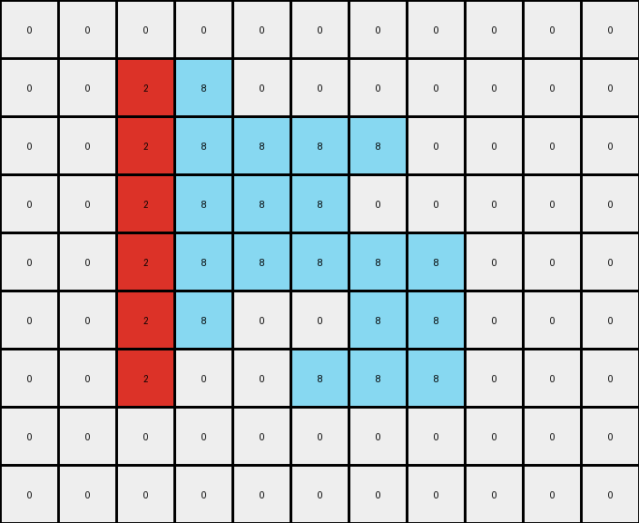
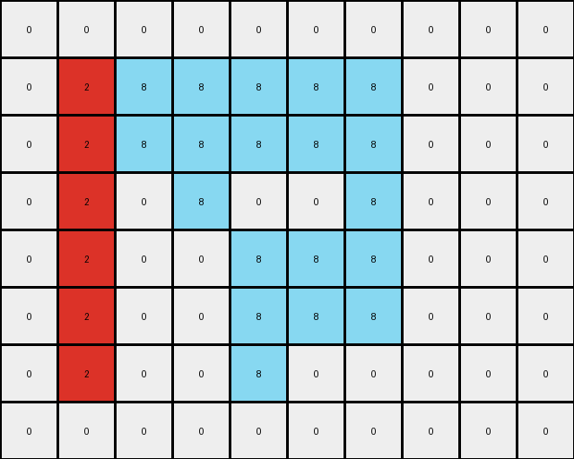
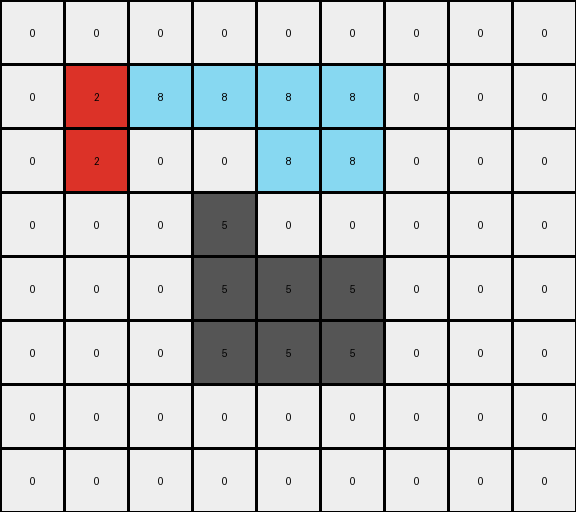

# 5-150deff5 • 022 • refine_coder

---

Previous Code:
```python
"""
1.  **Identify** the contiguous shape formed by gray (5) pixels in the input grid. This is the `gray_object`.
2.  **Preserve** all pixels that are white (0) in the input grid, keeping their positions unchanged in the output grid.
3.  **Extract** the leftmost vertical line segment of the `gray_object`. Create
    a new object with the color red (2) that has the height of the extracted segment. This is the `red_object`.
4. **Extract** the remaining columns of the gray object, and convert them into the azure (8) color. This is the `azure_object`.
5.  **Place** the `red_object` in the output grid in place of the leftmost column of the original gray object
6. **Place** the `azure_object` in the output grid, starting from the immediate
   right of the red object, and filling the columns of the original gray object.
"""

import numpy as np

def get_object(grid, color):
    """Finds the coordinates of a contiguous object of a specified color."""
    coords = []
    visited = set()
    rows, cols = grid.shape
    
    def is_valid(r, c):
        return 0 <= r < rows and 0 <= c < cols

    def dfs(r, c):
        if (r, c) in visited or not is_valid(r, c) or grid[r, c] != color:
            return
        visited.add((r, c))
        coords.append((r, c))
        for dr, dc in [(0, 1), (1, 0), (0, -1), (-1, 0)]:
            dfs(r + dr, c + dc)

    for r in range(rows):
        for c in range(cols):
            if grid[r, c] == color and (r, c) not in visited:
                dfs(r, c)
                return coords # return first object found
    return []


def transform(input_grid):
    # initialize output_grid
    output_grid = np.copy(input_grid)
    
    # get the gray object
    gray_object_coords = get_object(input_grid, 5)

    # if no gray object exists, return
    if not gray_object_coords:
      return output_grid

    # change the color of gray pixels to white
    for r, c in gray_object_coords:
        output_grid[r, c] = 0

    # find leftmost and rightmost columns, and min and max rows
    min_col = min(c for _, c in gray_object_coords)
    max_col = max(c for _, c in gray_object_coords)
    min_row = min(r for r, _ in gray_object_coords)
    max_row = max(r for r, _ in gray_object_coords)

    # build red object using the left part of gray object
    for r in range(min_row, max_row + 1):
        output_grid[r, min_col] = 2


    #build azure object by extending right from red object
    for r, c in gray_object_coords:
        if c > min_col:
          output_grid[r,c] = 8

    return output_grid
```

Train Set Results:

## Example 1:**

Input:
```
0 0 0 0 0 0 0 0 0 0 0
0 0 5 5 0 0 0 0 0 0 0
0 0 5 5 5 5 5 0 0 0 0
0 0 0 5 5 5 0 0 0 0 0
0 0 0 5 5 5 5 5 0 0 0
0 0 0 5 0 0 5 5 0 0 0
0 0 0 0 0 5 5 5 0 0 0
0 0 0 0 0 0 0 0 0 0 0
0 0 0 0 0 0 0 0 0 0 0
```
Expected Output:
```
0 0 0 0 0 0 0 0 0 0 0
0 0 8 8 0 0 0 0 0 0 0
0 0 8 8 2 2 2 0 0 0 0
0 0 0 2 8 8 0 0 0 0 0
0 0 0 2 8 8 8 8 0 0 0
0 0 0 2 0 0 8 8 0 0 0
0 0 0 0 0 2 2 2 0 0 0
0 0 0 0 0 0 0 0 0 0 0
0 0 0 0 0 0 0 0 0 0 0
```
Transformed Output:
```
0 0 0 0 0 0 0 0 0 0 0
0 0 2 8 0 0 0 0 0 0 0
0 0 2 8 8 8 8 0 0 0 0
0 0 2 8 8 8 0 0 0 0 0
0 0 2 8 8 8 8 8 0 0 0
0 0 2 8 0 0 8 8 0 0 0
0 0 2 0 0 8 8 8 0 0 0
0 0 0 0 0 0 0 0 0 0 0
0 0 0 0 0 0 0 0 0 0 0
```

match: False
pixels_off: 15
size_correct: True
color_palette_correct: True
correct_pixel_counts: False

## Example 2:**

Input:
```
0 0 0 0 0 0 0 0 0 0
0 5 5 5 5 5 5 0 0 0
0 5 5 5 5 5 5 0 0 0
0 0 0 5 0 0 5 0 0 0
0 0 0 0 5 5 5 0 0 0
0 0 0 0 5 5 5 0 0 0
0 0 0 0 5 0 0 0 0 0
0 0 0 0 0 0 0 0 0 0
```
Expected Output:
```
0 0 0 0 0 0 0 0 0 0
0 8 8 2 8 8 2 0 0 0
0 8 8 2 8 8 2 0 0 0
0 0 0 2 0 0 2 0 0 0
0 0 0 0 2 8 8 0 0 0
0 0 0 0 2 8 8 0 0 0
0 0 0 0 2 0 0 0 0 0
0 0 0 0 0 0 0 0 0 0
```
Transformed Output:
```
0 0 0 0 0 0 0 0 0 0
0 2 8 8 8 8 8 0 0 0
0 2 8 8 8 8 8 0 0 0
0 2 0 8 0 0 8 0 0 0
0 2 0 0 8 8 8 0 0 0
0 2 0 0 8 8 8 0 0 0
0 2 0 0 8 0 0 0 0 0
0 0 0 0 0 0 0 0 0 0
```

match: False
pixels_off: 15
size_correct: True
color_palette_correct: True
correct_pixel_counts: False

## Example 3:**

Input:
```
0 0 0 0 0 0 0 0 0
0 5 5 5 5 5 0 0 0
0 0 0 0 5 5 0 0 0
0 0 0 5 0 0 0 0 0
0 0 0 5 5 5 0 0 0
0 0 0 5 5 5 0 0 0
0 0 0 0 0 0 0 0 0
0 0 0 0 0 0 0 0 0
```
Expected Output:
```
0 0 0 0 0 0 0 0 0
0 2 2 2 8 8 0 0 0
0 0 0 0 8 8 0 0 0
0 0 0 2 0 0 0 0 0
0 0 0 2 8 8 0 0 0
0 0 0 2 8 8 0 0 0
0 0 0 0 0 0 0 0 0
0 0 0 0 0 0 0 0 0
```
Transformed Output:
```
0 0 0 0 0 0 0 0 0
0 2 8 8 8 8 0 0 0
0 2 0 0 8 8 0 0 0
0 0 0 5 0 0 0 0 0
0 0 0 5 5 5 0 0 0
0 0 0 5 5 5 0 0 0
0 0 0 0 0 0 0 0 0
0 0 0 0 0 0 0 0 0
```

match: False
pixels_off: 10
size_correct: True
color_palette_correct: False
correct_pixel_counts: False
Here's an analysis of the provided examples and a plan to refine the natural language program and code:

**General Assessment:**

The initial natural language program and the derived code have fundamental flaws in how they handle the placement and coloring of the `red_object` and `azure_object`. The code incorrectly assumes a simple left-to-right replacement, and it does not correctly segment the `gray_object` based on distinct vertical sections. The core issue is a misinterpretation of how the gray object's columns should be divided and recolored. The results are not just a simple shift; there is a clear pattern of alternating colors by distinct, contiguous vertical parts of the original grey object.

**Strategy for Resolving Errors:**

1.  **Improved Object Segmentation:** The key is to correctly identify *distinct* vertical segments within the `gray_object`. The current `get_object` function finds all connected gray pixels, but it doesn't differentiate between separate vertical lines that happen to be adjacent.
2.  **Alternating Coloring:** The transformation isn't a simple split into left (red) and right (azure). It's an alternation.  We need to identify each contiguous vertical segment of the `gray_object` and alternate the colors between red and azure.
3. Refine Object Identification: Ensure white space is accounted for.

**Example Analysis and Metrics:**

To accurately analyze the object segmentation and transformation, I will define segments, then describe them.

*   **Example 1:**
    *   **Input:** A gray shape that isn't just left/right splittable
    *   **Expected Output:** White, with a red and azure sections.
    *   **Observed Output:** Incorrect placement of red and azure.
    *    **Analysis:** The concept of left and right segments must be abandoned.

*   **Example 2:**
    *   **Input:** Similar to example 1.
    *   **Expected Output:** alternating blocks of red and azure.
    *   **Observed Output:** similar error as example 1
    *   **Analysis:** Again shows the need for alternation.

*   **Example 3:**
        *  **Input**: A gray object
        *   **Expected Output:** White with red and azure segments
        *   **Observed Output:** Fails and leaves some gray
        *   **Analysis**: Demonstrates a problem with how the objects are identified and segmented

**YAML Fact Block:**

```yaml
facts:
  - task_id: 020
  - objects:
      - name: gray_object
        color: gray (5)
        properties:
          - contiguous: True
          - segments: Multiple vertical segments
      - name: red_object
        color: red (2)
        properties:
          - source: gray_object segments, every other one, starting with first
      - name: azure_object
        color: azure (8)
        properties:
          - source: gray_object segments, every other one, starting with second
  - actions:
      - description: Identify contiguous vertical segments within the gray_object.
      - description: Color alternating segments as red and azure, starting with red.
      - description: Maintain the position of the white background.

```

**Natural Language Program:**

1.  **Identify** the white (0) background and preserve its position in the output grid.
2.  **Identify** the contiguous gray (5) object in the input grid.
3.  **Segment** the gray object into distinct vertical segments. A segment is defined as a contiguous set of gray pixels in one or more adjacent columns. There may or may not be a single white pixel separating the object into segments.
4.  **Alternate Colors:** Starting with the leftmost segment, color it red (2). Color the next segment azure (8). Continue alternating red and azure for all segments of the gray object.
5. **Place** the colored segments to the output grid in place of the gray object.


**INSTRUCTIONS**

- generate a Python module to represent the natural language program 
- follow the template below
- all common math and science libraries are available
- create docstring only at top - but comment the workflow in the function
- use helper functions for common operations like finding objects, counting,
  measuring, moving, etc. 

remember - we are working iteratively - so this code will inform your future
self as we converge on the solution

*template:*

```python
"""
{{ natural language description of the transformation rule }}
"""

{{ imports }}

def transform(input_grid):
    # initialize output_grid

    # change output pixels 

    return output_grid

```
