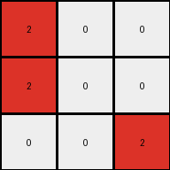
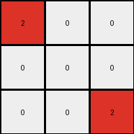

# 6-0520fde7 • 005 • refine_dreamer

---


Previous Code:
```python
"""
1.  **Initialize Output:** Create a 3x3 output grid filled with white pixels (color 0).

2.  Locate zero value pixels in input.

3.  **Iterate through zero value pixels**:
  *   if a zero value pixel in the input aligns with the output origin (0,0) and a color of 2 in the output, set the corresponding output to 2.
  *   if a zero value pixel in the input aligns with the output center (1,1) and a color of 2 in the output, set the corresponding output to 2.
  *   if a zero value pixel in the input aligns with the bottom right of the output (2,2) and a color of 2 in the output, set the corresponding output to 2.

4. **Return the output grid**
"""

import numpy as np

def get_zero_pixel_positions(grid):
    return np.argwhere(grid == 0)

def transform(input_grid):
    # Initialize a 3x3 output grid filled with white (0)
    output_grid = np.zeros((3, 3), dtype=int)

    # Get positions of zero-valued pixels in the input grid
    zero_positions = get_zero_pixel_positions(input_grid)

    # Get the center column for alignment checks.  We use the center
    # column because the examples show the output 3x3 centered there.
    center_col = input_grid.shape[1] // 2

    # Iterate and check alignment
    for row, col in zero_positions:
        # Calculate relative position to the center of the input
        row_rel = row 
        col_rel = col - (center_col-1)  # Adjust column relative to the output grid center
        # check alignment and update corresponding output pixel, origin
        if row_rel == 0 and col_rel == 0 :
          if (row_rel, col_rel) == (0,0):
             output_grid[0,0] = 2
          elif (row_rel, col_rel) == (0,1):
             output_grid[0,1] = 2
          elif (row_rel, col_rel) == (0,2):
             output_grid[0,2] = 2
          
        # check alignment and update corresponding output pixel, center
        elif row_rel == 1 and col_rel == 1:
            output_grid[1, 1] = 2
        
        elif row_rel == 1 and col_rel == 0:
            output_grid[1, 0] = 2

        #bottom right
        elif row_rel == 2 and col_rel == 2 :
            output_grid[2, 2] = 2

        elif row_rel == 2 and col_rel == 1 :
            output_grid[2, 1] = 2
    return output_grid
```

Train Set Results:

## Example 1:**

Input:
```
1 0 0 5 0 1 0
0 1 0 5 1 1 1
1 0 0 5 0 0 0
```
Expected Output:
```
0 0 0
0 2 0
0 0 0
```
Transformed Output:
```
2 0 0
2 0 0
0 0 2
```

match: False
pixels_off: 4
size_correct: True
color_palette_correct: True
correct_pixel_counts: False

## Example 2:**

Input:
```
1 1 0 5 0 1 0
0 0 1 5 1 1 1
1 1 0 5 0 1 0
```
Expected Output:
```
0 2 0
0 0 2
0 2 0
```
Transformed Output:
```
2 0 0
0 0 0
0 0 2
```

match: False
pixels_off: 5
size_correct: True
color_palette_correct: True
correct_pixel_counts: False

## Example 3:**

Input:
```
0 0 1 5 0 0 0
1 1 0 5 1 0 1
0 1 1 5 1 0 1
```
Expected Output:
```
0 0 0
2 0 0
0 0 2
```
Transformed Output:
```
0 0 0
2 0 0
0 0 0
```

match: False
pixels_off: 1
size_correct: True
color_palette_correct: True
correct_pixel_counts: False

**INSTRUCTIONS**

The code above was generated based on observations from the first training
example

we have tested the transform function on each of the task example inputs and
compared with the expected output

review each of the examples provided and the results and consider how the
natural language program should be updated to accommodate this new knowledge

respond with the following deliverables:

- general assessment of the information provided and strategy for resolving the
  errors
- gather metrics about each of the examples and results - use code_execution to
  develop accurate reports on your assumptions
- a YAML block documenting facts - Focus on identifying objects, their properties, and the actions performed on them.
- a natural language program - Be as clear and concise as possible, providing a complete description of the transformation rule.


your responses should be considered as information in a report - not a
conversation
