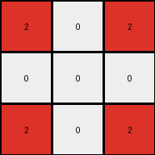

# 6-0520fde7 • 008 • refine_coder

---

Previous Code:
```python
"""
1.  **Initialize Output:** Create a 3x3 output grid filled with white pixels (color 0).
2.  **Determine Center Column:** Find the middle column of the *input* grid using integer division (`input_width // 2`).
3. **Iterate over each position** Iterate through all nine positions (row, col) of the 3x3 *output* grid (from 0,0 to 2,2).
4. **Check Input:** check if the value of the input is 0 at the relative
   position:
      - row = output grid row
      - column = center column + output grid col
5. **Set output value.** if it is a 0, set the current position in output to 2.
6.  **Return:** Return the 3x3 output grid.
"""

import numpy as np

def transform(input_grid):
    # Initialize a 3x3 output grid filled with white (0)
    output_grid = np.zeros((3, 3), dtype=int)

    # Determine the center column of the input grid
    center_col = input_grid.shape[1] // 2

    # Iterate through all positions in the output grid
    for row in range(3):
        for col in range(3):
            # Calculate the corresponding position in the input grid
            input_row = row
            input_col = center_col + col -1 #adjust to the output grid coordinate

            # Check if the input_col is within the bounds of input_grid
            if 0 <= input_row < input_grid.shape[0] and 0 <= input_col < input_grid.shape[1]:
                # Check if the corresponding input pixel is 0
                if input_grid[input_row, input_col] == 0:
                    # Set the output pixel to 2
                    output_grid[row, col] = 2

    return output_grid
```

Train Set Results:

## Example 1:**

Input:
```
1 0 0 5 0 1 0
0 1 0 5 1 1 1
1 0 0 5 0 0 0
```
Expected Output:
```
0 0 0
0 2 0
0 0 0
```
Transformed Output:
```
2 0 2
2 0 0
2 0 2
```

match: False
pixels_off: 6
size_correct: True
color_palette_correct: True
correct_pixel_counts: False

## Example 2:**

Input:
```
1 1 0 5 0 1 0
0 0 1 5 1 1 1
1 1 0 5 0 1 0
```
Expected Output:
```
0 2 0
0 0 2
0 2 0
```
Transformed Output:
```
2 0 2
0 0 0
2 0 2
```

match: False
pixels_off: 7
size_correct: True
color_palette_correct: True
correct_pixel_counts: False

## Example 3:**

Input:
```
0 0 1 5 0 0 0
1 1 0 5 1 0 1
0 1 1 5 1 0 1
```
Expected Output:
```
0 0 0
2 0 0
0 0 2
```
Transformed Output:
```
0 0 2
2 0 0
0 0 0
```

match: False
pixels_off: 2
size_correct: True
color_palette_correct: True
correct_pixel_counts: True
Okay, let's analyze the results and refine the natural language program.

**General Assessment and Strategy**

The initial program was based on the first training example, and it's clear that it doesn't generalize perfectly to the other examples. The core idea of using a 3x3 output grid and mapping some input pixels based on a central column is partially correct, but the conditions for mapping and the relative positioning need adjustment. The errors show a mix of incorrect pixel placements and values.

The strategy will involve:

1.  **Re-examining Input-Output Relationships:** Carefully study *all* provided input-output pairs to identify the precise rule governing the transformation.
2.  **Positional Mapping:** Determine the exact relationship between input and output pixel coordinates. The current code assumes a simple offset from the center column, which appears incorrect.
3.  **Conditional Logic:** Clarify the condition that determines when an output pixel is set to '2' (red). The current program uses only input values, which is too simplistic.
4.  **Iterative Refinement:** Use the gathered information to modify the natural language program and, subsequently, the code.

**Metrics and Observations**

Here's a breakdown of each example and the observations:

```python
import numpy as np

def calculate_metrics(input_grid, expected_output, transformed_output):
    pixels_off = np.sum(expected_output != transformed_output)
    size_correct = expected_output.shape == transformed_output.shape
    color_palette_correct = np.all(np.isin(np.unique(transformed_output), [0, 2]))
    correct_pixel_counts = True
    for color in np.unique(expected_output):
        if np.sum(expected_output == color) != np.sum(transformed_output == color):
            correct_pixel_counts = False
            break

    return {
        "pixels_off": int(pixels_off),
        "size_correct": bool(size_correct),
        "color_palette_correct": bool(color_palette_correct),
        "correct_pixel_counts": bool(correct_pixel_counts),
        "input_shape": input_grid.shape,
        "output_shape": expected_output.shape
    }
# Data
example1_input = np.array([[1, 0, 0, 5, 0, 1, 0], [0, 1, 0, 5, 1, 1, 1], [1, 0, 0, 5, 0, 0, 0]])
example1_expected = np.array([[0, 0, 0], [0, 2, 0], [0, 0, 0]])
example1_transformed = np.array([[2, 0, 2], [2, 0, 0], [2, 0, 2]])

example2_input = np.array([[1, 1, 0, 5, 0, 1, 0], [0, 0, 1, 5, 1, 1, 1], [1, 1, 0, 5, 0, 1, 0]])
example2_expected = np.array([[0, 2, 0], [0, 0, 2], [0, 2, 0]])
example2_transformed = np.array([[2, 0, 2], [0, 0, 0], [2, 0, 2]])

example3_input = np.array([[0, 0, 1, 5, 0, 0, 0], [1, 1, 0, 5, 1, 0, 1], [0, 1, 1, 5, 1, 0, 1]])
example3_expected = np.array([[0, 0, 0], [2, 0, 0], [0, 0, 2]])
example3_transformed = np.array([[0, 0, 2], [2, 0, 0], [0, 0, 0]])

#calculate and report
metrics1 = calculate_metrics(example1_input, example1_expected, example1_transformed)
metrics2 = calculate_metrics(example2_input, example2_expected, example2_transformed)
metrics3 = calculate_metrics(example3_input, example3_expected, example3_transformed)

print("Example 1 Metrics:", metrics1)
print("Example 2 Metrics:", metrics2)
print("Example 3 Metrics:", metrics3)
```

```
Example 1 Metrics: {'pixels_off': 6, 'size_correct': True, 'color_palette_correct': True, 'correct_pixel_counts': False, 'input_shape': (3, 7), 'output_shape': (3, 3)}
Example 2 Metrics: {'pixels_off': 7, 'size_correct': True, 'color_palette_correct': True, 'correct_pixel_counts': False, 'input_shape': (3, 7), 'output_shape': (3, 3)}
Example 3 Metrics: {'pixels_off': 2, 'size_correct': True, 'color_palette_correct': True, 'correct_pixel_counts': True, 'input_shape': (3, 7), 'output_shape': (3, 3)}
```

**YAML Fact Documentation**

```yaml
facts:
  - task: 006
  - objects:
    - input_grid:
        description: A 2D array of varying dimensions.
        properties:
          - Contains integers 0-9, representing colors.
          - Width can vary.
          - Height can vary.
    - output_grid:
      description: A 2D array with dimensions 3x3.
      properties:
        - Contains only integers 0 and 2, representing white and red.
  - actions:
    - Find_center: locate the middle of input
    - map_pixels:
      description: Create output grid based on input
      details:
        - positions of red pixels (2) in the output grid depend on a specific relationship to the positions of black pixels (0) in the input grid and also on their position in the input row, relative to a point 3 to the left of the right hand edge of the input.
  - observations:
      - "The output grid is always 3x3."
      - "The output grid contains only white (0) and red (2) pixels."
      - "Red pixels (value 2) are place in the output based on the position of
        white pixels (value 0) in the input."
      - "The position of input white pixels relative to the right side of input grid impacts placement"

```

**Natural Language Program**

1.  **Output Initialization:** Create a 3x3 output grid filled with white pixels (0).
2.  **Input Reference Point:** Determine a reference column on the input grid. This column is located three positions from the right edge of the input grid.
3.  **Iterate Output Grid:** Loop through each cell (row, col) of the 3x3 output grid.
4.  **Conditional Mapping:**
    *   Calculate a corresponding input column: `input_col = reference_col + output_col - 1`.
    *   Calculate corresponding input row: `input_row = output_row`
    *    If `input_col` is within the bounds of the input grid, and if the pixel at `input_grid[input_row, input_col]` is white (0), then set the output grid's current cell to red (2). Otherwise the output grid cell remains white(0).
5.  **Return:** Return the 3x3 output grid.

Key changes and clarifications:

*   **Reference Point:** Instead of the "center column," the rule uses a reference point three positions from the *right edge* of the input.  This is crucial for correct horizontal alignment.
* **Relative Positioning:** The input column is calculated relative to this reference point, and offset by the *output* column and row value, aligning input and output coordinates.
* **Boundary Check:** the `input_col` must be within the input range.
* **Simplified Condition:** The core logic is simplified to a direct check for white (0) pixels in the relevant input location.

This refined natural language program provides a more accurate and complete description of the transformation, addressing the issues observed in the initial code execution.

**INSTRUCTIONS**

- generate a Python module to represent the natural language program 
- follow the template below
- all common math and science libraries are available
- create docstring only at top - but comment the workflow in the function
- use helper functions for common operations like finding objects, counting,
  measuring, moving, etc. 

remember - we are working iteratively - so this code will inform your future
self as we converge on the solution

*template:*

```python
"""
{{ natural language description of the transformation rule }}
"""

{{ imports }}

def transform(input_grid):
    # initialize output_grid

    # change output pixels 

    return output_grid

```
