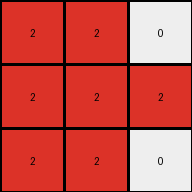

# 6-0520fde7 • 011 • refine_dreamer

---

Previous Code:
```python
"""
The transformation rule is as follows:

1. Ignore the Central Column: Disregard the central column of the input grid, which is filled with gray (5) pixels.
2. Identify Blue Regions: Focus on the blue (1) pixels in the remaining parts of the input grid.
3. Translate and Replace: Create a new 3x3 grid. Map the blue pixels from the relevant part of the input grid to the new grid, changing their color to red (2). All other pixels in the output grid should be white (0).
"""

import numpy as np

def get_non_central_columns(input_grid):
    """
    Extracts columns of the input_grid that are to the left and right of the central grey column.
    """
    height, width = input_grid.shape
    center_col_index = width // 2

    left_cols = []
    right_cols = []
    
    for x in range(width):
        if x == center_col_index:
            continue
        
        if input_grid[0, x] != 5 and input_grid[1, x] !=5 and input_grid[2, x] != 5:

            column = []
            for y in range(height):
                column.append(input_grid[y,x])

            if x < center_col_index:
              left_cols.append((x,column))
            else:
              right_cols.append((x-center_col_index-1,column)) # correct index after removing central column

    return left_cols, right_cols

def transform(input_grid):
    """
    Transforms an input grid into an output grid according to the specified rules.
    """

    # Initialize output_grid as 3x3, filled with white (0).
    output_grid = np.zeros((3, 3), dtype=int)

    # Get non-central columns
    left_cols, right_cols = get_non_central_columns(input_grid)

    # all columns
    all_cols = left_cols + right_cols
    
    # Fill in the output
    for x, col in all_cols:
      for y, pixel in enumerate(col):
        if pixel == 1: # if blue pixel
          output_grid[y,x] = 2 # place a red
        
    return output_grid
```

Train Set Results:

## Example 1:**

Input:
```
1 0 0 5 0 1 0
0 1 0 5 1 1 1
1 0 0 5 0 0 0
```
Expected Output:
```
0 0 0
0 2 0
0 0 0
```
Transformed Output:
```
2 2 0
2 2 2
2 0 0
```

match: False
pixels_off: 5
size_correct: True
color_palette_correct: True
correct_pixel_counts: False

## Example 2:**

Input:
```
1 1 0 5 0 1 0
0 0 1 5 1 1 1
1 1 0 5 0 1 0
```
Expected Output:
```
0 2 0
0 0 2
0 2 0
```
Transformed Output:
```
2 2 0
2 2 2
2 2 0
```

match: False
pixels_off: 4
size_correct: True
color_palette_correct: True
correct_pixel_counts: False

## Example 3:**

Input:
```
0 0 1 5 0 0 0
1 1 0 5 1 0 1
0 1 1 5 1 0 1
```
Expected Output:
```
0 0 0
2 0 0
0 0 2
```
Transformed Output:
```
0 0 2
2 2 2
2 2 2
```

match: False
pixels_off: 5
size_correct: True
color_palette_correct: True
correct_pixel_counts: False
**INSTRUCTIONS**

The code above was generated based on observations from the first training
example

we have tested the transform function on each of the task example inputs and
compared with the expected output

review each of the examples provided and the results and consider how the
natural language program should be updated to accommodate this new knowledge

respond with the following deliverables:

- general assessment of the information provided and strategy for resolving the
  errors
- gather metrics about each of the examples and results - use code_execution to
  develop accurate reports on your assumptions
- a YAML block documenting facts - Focus on identifying objects, their properties, and the actions performed on them.
- a natural language program - Be as clear and concise as possible, providing a complete description of the transformation rule.


your responses should be considered as information in a report - not a
conversation
